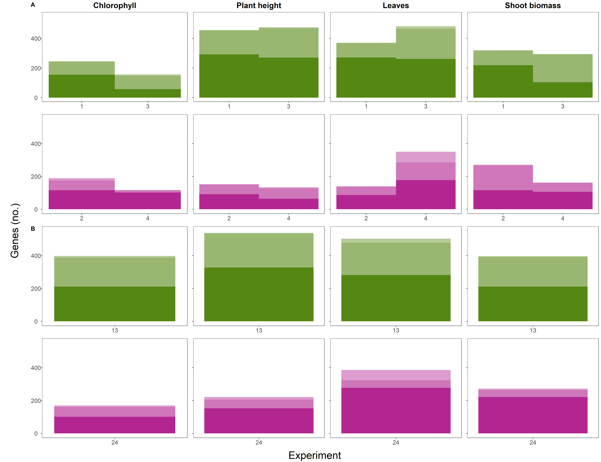

Genomic analyses
================
Rebecca Batstone
2021-10-20

Setup
-----

Summarize sig associations at the ps and gene levels (full and subsets)
-----------------------------------------------------------------------

``` r
load(file = "./Data_output/SNPs_sig_long.Rdata") # loads SNPs_sig_long

## no genes = coding regions, exclude non-coding. Include all variants

# how many variants in total are there?
SNPs_sig_long %>%
  summarize(no_vars = n_distinct(rs)) ## 5402
```

    ##   no_vars
    ## 1    5402

``` r
# how many SNPs fall into non-coding regions? How many distinct non-coding regions?
## no ID for non-coding regions 
SNPs_sig_long %>%
  filter(ncbi_func == "non-coding") %>%
  droplevels(.) %>%  
  summarize(no_vars = n_distinct(rs),
    no_regions = n_distinct(gene_name)) ## 572 SNPs, 369 regions
```

    ##   no_vars no_regions
    ## 1     572        369

``` r
# how many coding genes are there?
SNPs_sig_long %>%
  filter(ncbi_func != "non-coding") %>%
  droplevels(.) %>%
  summarize(no_genes = n_distinct(gene_ID)) ## 1770
```

    ##   no_genes
    ## 1     1770

``` r
## summarize at the SNP- and gene-levels for shoot biomass only
SNPs_sig_long %>%
  filter(trait == "shoot") %>%
  droplevels(.) %>%  
  summarize(no_vars = n_distinct(rs)) ## 1453
```

    ##   no_vars
    ## 1    1453

``` r
SNPs_sig_long %>%
  filter(trait == "shoot" & ncbi_func != "non-coding") %>%
  droplevels(.) %>%  
  summarize(no_genes = n_distinct(gene_ID)) ## 746
```

    ##   no_genes
    ## 1      746

``` r
SNPs_sig_long %>%
  filter(trait == "shoot" & ncbi_func != "non-coding") %>%
  droplevels(.) %>%  
  group_by(line) %>%  
  summarize(no_genes = n_distinct(gene_ID)) ## DZA: 548; A17: 383
```

    ## # A tibble: 2 x 2
    ##   line  no_genes
    ##   <chr>    <int>
    ## 1 A17        383
    ## 2 DZA        548

Summarize at the SNP-level for all traits
-----------------------------------------

``` r
load(file = "./Data_output/SNPs_sig_long.Rdata") # loads SNPs_sig_long
  
# create variant summary files for each trait individually

## function to summarize data at the variant-level:

trait.list <- c("all","chloro1","height1","leaf1","shoot",
                "chloro.plast","height.plast","leaf.plast","shoot.plast")

## source function
source("../Source_code/var_sum_func.R")

var_sum_out <- sapply(trait.list, var_sum_func, df = SNPs_sig_long, 
                      simplify = FALSE, USE.NAMES = TRUE)
```

    ## [1] "all"
    ## [1] "chloro1"
    ## [1] "height1"
    ## [1] "leaf1"
    ## [1] "shoot"
    ## [1] "chloro.plast"
    ## [1] "height.plast"
    ## [1] "leaf.plast"
    ## [1] "shoot.plast"

``` r
save(var_sum_out, file = "./Data_output/Var-lvl_summaries/var_sums.Rdata")
```

Summarize at the gene-lvl and categorize
----------------------------------------

``` r
load(file = "./Data_output/SNPs_sig_long.Rdata") # loads SNPs_sig_long

## recode levels of trait
SNPs_sig_long$trait <- recode_factor(SNPs_sig_long$trait, 
                              chloro1 = "chloro",
                              height1 = "height",
                              leaf1 = "leaf")

# Summarize at the gene-level (all traits)
SNPs_ann_gene <- SNPs_sig_long %>%
  filter(ncbi_func != "non-coding") %>%
  droplevels(.) %>%
  group_by(region, gene_ID, RefSeq_ID, ncbi_func, assoc) %>%
 mutate(
    no_effect_assoc = n(),
    assoc_no = paste0(assoc,"[",no_effect_assoc,"]")) %>%
  ungroup(.) %>%
  group_by(region, gene_ID, RefSeq_ID, ncbi_func) %>%
  summarize(
    no_vars = n_distinct(rs), ## no. of unique vars
    no_traits = n_distinct(trait), ## no. of unique traits
    min_ps = min(ps), 
    max_ps = max(ps), 
    no_effects = n(),
    min_score = min(scores), 
    max_score = max(scores), 
    ave_abs_score = mean(abs(scores)),
    ave_af = mean(af),
    assocs = paste(unique(assoc_no), collapse = ", "),
    lines = paste(unique(line), collapse = ", ")) %>%
  as.data.frame(.)

SNPs_ann_gene$host <- ifelse(SNPs_ann_gene$lines == "A17, DZA" | 
                               SNPs_ann_gene$lines == "DZA, A17", "Both",
                           ifelse(SNPs_ann_gene$lines == "A17", "A17 only", 
                                  "DZA only"))

SNPs_ann_gene <- SNPs_ann_gene %>%
  select(-lines)

save(SNPs_ann_gene, file = "./Data_output/Gene-lvl_summaries/SNPs_ann_gene_all.Rdata")
write.csv(SNPs_ann_gene, "./Data_output/Gene-lvl_summaries/SNPs_ann_gene_all.csv", 
          row.names = FALSE)

# function: iterate through each trait individually

trait.list <- c("chloro","height","leaf","shoot",
                "chloro.plast","height.plast","leaf.plast","shoot.plast")

## source function
source("../Source_code/gene_sum_func.R")

gene_sum_out <- sapply(trait.list, gene_sum_func, df = SNPs_sig_long,
                       simplify = FALSE, USE.NAMES = TRUE)
```

    ## [1] "chloro"
    ## [1] "height"
    ## [1] "leaf"
    ## [1] "shoot"
    ## [1] "chloro.plast"
    ## [1] "height.plast"
    ## [1] "leaf.plast"
    ## [1] "shoot.plast"

``` r
save(gene_sum_out, file = "./Data_output/Gene-lvl_summaries/Venn_diagram_nums.Rdata")

## summary for shoot plasticity genes (numbers reported in main text)
gene_sum_out[["shoot.plast"]] %>%
  group_by(host) %>%
  mutate(no_per_host = sum(count))
```

    ## # A tibble: 3 x 4
    ## # Groups:   host [3]
    ##   host     count trait       no_per_host
    ##   <chr>    <int> <chr>             <int>
    ## 1 A17 only   179 shoot.plast         179
    ## 2 Both        93 shoot.plast          93
    ## 3 DZA only   304 shoot.plast         304

Venn diagrams
-------------

``` r
load(file = "./Data_output/Gene-lvl_summaries/Venn_diagram_nums.Rdata") # loads gene_sum_out

Venn_diagram_nums <- gene_sum_out[1:4] %>%
  reduce(full_join, by = c("cat","host_exps")) %>%
  select(-starts_with("trait")) %>%
  as.data.frame(.)

## format
names(Venn_diagram_nums) <- c("cat","host_exps","chloro","height","leaf","shoot")

## add in total genes
Venn_diagrams <- rbind(Venn_diagram_nums, c("All","All",colSums(Venn_diagram_nums[,3:6], na.rm=TRUE)))

cols.to.num <- 3:6
Venn_diagrams[cols.to.num] <- sapply(Venn_diagrams[cols.to.num],as.numeric)

write.csv(Venn_diagrams, file = "./Figures_tables/Venn_numbers.csv", row.names = FALSE)

kable(Venn_diagrams)
```

| cat                 | host\_exps       |  chloro|  height|  leaf|  shoot|
|:--------------------|:-----------------|-------:|-------:|-----:|------:|
| GxE                 | A17 only\_2      |     124|      48|    50|    104|
| GxE                 | A17 only\_4      |      79|      58|   179|     76|
| GxE                 | DZA only\_1      |     175|     254|   171|    186|
| GxE                 | DZA only\_3      |     109|     284|   239|    144|
| GxG                 | A17 only\_2, 4   |       9|       2|     7|     18|
| GxG                 | DZA only\_1, 3   |      18|      98|    85|     33|
| other               | Both\_1, 2       |      26|      34|    16|     35|
| other               | Both\_1, 4       |      11|      19|    44|     21|
| other               | Both\_2, 3       |      14|      25|    26|     57|
| other               | Both\_3, 4       |       6|      19|    65|     12|
| Partially Universal | Both\_1, 2, 3    |       5|      21|    14|     25|
| Partially Universal | Both\_1, 2, 4    |       7|       8|     2|     12|
| Partially Universal | Both\_1, 3, 4    |       1|      14|    28|      3|
| Partially Universal | Both\_2, 3, 4    |       1|       5|    14|     15|
| Universal           | Both\_1, 2, 3, 4 |       3|       9|    11|      5|
| All                 | All              |     588|     898|   951|    746|

``` r
(Venn_diagrams.sum <- Venn_diagrams %>%
  group_by(cat) %>%
  summarize_if(is.numeric, sum, na.rm=TRUE))
```

    ## # A tibble: 6 x 5
    ##   cat                 chloro height  leaf shoot
    ##   <chr>                <dbl>  <dbl> <dbl> <dbl>
    ## 1 All                    588    898   951   746
    ## 2 GxE                    487    644   639   510
    ## 3 GxG                     27    100    92    51
    ## 4 other                   57     97   151   125
    ## 5 Partially Universal     14     48    58    55
    ## 6 Universal                3      9    11     5

``` r
kable(Venn_diagrams.sum)
```

| cat                 |  chloro|  height|  leaf|  shoot|
|:--------------------|-------:|-------:|-----:|------:|
| All                 |     588|     898|   951|    746|
| GxE                 |     487|     644|   639|    510|
| GxG                 |      27|     100|    92|     51|
| other               |      57|      97|   151|    125|
| Partially Universal |      14|      48|    58|     55|
| Universal           |       3|       9|    11|      5|

``` r
# for plasticity traits
Venn_diagram_nums <- gene_sum_out[5:8] %>%
  reduce(full_join, by = c("host")) %>%
  select(-starts_with("trait")) %>%
  as.data.frame(.)

## format
names(Venn_diagram_nums) <- c("host","chloro.plast","height.plast","leaf.plast","shoot.plast")

## add in total genes
Venn_diagrams <- rbind(Venn_diagram_nums, c("All",colSums(Venn_diagram_nums[,2:5], na.rm=TRUE)))

cols.to.num <- 2:5
Venn_diagrams[cols.to.num] <- sapply(Venn_diagrams[cols.to.num],as.numeric)

write.csv(Venn_diagrams, file = "./Figures_tables/Venn_numbers_plast.csv", row.names = FALSE)

kable(Venn_diagrams)
```

| host     |  chloro.plast|  height.plast|  leaf.plast|  shoot.plast|
|:---------|-------------:|-------------:|-----------:|------------:|
| A17 only |           120|           133|         283|          179|
| Both     |            50|            88|         103|           93|
| DZA only |           348|           450|         400|          304|
| All      |           518|           671|         786|          576|

Overlap in genes for shoot biomass (and other traits) and plasticity
--------------------------------------------------------------------

``` r
# get overlap between plast and shoot
load(file = "./Data_output/SNPs_sig_long.Rdata") # loads SNPs_sig_long

## remove all 1's after traits
SNPs_sig_long$trait.c <- str_remove(SNPs_sig_long$trait, "1")

# Use overlap function to get number of genes overlapping between trait and trait.plast

## traits to iterate through:
trait.list <- c("chloro","height","leaf","shoot")

## source function
source('../Source_code/overlap_func.R')

overlap_out <- sapply(trait.list, overlap_func, df = SNPs_sig_long,
                      simplify = FALSE, USE.NAMES = TRUE)
```

    ## [1] "chloro"
    ## [1] "height"
    ## [1] "leaf"
    ## [1] "shoot"

``` r
# combine
overlap <- overlap_out %>% 
  reduce(full_join, by = c("overlap")) %>%
  as.data.frame(.)

colnames(overlap) <- c("overlap", trait.list)

## add in total genes
overlap <- rbind(overlap, c("tot_plast",colSums(overlap[1:2,2:5], na.rm=TRUE)))

kable(overlap)
```

| overlap      | chloro | height | leaf | shoot |
|:-------------|:-------|:-------|:-----|:------|
| both\_traits | 323    | 540    | 603  | 400   |
| plast\_only  | 195    | 131    | 183  | 176   |
| trait\_only  | 265    | 358    | 348  | 346   |
| tot\_plast   | 518    | 671    | 786  | 576   |

Make stacked barplots (number of genes for each trait and line)
---------------------------------------------------------------

``` r
load(file = "./Data_output/SNPs_sig_long.Rdata") # loads SNPs_sig_long

# get counts of sig SNPs for each region, trait, exp
SNPs_sub <- SNPs_sig_long %>%
  filter(ncbi_func != "non-coding") %>%
  group_by(trait, line, exp, region, .drop = FALSE) %>%
  summarize(gene_count = n_distinct(gene_ID),
            ps_count = n_distinct(rs)) %>%
  mutate(line_region = paste0(line, "_", region))

SNPs_sub$line_region <- factor(SNPs_sub$line_region, 
                               levels = c("A17_Chromosome","A17_pSymA","A17_pSymB",
                                          "DZA_Chromosome","DZA_pSymA","DZA_pSymB"))

write.csv(SNPs_sub, file = "./Data_output/Gene-lvl_summaries/GxE_numbers.csv", row.names = FALSE)

SNPs_sub2 <- SNPs_sig_long %>%
  filter(ncbi_func != "non-coding") %>%
  group_by(trait, line, region) %>%
  summarize(gene_count = n_distinct(gene_ID),
            ps_count = n_distinct(rs))

write.csv(SNPs_sub2, file = "./Data_output/Gene-lvl_summaries/GxG_numbers.csv", row.names = FALSE)

# make plotting function
trait.list <- c(rep("chloro1", 2), rep("height1",2), rep("leaf1",2),rep("shoot",2), 
                rep("chloro.plast",2), rep("height.plast",2), rep("leaf.plast",2), rep("shoot.plast",2))
line.list <- rep(c("DZA", "A17"),8)
trait_line.list <- paste0(trait.list, "-",line.list)

## source function
source("../Source_code/bar_func.R")

bars_out <- mapply(combs = trait_line.list, 
                   traits = trait.list, 
                   lines = line.list, 
                     FUN = bar_func, 
                   USE.NAMES = TRUE, 
                   MoreArgs = list(df = SNPs_sub))
```

    ## [1] "chloro1-DZA"
    ## [1] "chloro1-A17"
    ## [1] "height1-DZA"
    ## [1] "height1-A17"
    ## [1] "leaf1-DZA"
    ## [1] "leaf1-A17"
    ## [1] "shoot-DZA"
    ## [1] "shoot-A17"
    ## [1] "chloro.plast-DZA"
    ## [1] "chloro.plast-A17"
    ## [1] "height.plast-DZA"
    ## [1] "height.plast-A17"
    ## [1] "leaf.plast-DZA"
    ## [1] "leaf.plast-A17"
    ## [1] "shoot.plast-DZA"
    ## [1] "shoot.plast-A17"

``` r
# make a paneled Figure (all traits)
row1 <- plot_grid( bars_out[[1]] + ggtitle("Chlorophyll") + theme(axis.text.y = element_text(size=14)), 
                    # chloro, DZA
                    bars_out[[3]]  + ggtitle("Plant height"), 
                    # height, DZA
                    bars_out[[5]] + ggtitle("Leaves"), 
                    # leaf, DZA
                    bars_out[[7]] + ggtitle("Shoot biomass"), 
                    # shoot, DZA
                    ncol = 4, 
                    nrow = 1, 
                    align="h", 
                    rel_widths = c(1,0.85,0.85,0.85),
                    labels=c("A","","","",""))

row2 <- plot_grid( bars_out[[2]] + theme(axis.text.y = element_text(size=14)), 
                    # chloro, A17
                    bars_out[[4]], 
                    # height, A17
                    bars_out[[6]], 
                    # leaf, A17
                    bars_out[[8]], 
                    # shoot, DZA
                    ncol = 4, 
                   nrow = 1, 
                   align="h", 
                   rel_widths = c(1,0.85,0.85,0.85),
                   labels=NULL)

row3 <- plot_grid( bars_out[[9]] + theme(axis.text.y = element_text(size=14)), 
                    # chloro, DZA
                    bars_out[[11]], 
                    # height, DZA
                    bars_out[[13]], 
                    # leaf, DZA
                    bars_out[[15]], 
                    # shoot, DZA
                    ncol = 4, 
                   nrow = 1, 
                   align="h", 
                   rel_widths = c(1,0.85,0.85,0.85),
                   labels=c("B","","","",""))

row4 <- plot_grid( bars_out[[10]] + theme(axis.text.y = element_text(size=14)), 
                    # chloro, A17
                    bars_out[[12]], 
                    # height, A17
                    bars_out[[14]], 
                    # leaf, A17
                    bars_out[[16]], 
                    # shoot, A17
                    ncol = 4, 
                   nrow = 1, 
                   align="h", 
                   rel_widths = c(1,0.85,0.85,0.85),
                   labels=NULL)

comb <- plot_grid(row1, row2, row3, row4,
                    ncol = 1, nrow = 4, align="v", labels=NULL)

# add on the shared x axis title
fig_x_axis <- add_sub(comb, "Experiment", size=24)

# add on the shared y axis title
fig_y_axis <- ggdraw() + draw_label("Genes (no.)", size = 24, angle=90)

# put them together
fig <- plot_grid(fig_y_axis, fig_x_axis, ncol=2, rel_widths=c(0.05, 1)) 
# rel_heights or widths values control text margins

save_plot("./Figures_tables/stacked_bars_all.png", fig,
          ncol = 4, # we're saving a grid plot of 2 columns
          nrow = 4, # and 2 rows
          # each individual subplot should have an aspect ratio of 1.3
          base_aspect_ratio = 1.3)


```


Variant-lvl analyses
--------------------

### Select traits, rename cols

``` r
load(file = "./Data_output/SNPs.Rdata") # loads SNPs

## subset dataframe, rename cols

SNPs_sel <- SNPs %>%
  select(rs, 
         # betas DZA
         beta.chloro.1.DZA = chloro1_DZA_1, 
         beta.chloro.3.DZA = chloro1_DZA_3, 
         beta.height.1.DZA = height1_DZA_1, 
         beta.height.3.DZA = height1_DZA_3, 
         beta.leaf.1.DZA = leaf1_DZA_1, 
         beta.leaf.3.DZA = leaf1_DZA_3, 
         beta.shoot.1.DZA = shoot_DZA_1, 
         beta.shoot.3.DZA = shoot_DZA_3,
         beta.chloro.plast.13.DZA = chloro.plast_DZA_13,
         beta.height.plast.13.DZA = height.plast_DZA_13,
         beta.leaf.plast.13.DZA = leaf.plast_DZA_13,
         beta.shoot.plast.13.DZA = shoot.plast_DZA_13,
         # sig DZA
         sig.chloro.1.DZA = chloro1_DZA_1.FIsig, 
         sig.chloro.3.DZA = chloro1_DZA_3.FIsig, 
         sig.height.1.DZA = height1_DZA_1.FIsig, 
         sig.height.3.DZA = height1_DZA_3.FIsig, 
         sig.leaf.1.DZA = leaf1_DZA_1.FIsig, 
         sig.leaf.3.DZA = leaf1_DZA_3.FIsig, 
         sig.shoot.1.DZA = shoot_DZA_1.FIsig, 
         sig.shoot.3.DZA = shoot_DZA_3.FIsig, 
         sig.chloro.plast.13.DZA = chloro.plast_DZA_13.FIsig, 
         sig.height.plast.13.DZA = height.plast_DZA_13.FIsig, 
         sig.leaf.plast.13.DZA = leaf.plast_DZA_13.FIsig, 
         sig.shoot.plast.13.DZA = shoot.plast_DZA_13.FIsig, 
         # betas A17
         beta.chloro.2.A17 = chloro1_A17_2, 
         beta.chloro.4.A17 = chloro1_A17_4, 
         beta.height.2.A17 = height1_A17_2, 
         beta.height.4.A17 = height1_A17_4, 
         beta.leaf.2.A17 = leaf1_A17_2, 
         beta.leaf.4.A17 = leaf1_A17_4, 
         beta.shoot.2.A17 = shoot_A17_2, 
         beta.shoot.4.A17 = shoot_A17_4,
         beta.chloro.plast.24.A17 = chloro.plast_A17_24,
         beta.height.plast.24.A17 = height.plast_A17_24,
         beta.leaf.plast.24.A17 = leaf.plast_A17_24,
         beta.shoot.plast.24.A17 = shoot.plast_A17_24,
         # sig A17
         sig.chloro.2.A17 = chloro1_A17_2.FIsig, 
         sig.chloro.4.A17 = chloro1_A17_4.FIsig, 
         sig.height.2.A17 = height1_A17_2.FIsig, 
         sig.height.4.A17 = height1_A17_4.FIsig, 
         sig.leaf.2.A17 = leaf1_A17_2.FIsig, 
         sig.leaf.4.A17 = leaf1_A17_4.FIsig, 
         sig.shoot.2.A17 = shoot_A17_2.FIsig, 
         sig.shoot.4.A17 = shoot_A17_4.FIsig, 
         sig.chloro.plast.24.A17 = chloro.plast_A17_24.FIsig, 
         sig.height.plast.24.A17 = height.plast_A17_24.FIsig, 
         sig.leaf.plast.24.A17 = leaf.plast_A17_24.FIsig, 
         sig.shoot.plast.24.A17 = shoot.plast_A17_24.FIsig, 
         # other info:
         region, ps, af, impact, RefSeq_ID, ncbi_func, start_pos, end_pos
         )

save(SNPs_sel, file = "./Data_output/SNPs_sel.Rdata")
```

### Correlations of effect sizes across experiments (same trait)

``` r
load(file = "./Data_output/SNPs_sel.Rdata") # loads SNPs_sel

# specify vars to loop over
reg.x.list <- c("chloro.1","height.1", "leaf.1","shoot.1",
                "chloro.2","height.2", "leaf.2","shoot.2")
reg.y.list <- c("chloro.3","height.3", "leaf.3","shoot.3",
                "chloro.4","height.4", "leaf.4","shoot.4")
line.list <- c(rep("DZA",4),rep("A17",4))
cols.list <- c(rep("#79AB39",4),rep("#C646A9",4))
comb.list <- paste0(reg.x.list,"-",reg.y.list,"-",line.list)

# using function for regressing variant level effects
source("../Source_code/var_effect_corr_func.R")
  
plot_out <- mapply(combs = comb.list, regx = reg.x.list, regy = reg.y.list, 
                   lines = line.list, cols = cols.list, FUN = var_effect_corr_func,  
                   USE.NAMES = TRUE, MoreArgs = list(df = SNPs_sel))
```

    ## [1] "chloro.1-chloro.3-DZA"
    ## [1] "height.1-height.3-DZA"
    ## [1] "leaf.1-leaf.3-DZA"
    ## [1] "shoot.1-shoot.3-DZA"
    ## [1] "chloro.2-chloro.4-A17"
    ## [1] "height.2-height.4-A17"
    ## [1] "leaf.2-leaf.4-A17"
    ## [1] "shoot.2-shoot.4-A17"

``` r
## just shoot biomass
## same trait across exp
fig_base <- plot_grid(plot_out[[4]] + ggtitle("Shoot biomass") + 
                        xlab("Effect size experiment 1") + 
                        ylab("Effect size \n experiment 3"), 
                      plot_out[[8]] + 
                        xlab("Effect size experiment 2") + 
                        ylab("Effect size \n experiment 4"),
          ncol = 1,
          nrow = 2,
          align = "hv",
          labels = c("A)","B)"))

save_plot("./Figures_tables/var_effect_corrs_shoot.pdf", fig_base,
          ncol = 1, # we're saving a grid plot of 2 columns
          nrow = 2, # and 3 rows
          # each individual subplot should have an aspect ratio of 1.3
          base_aspect_ratio = 1.3
          )

include_graphics("./Figures_tables/var_effect_corrs_shoot.pdf")
```


``` r
## corrplots (rest)

## same trait across exp
fig_DZA_base <- plot_grid(plot_out[[1]] + ggtitle("Chlorophyll"),
                          plot_out[[2]] + ggtitle("Plant height"), 
                          plot_out[[3]] + ggtitle("Leaves"),
          ncol = 3,
          nrow = 1,
          align = "h",
          labels = NULL)

fig.xaxis <- add_sub(fig_DZA_base, "Effect size experiment 1", size = 20, hjust = 0.5)
# add on the shared y axis title
fig.yaxis <- ggdraw() + draw_label("Effect size \n experiment 3", size = 20, angle=90)
# put them together
fig_DZA <- plot_grid(fig.yaxis, fig.xaxis, ncol=2, rel_widths=c(0.05, 1)) 

## for A17
fig_A17_base <- plot_grid(plot_out[[5]],
                          plot_out[[6]], 
                          plot_out[[7]],
          ncol = 3,
          nrow = 1,
          align = "h",
          labels = NULL)

fig.xaxis <- add_sub(fig_A17_base, "Effect size experiment 2", size = 20, hjust = 0.5)
# add on the shared y axis title
fig.yaxis <- ggdraw() + draw_label("Effect size \n experiment 4", size = 20, angle=90)
# put them together
fig_A17 <- plot_grid(fig.yaxis, fig.xaxis, ncol=2, rel_widths=c(0.05, 1)) 

## combine both
fig <- plot_grid(fig_DZA, fig_A17,
                  ncol = 1,
                  nrow = 2,
                  align = "v",
                  labels = NULL)

save_plot("./Figures_tables/var_effect_corrs_all.pdf", fig,
          ncol = 3, # we're saving a grid plot of 2 columns
          nrow = 2, # and 3 rows
          # each individual subplot should have an aspect ratio of 1.3
          base_aspect_ratio = 1.3
          )

include_graphics("./Figures_tables/var_effect_corrs_all.pdf")
```


GxE global analyses
-------------------

### Compile GEMMA output files

includes GEMMA outputs for six traits: chloro, height, leaf, shoot, nod, nod\_weight

Each trait was measured in four experiments total, that's why there are 24 "traits" total (6X4 = 24)

This code combines the association tests for each trait across the genome (i.e., chr, pSymA, pSymB all in one file)

``` r
## function
  
### make trait number list
trait.list <- str_pad(1:24, 2, pad = "0")
comb_func <- sapply(trait.list, function(x){

file_list <- list.files(path="./Data_output/betasigs_29Mar2021/", 
                        pattern = paste0(x, ".assoc"), full.names = T)

extract_fun <- function(files){
  traits <- read.table(files, header=T, sep="\t") # read in the file
    return(traits)
}  

traits <- lapply(file_list, extract_fun)

comb <- bind_rows(traits)

write.csv(comb, file = paste0("./Data_output/Global_gxe/trait_", x , ".csv"), row.names = FALSE)

print(paste0("completed trait", x))
})
```

    ## [1] "completed trait01"
    ## [1] "completed trait02"
    ## [1] "completed trait03"
    ## [1] "completed trait04"
    ## [1] "completed trait05"
    ## [1] "completed trait06"
    ## [1] "completed trait07"
    ## [1] "completed trait08"
    ## [1] "completed trait09"
    ## [1] "completed trait10"
    ## [1] "completed trait11"
    ## [1] "completed trait12"
    ## [1] "completed trait13"
    ## [1] "completed trait14"
    ## [1] "completed trait15"
    ## [1] "completed trait16"
    ## [1] "completed trait17"
    ## [1] "completed trait18"
    ## [1] "completed trait19"
    ## [1] "completed trait20"
    ## [1] "completed trait21"
    ## [1] "completed trait22"
    ## [1] "completed trait23"
    ## [1] "completed trait24"

``` r
# ## alternative 
# # merge across regions for each trait
# bind_func <- function(x){
#   trait_chr <- read.delim(paste0("./chr_subset191_LD_ulmm_trait_",
#   x, ".assoc.txt"))
#   trait_psyma <- read.delim(paste0("./psyma_subset191_LD_ulmm_trait_",
#   x, ".assoc.txt"))
#   trait_psymb <- read.delim(paste0("./psymb_subset191_LD_ulmm_trait_",
#   x, ".assoc.txt"))
# 
# trait <- rbind(trait_chr, trait_psyma, trait_psymb)
# 
# write.csv(trait, file = paste0("./trait_",
#   x, ".csv"), row.names = FALSE)
#   
# }
# 
# index <- sprintf("%02d",1:24)
# 
# sapply(index, bind_func)
```

### Global test of GxE

Completed on the server:

``` r
### ran on server ###

#
#
#

traits <- read.table("./output/real/README.txt", header = FALSE)

slopes_func <- function(traits.exp1, traits.exp2){

data_1 <- read_csv(paste0("./output/real/trait_", 
                          substr(traits$V2[traits.exp1], 6, 7), ".csv"),
                          col_names = TRUE)
data_2 <- read_csv(paste0("./output/real/trait_", 
                          substr(traits$V2[traits.exp2], 6, 7), ".csv"),
                          col_names = TRUE)

data <- full_join(data_1, data_2, by = "rs", suffix = c(".exp1",".exp2")) %>%
  select(rs, starts_with("beta"), starts_with("se"), starts_with("n_miss"))

# cal sd
data$n.exp1 <- 191 - data$n_miss.exp1
data$n.exp2 <- 191 - data$n_miss.exp2
data$sd.exp2 <- data$se.exp2 * sqrt(data$n.exp2)
data$sd.exp1 <- data$se.exp1 * sqrt(data$n.exp1)

## source("./null_line.R")

  null_line <- function(df, x){
  
  df$null <- rep(list(NA), nrow(df))
  
    for (i in 1:nrow(df)) {
        df$null[[i]] <- rnorm(1, df$beta.exp1[i], df$sd.exp2[i])
    }

  df$null <- as.numeric(df$null)
  
  lm1 <- lm(null ~ beta.exp1, data = df)
  summary(lm1)
  
  slope <- lm1$coefficients[2]
  
  return(slope)

  }
  
  ###

slopes_out <- lapply(1:1000, null_line, df = data)

return(slopes_out)

}

trait.exp1 <- c(1,2,5,6,9,10,13,14,17,18,21,22)
trait.exp2 <- c(3,4,7,8,11,12,15,16,19,20,23,24)

slopes_out_all <- mapply(trait.exp1, trait.exp2, FUN = slopes_func)
save(slopes_out_all, file = "./slopes_out_all.Rdata")

#
#
#

### end server run
```

### Global test of GxE (plotting)

``` r
traits <- read.table("./Data_output/Global_gxe/README.txt", header = FALSE)

# load slopes_out_all
load(file = "./Data_output/Global_gxe/slopes_out_all.Rdata")

## merge data
seq_x1 <- seq(1,12000,1000)
seq_x2 <- seq_x1 + 999

col.names <- unique(sapply(strsplit(as.character(traits$V1), "_", fixed = TRUE),
       function(i) paste(head(i, -1), collapse = "_")))

extract_slopes_func <- function(x1, x2, cols){

  slopes_df <- as.data.frame(unlist(slopes_out_all[x1:x2]))
  colnames(slopes_df) <- cols
  
  return(slopes_df)
  
}

slopes_out <- mapply(x1 = seq_x1, 
                     x2 = seq_x2, 
                     cols = col.names, 
                     FUN = extract_slopes_func, 
                     USE.NAMES = TRUE)

plot_func <- function(traits1, traits2, cols, list){

  data_1 <- read_csv(paste0("./Data_output/Global_gxe/trait_", 
                            substr(traits$V2[traits1], 6, 7), ".csv"),
                            col_names = TRUE)
  data_2 <- read_csv(paste0("./Data_output/Global_gxe/trait_", 
                            substr(traits$V2[traits2], 6, 7), ".csv"),
                            col_names = TRUE)
  
  data <- full_join(data_1, data_2, by = "rs", suffix = c(".exp1",".exp2")) %>%
    select(rs, starts_with("beta"), starts_with("se"), starts_with("n_miss"))
  
  # cal sd
  data$n.exp1 <- 191 - data$n_miss.exp1
  data$n.exp2 <- 191 - data$n_miss.exp2
  data$sd.exp2 <- data$se.exp2 * sqrt(data$n.exp2)
  data$sd.exp1 <- data$se.exp1 * sqrt(data$n.exp1)
  
  # check distribution
  data.l <- data %>%
    gather(exps, betas, beta.exp1, beta.exp2)
  
  ggplot(data.l, aes(x= betas, fill = exps)) +
    geom_histogram(binwidth=.01, alpha=.5, position="dodge") +
    ggtitle(paste0(cols)) +
    theme(plot.title = element_text(hjust = 0.5))
  
  ## save the resulting plot
  ggsave(file = paste0("./Data_output/Global_gxe/beta_dist_plots/beta_dist_", cols, ".png"))
  
  # real slope
  lm <- lm(beta.exp2 ~ beta.exp1, data = data)
  real_slope <- lm$coefficients[2]
  
  # draw dist for null slopes, add in real slope
  ## merge data

  df <- as.data.frame(list[[cols]])
  colnames(df) <- paste0(cols)
  
  hist <- ggplot(df, aes(x= get(cols)))+
    geom_histogram(binwidth=.01, alpha=.5) +
    geom_vline(aes(xintercept = real_slope), color = "red") +
    xlab(paste0(cols))

  ## save the resulting plot
  ggsave(file = paste0("./Data_output/Global_gxe/real_perms/", cols, ".png"))

  p_value <- findInterval(real_slope, sort(df[[cols]]))/1000

  return(list(hist))

}

trait.exp1 <- c(1,2,5,6,9,10,13,14,17,18,21,22)
trait.exp2 <- c(3,4,7,8,11,12,15,16,19,20,23,24)

plots_out <- mapply(traits1 = trait.exp1, traits2 = trait.exp2, 
                    cols = col.names,
                    FUN = plot_func, 
                    MoreArgs = list(list = slopes_out),
                    USE.NAMES = FALSE)

plots_all <- plot_grid(plotlist = plots_out,
                       ncol = 4,
                       nrow = 2,
                       align = "hv",
                       labels = NULL)

save_plot("./Data_output/Global_gxe/all_dist.png", plots_all,
          ncol = 4, # we're saving a grid plot of 2 columns
          nrow = 2, # and 3 rows
          # each individual subplot should have an aspect ratio of 1.3
          base_aspect_ratio = 1.3
          )
```

Circos plots
------------

<https://jokergoo.github.io/circlize_book/book/>

Gu, Z. (2014) circlize implements and enhances circular visualization in R. Bioinformatics. DOI: 10.1093/bioinformatics/btu393

``` r
### function
source('../Source_code/circos_func.R')

### traits
trait.list <- c("chloro","height","leaf","shoot")

### call
circos_out <- sapply(trait.list, circos_func, 
                      simplify = FALSE, USE.NAMES = TRUE)
```

    ## [1] "chloro"

    ## [1] "height"

    ## [1] "leaf"

    ## [1] "shoot"

Merging uniprot accessions and RefSeq\_IDs, and DAVID outputs
-------------------------------------------------------------

``` r
## uniprot
genes_shoot <- read_csv("./Data_output/Gene-lvl_summaries/genes_shoot.csv")
genes_uniprot <- 
 read_excel("./Data_output/DAVID_files/all_sig_genes_uniprot.xlsx")

genes_shoot_uniprot <- left_join(genes_shoot,
                                 genes_uniprot, by = "RefSeq_ID")

write.csv(genes_shoot_uniprot, file = "./Data_output/DAVID_files/all_sig_genes_uniprot_comb.csv", 
          row.names = FALSE)

## merge all DAVID outputs
genes_GxE_DZA1 <- 
 read_excel("./Data_output/DAVID_files/GxE_DZA-1_func_ann.xlsx")
genes_GxE_DZA1$type <- "GxE_DZA1"
###
genes_GxE_DZA3 <- 
 read_excel("./Data_output/DAVID_files/GxE_DZA-3_func_ann.xlsx")
genes_GxE_DZA3$type <- "GxE_DZA3"
###
genes_GxE_A172 <- 
 read_excel("./Data_output/DAVID_files/GxE_A17-2_func_ann.xlsx")
genes_GxE_A172$type <- "GxE_A172"
###
genes_GxE_A174 <- 
 read_excel("./Data_output/DAVID_files/GxE_A17-4_func_ann.xlsx")
genes_GxE_A174$type <- "GxE_A174"
###
genes_GxG_DZA <- 
 read_excel("./Data_output/DAVID_files/GxG_DZA_func_ann.xlsx")
genes_GxG_DZA$type <- "GxG_DZA"
###
genes_GxG_A17 <- 
 read_excel("./Data_output/DAVID_files/GxG_A17_func_ann.xlsx")
genes_GxG_A17$type <- "GxG_A17"
###
genes_uni <- 
 read_excel("./Data_output/DAVID_files/universal_func_ann.xlsx")
genes_uni$type <- "universal"
###
genes_plast <- 
 read_excel("./Data_output/DAVID_files/plast_shoot_func_ann.xlsx")
genes_plast$type <- "plasticity"

## combine
genes_DAVID <- rbind(genes_GxE_DZA1, genes_GxE_DZA3, genes_GxE_A172, genes_GxE_A174,
                     genes_GxG_DZA, genes_GxG_A17,
                     genes_uni, genes_plast)

write.csv(genes_DAVID, file = "./Data_output/DAVID_files/DAVID_outputs_combined.csv", row.names = FALSE)
```

Compare analyses based on WG with separate genomic regions
----------------------------------------------------------

``` r
## chromosome first
load("./Data_output/methods_comp/betasigs_15May2020/chr_betasigs.Rdata") ## realres.psFIsig
chr_sigs <- realres.psFIsig
chr_sigs$region <- "Chromosome"

## psyma
load("./Data_output/methods_comp/betasigs_15May2020/psyma_betasigs.Rdata") ## realres.psFIsig
psyma_sigs <- realres.psFIsig
psyma_sigs$region <- "pSymA"

## psymb
load("./Data_output/methods_comp/betasigs_15May2020/psymb_betasigs.Rdata") ## realres.psFIsig
psymb_sigs <- realres.psFIsig
psymb_sigs$region <- "pSymB"

## combine altogether:
SNPs_comb <- rbind(chr_sigs, psyma_sigs, psymb_sigs)

## select relevant cols
SNPs_comb.s <- SNPs_comb %>%
  select(rs, region, starts_with("shoot"), starts_with("nod"), -starts_with("nod.weight"))

## load betasigs from WG
load("./Data_output/methods_comp/betasigs_12June2020/WG_betasigs.Rdata") ## realres.psFIsig
WG_sigs <- realres.psFIsig

WG_sigs$rs <- str_replace(WG_sigs$rs, "NZ_CP021797.1", "chr")
WG_sigs$rs <- str_replace(WG_sigs$rs, "NZ_CP021798.1", "psyma")
WG_sigs$rs <- str_replace(WG_sigs$rs, "NZ_CP021799.1", "psymb")

sigs_all <- full_join(SNPs_comb.s, WG_sigs, by ="rs", all = TRUE, suffix = c("_M1","_M2"))
## 7961 SNPs

## load betasigs from WG
load("./Data_output/methods_comp/betasigs_17June2020/WG2_betasigs.Rdata") ## realres.psFIsig
WG2_sigs <- realres.psFIsig

## rename genomic region in rs
WG2_sigs$rs <- str_replace(WG2_sigs$rs, "NZ_CP021797.1", "chr")
WG2_sigs$rs <- str_replace(WG2_sigs$rs, "NZ_CP021798.1", "psyma")
WG2_sigs$rs <- str_replace(WG2_sigs$rs, "NZ_CP021799.1", "psymb")

## append _M3 to third set of betas
sigs <- full_join(sigs_all, WG2_sigs, by ="rs", all = TRUE)
cols <- colnames(sigs %>%
  select(-rs, -region, -ends_with("_M1"), -ends_with("_M2")))
to_app <- "_M3"
cols <- setNames(cols, paste0(cols, to_app))

sigs <- sigs %>% 
  rename_at(cols, list( ~paste0(.,to_app)))

## add ps and set to numeric  
sigs$ps <- sapply(strsplit(as.character(sigs$rs), split="-"), "[", 4)
sigs$ps <- as.numeric(sigs$ps)
## 7961 SNPs

### add in gene products
load(file = "./Data_output/methods_comp/vcf_ann_11May2020/gene_functions.Rdata") # loads funcs

## match info
sigs$ncbi_func <- funcs$ncbi_func[match(sigs$rs, funcs$rs)]
sigs$RefSeq_ID <- funcs$RefSeq_ID[match(sigs$rs, funcs$rs)]
sigs$protein_ID <- funcs$protein_ID[match(sigs$rs, funcs$rs)]
sigs$gene_ID <- funcs$gene_ID[match(sigs$rs, funcs$rs)]

## replace na in NCBI fun with non-coding
sigs$ncbi_func[is.na(sigs$ncbi_func)] <- "non-coding"

## code region as factor
sigs$region <- factor(sigs$region, levels = c("Chromosome","pSymA","pSymB"))

######### create long version of SNPs_all ###########
rownames(sigs) <- sigs[,1] ## name rows by position

# use gather to convert wide to long
SNPs_long.1 <- sigs %>% 
  gather(betas, scores, c(3:6, 11:14, 19:26, 35:42)) %>% ## gather betas
  mutate(rs_betas = paste(rs, betas, sep="_")) %>%
  select(-contains(".FIsig"))

SNPs_long.2 <- sigs %>% 
  gather(betas, sig, c(7:10, 15:18, 27:34, 43:50)) %>% ## gather sigs
  mutate(rs_betas = paste(rs, betas, sep="_")) %>%
  select(rs_betas, sig)

SNPs_long.2$rs_betas <- str_replace(SNPs_long.2$rs_betas, ".FIsig", "")

# merge into one, getting rid of redundant cols
SNPs_long1 <- full_join(SNPs_long.1, SNPs_long.2, by = "rs_betas")

# Rename cols
colnames(SNPs_long1)[colnames(SNPs_long1)=="betas"] <- "assoc"

# split into trait and env
SNPs_long1.s <- separate(data = SNPs_long1, 
                            col = assoc, into = c("trait","line","exp","method"), sep = "\\_", remove = FALSE)

# format cols, add line
SNPs_long1.s$ps <- as.numeric(SNPs_long1.s$ps)
SNPs_long1.s <- SNPs_long1.s %>% 
  unite(col = line_exp, c("line","exp"),sep = "-", remove = FALSE)
SNPs_long1.s$line_exp <- factor(SNPs_long1.s$line_exp, 
                                    levels = c("DZA-1","A17-2","DZA-3","A17-4"))

# get rid of unwanted cols
SNPs_long.f <- SNPs_long1.s[ , -which(names(SNPs_long1.s) %in% c("rs_betas"))]

## add in direction:
SNPs_long.f$dir <- ifelse(SNPs_long.f$scores > 0, "+", "-")

## save
# save(SNPs_long, file = "./pleiotropy/SNPs_long.Rdata")

## filter only sig SNPs
SNPs_sig_long <- SNPs_long.f %>%
  filter(sig == TRUE) %>%
  select(-sig)

########## make stacked barplots ##########

# get counts of sig SNPs for each region, trait, exp
SNPs_sub <- SNPs_sig_long %>%
  filter(ncbi_func != "non-coding") %>%
  group_by(trait, line, exp, region, method) %>%
  summarize(gene_count = n_distinct(RefSeq_ID),
            ps_count = n_distinct(ps)) %>%
  mutate(line_region = paste0(line, "_", region))

SNPs_sub$line_region <- factor(SNPs_sub$line_region, 
                               levels = c("A17_Chromosome","A17_pSymA","A17_pSymB",
                                          "DZA_Chromosome","DZA_pSymA","DZA_pSymB"))

# make plotting function

## designate plotting colors
line_region_cols <- c("#DC9CCD","#CF77BA","#B32691",
                      "#B6CB9A","#99B771","#558713")
names(line_region_cols) <- levels(SNPs_sub$line_region)
colScale <- scale_fill_manual(values = line_region_cols)

trait_list <- c(rep("shoot", 6), rep("nod",6))
method_list <- rep(c("M1", "M2","M3"),4)
line_list <- rep(c(rep(c("DZA"),3),rep(c("A17"),3)),2)

bar_func <- function(traits, lines, methods, df){
  
  bp <- ggplot(data = df %>% filter(trait == traits & line == lines & method == methods),
               aes(x=exp, y=gene_count, fill=line_region)) +
    geom_bar(width = 1, stat = "identity") +
    colScale +
    theme_bw() +
    xlab("Experiment") +
    ylab("Genes (no.)") +
    ggtitle(paste0(lines, ": ", traits, ": ", methods)) +
    theme(axis.title.y = element_blank(), 
          axis.text.y = element_text(size=14), 
          axis.title.x = element_blank(), 
          legend.title = element_text(colour="black", size=10, face="bold"),
          legend.text = element_text(colour="black", size=8),
          strip.text = element_text(size = 12, face="bold"),
          axis.text.x = element_text(size=14),
          legend.position="none",
          legend.background = element_blank(),
          plot.title = element_text(hjust=0.5, size=18, face = "bold"),
          panel.grid.major = element_blank(), 
          panel.grid.minor = element_blank()
        )
    
  print(paste0(lines, ": ", traits, ": ", methods))
  return(list(bp))
}

bars_out <- mapply(traits = trait_list, lines = line_list, methods = method_list,
                     FUN = bar_func, USE.NAMES = FALSE, MoreArgs = list(df = SNPs_sub))
```

    ## [1] "DZA: shoot: M1"
    ## [1] "DZA: shoot: M2"
    ## [1] "DZA: shoot: M3"
    ## [1] "A17: shoot: M1"
    ## [1] "A17: shoot: M2"
    ## [1] "A17: shoot: M3"
    ## [1] "DZA: nod: M1"
    ## [1] "DZA: nod: M2"
    ## [1] "DZA: nod: M3"
    ## [1] "A17: nod: M1"
    ## [1] "A17: nod: M2"
    ## [1] "A17: nod: M3"

``` r
comb.p <- plot_grid(bars_out[[1]], bars_out[[2]], bars_out[[3]], # shoot, DZA
                    bars_out[[4]], bars_out[[5]], bars_out[[6]], # shoot, A17
                    #bars_out[[7]], bars_out[[8]], bars_out[[9]], # nod, DZA
                    #bars_out[[10]], bars_out[[11]], bars_out[[12]], # nod, A17
                    ncol = 3, nrow = 2, align="hv", labels=NULL)

# add on the shared x axis title
fig_x_axis <- add_sub(comb.p, "Experiment", size=24)

# add on the shared y axis title
fig_y_axis <- ggdraw() + draw_label("Genes (no.)", size = 24, angle=90)

# put them together
fig <- plot_grid(fig_y_axis, fig_x_axis, ncol=2, rel_widths=c(0.05, 1)) 
# rel_heights or widths values control text margins

save_plot("./Data_output/methods_comp/stacked_bars_methods.png", fig,
          ncol = 3, # we're saving a grid plot of 2 columns
          nrow = 2, # and 2 rows
          # each individual subplot should have an aspect ratio of 1.3
          base_aspect_ratio = 1.3)
```
