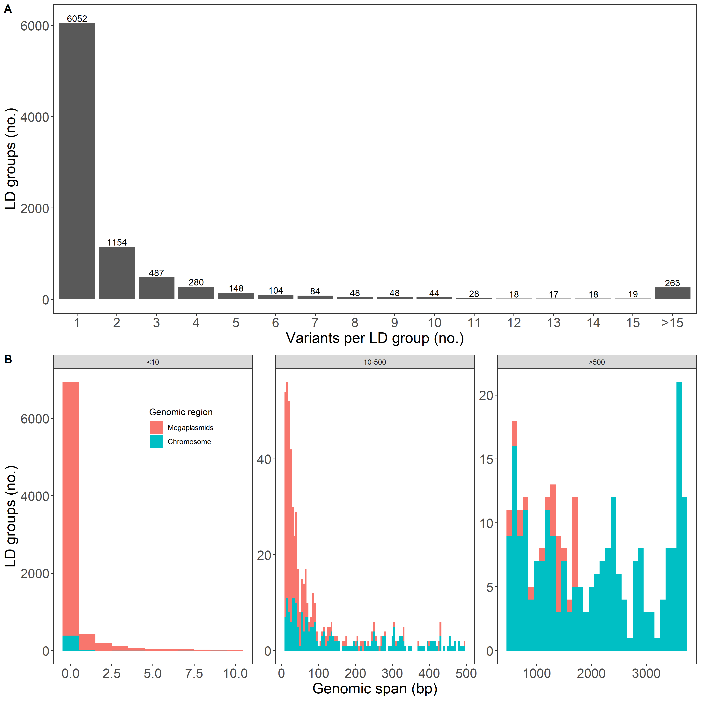

## Setup

```{r setup, include=FALSE}
# global options
knitr::opts_chunk$set(echo = TRUE, warning = FALSE, message = FALSE)

# set working directory
setwd("../../Complex_genetics/GWAS")

# load packages
library("tidyverse") ## includes ggplot2, dplyr, readr, stringr
library("knitr") ## produce the knitted doc
library("cowplot") ## plot_grid function
library("harmonicmeanp") ## calculate harmonic means
```

## LD grouping (a la Epstein et al., 2018)

slurm and shell script located on server:

```{bash LD_groups, eval = FALSE}
## copy of shell script

#!/bin/bash

# Uses plink and vcftools

### Input files:
###     - genome.vcf.gz     Variant calls
###
### Scripts:
###     - vcf2tsv.py
###
###     - ld_grouping_choose_one.py
###
###     - r2_groups_extra_sort  This is a C++ program which you will
###                             need to compile before you can use.
###
### Compiling the C++ program; I recommend compiling the program on the
### cluster, because your own computer may have a different version of
### various supporting libraries:
###
### g++ -o r2_groups_xtra_sort r2_groups_xtra_sort.cpp -Wall -O3 --std=c++11


### SETTINGS
R2=0.95
MIN_MAF=0.05
MAX_MISSING=0.8 # Really means 20% max missingness
MIN_DP=20
MAX_DP=230
MAX_NON_REF=190

MEL_191_LIST="/path/to/strains"
GENOTYPES="/path/to/vcf"
EPSTEIN="/path/to/Epstein_scripts"
VCFTOOLS="path/to/vcftools"

set -euo pipefail

### Separate directory for each r^2 threshold
mkdir -p $R2
cd $R2

### First filter the VCF file using the same settings we are going to
### use for GWAS
$VCFTOOLS --gzvcf $GENOTYPES --stdout --recode --keep $MEL_191_LIST | \
        $VCFTOOLS --vcf - --stdout --recode --max-missing $MAX_MISSING  \
        --maf $MIN_MAF --min-meanDP $MIN_DP --max-meanDP $MAX_DP --max-non-ref-ac-any $MAX_NON_REF > \
        "tmp.vcf" \
    || { echo "filtering vcf failed"; exit 1; }

### Convert filtered VCF file into format for LD group identification
### program.
$EPSTEIN/vcf2tsv.py --het-miss --rs --output "tmp.tsv" \
        "tmp.vcf" \
    || { echo "converting to tsv format failed"; exit 1; }

### Identify LD groups using C++ program
$EPSTEIN/r2_groups_xtra_sort $R2 1 "tmp.tsv" > "tmp.groups.tsv" \
    || { echo "grouping at ${R2} failed"; exit 1; }

### Sort by group and by seed status
head -n 1 "tmp.groups.tsv" > "output.tsv"
tail -n +2 "tmp.groups.tsv" | sort -k 6n,6 -k 7rn,7 >> "output.tsv" \
    || { echo "sorting at ${R2} failed"; exit 1; }

# Choose one variant to represent each group; given the way
# the file is sorted, this will be the variant with the greatest
# number of individuals genotyped, and if there are ties, the
# greatest minor allele frequency. "one_variant.tsv" is used as
# input for the GWAS analysis.
$EPSTEIN/ld_grouping_choose_one.py --output "one_variant.tsv" "output.tsv" \
    || { echo "choosing one variant for ${R2} failed"; exit 1; }

# Eliminate temporary files
rm tmp.*
```

### Linkage group visualization

```{r linkage}
## threshold vals to loop over
LD_thresh <- c(95, 80, 70)

## source the function
source("../Source_code/linkage_func.R")

LD_res <- sapply(LD_thresh, linkage_func,
                 USE.NAMES = TRUE, simplify = FALSE)



# get dfs
## 95
LG_0.95 <- as.data.frame(LD_res[[1]])
LG_0.95$thresh <- "95"
LG_0.95_sel <- LG_0.95 %>%
  filter(seed == 1) %>%
  group_by(chrom) %>%
  summarize(count = n())
## 80
LG_0.80 <- as.data.frame(LD_res[[2]])
LG_0.80$thresh <- "80"
LG_0.80_sel <- LG_0.80 %>%
  filter(seed == 1) %>%
  group_by(chrom) %>%
  summarize(count = n())
## 70
LG_0.70 <- as.data.frame(LD_res[[3]])
LG_0.70$thresh <- "70"
LG_0.70_sel <- LG_0.70 %>%
  filter(seed == 1) %>%
  group_by(chrom) %>%
  summarize(count = n())

## combine LG
LG_all <- rbind(LG_0.95, LG_0.80, LG_0.70)
save(LG_all, file = "./Linkage_analyses/LG_all.Rdata")
```

## Create phenotype file (.fam) for GEMMA (199 - 8 = 191)

Here are the 8 non-Ensifer strains:
285, 476, 486, 522, 557, 702A, 717A, 733B

```{r list_195}
load(file = "../Phenotypic_analyses/Data_output/emmeans.w_Ensifer.Rdata") ## loads emmeans.w_Ensifer

# add MAG to strain_ID
emmeans.w_Ensifer$add <- "MAG"
emmeans.w_Ensifer$strains <- str_c(emmeans.w_Ensifer$add, 
                                   emmeans.w_Ensifer$strain_ID, sep = "", collapse = NULL)
emmeans.w_Ensifer$strains <- as.factor(emmeans.w_Ensifer$strains)

# rename strain to match vcf on server:
emmeans.w_Ensifer$strains <- recode_factor(emmeans.w_Ensifer$strains, 
                                      MAG194 = "MAG194-mel",
                                      MAG758A = "MAG758A-mel")

# scale cols to make .fam file
cols_to_scale<-c("chloro1_DZA_1", "chloro1_A17_2","chloro1_DZA_3","chloro1_A17_4",
                        "height1_DZA_1", "height1_A17_2","height1_DZA_3", "height1_A17_4", 
                        "leaf1_DZA_1",   "leaf1_A17_2","leaf1_DZA_3",      "leaf1_A17_4",
                        "shoot_DZA_1",   "shoot_A17_2","shoot_DZA_3","shoot_A17_4",
                        "nod_DZA_1", "nod_A17_2","nod_DZA_3","nod_A17_4",
                      "nod.weight_DZA_1", "nod.weight_A17_2","nod.weight_DZA_3","nod.weight_A17_4")
emmeans.w191.scaled <- emmeans.w_Ensifer
emmeans.w191.scaled[,cols_to_scale] <- scale(emmeans.w191.scaled[,cols_to_scale])

# save, then create .fam file
write.csv(emmeans.w191.scaled, file="./Data_output/emmeans_scaled_191.csv", row.names = FALSE)

## look at distributions
### convert from wide to long format
emmeans.w191.scaled_long <- gather(emmeans.w191.scaled, key = "traits", value = "em_means",
         chloro1_DZA_1,    chloro1_A17_2,    chloro1_DZA_3,    chloro1_A17_4, 
         height1_DZA_1,   height1_A17_2,    height1_DZA_3,    height1_A17_4,
         leaf1_DZA_1,      leaf1_A17_2,      leaf1_DZA_3,     leaf1_A17_4,
         shoot_DZA_1,      shoot_A17_2,      shoot_DZA_3,      shoot_A17_4,
         nod_DZA_1,      nod_A17_2,        nod_DZA_3,        nod_A17_4,
        nod.weight_DZA_1, nod.weight_A17_2, nod.weight_DZA_3, nod.weight_A17_4,
        chloro.plast_DZA_13, chloro.plast_A17_24,
        height.plast_DZA_13, height.plast_A17_24,
        leaf.plast_DZA_13, leaf.plast_A17_24,
        shoot.plast_DZA_13, shoot.plast_A17_24)

## Density plots with semi-transparent fill
(density_emmeans <- ggplot(emmeans.w191.scaled_long, aes(x=em_means)) + 
  geom_density(alpha=.3) +
  facet_wrap(~ as.factor(traits), ncol = 4, scales = "free") + 
  geom_vline(aes(xintercept=0), linetype="dashed", size=1) +
  theme_bw())

## create .fam file:
emmeans.w191.scaled$V1 <- 0
emmeans.w191.scaled$V2 <- 0
emmeans.w191.scaled$V3 <- 0
emmeans.w191.scaled$strains2 <- emmeans.w191.scaled$strains

## select cols to include:
pheno191 <- emmeans.w191.scaled[,c("strains","strains2","V1","V2","V3",
                                   "chloro1_DZA_1", "chloro1_A17_2","chloro1_DZA_3","chloro1_A17_4",
                        "height1_DZA_1", "height1_A17_2","height1_DZA_3", "height1_A17_4", 
                        "leaf1_DZA_1",   "leaf1_A17_2","leaf1_DZA_3",      "leaf1_A17_4",
                        "shoot_DZA_1",   "shoot_A17_2","shoot_DZA_3","shoot_A17_4",
                        "nod_DZA_1", "nod_A17_2","nod_DZA_3","nod_A17_4",
                      "nod.weight_DZA_1", "nod.weight_A17_2","nod.weight_DZA_3","nod.weight_A17_4",
                      "chloro.plast_DZA_13","chloro.plast_A17_24",
                      "height.plast_DZA_13","height.plast_A17_24",
                      "leaf.plast_DZA_13","leaf.plast_A17_24",
                      "shoot.plast_DZA_13","shoot.plast_A17_24")]

## replace NA's with 0's
pheno191[, 6:37][is.na(pheno191[, 6:37])] <- 0

## save as .fam file
write.table(pheno191, file="./Data_output/phenos191.fam", 
            row.names = FALSE, col.names = FALSE, sep = "\t", quote = FALSE)
```

Phenotypes included in .fam file:

1. chloro1_DZA_1	
2. chloro1_A17_2  
3. chloro1_DZA_3  
4. chloro1_A17_4  
5. height_DZA_1 
6. height_A17_2 
7. height_DZA_3	
8. height_A17_4	
9. leaf_DZA_1	
10. leaf_A17_2	
11. leaf_DZA_3	
12. leaf_A17_4	
13. shoot_DZA_1	
14. shoot_A17_2	
15. shoot_DZA_3	
16. shoot_A17_4	
17. nod_DZA_1	
18. nod_A17_2	
19. nod_DZA_3	
20. nod_A17_4	
21. nod.weight_DZA_1  
22. nod.weight_A17_2	
23. nod.weight_DZA_3	
24. nod.weight_A17_4  
25. chloro.plast_DZA_13 	
26. chloro.plast_A17_24 
27. height.plast_DZA_13 
28. height.plast_A17_24 
29. leaf.plast_DZA_13	
30. leaf.plast_A17_24 
31. shoot.plast_DZA_13  
32. shoot.plast_A17_24  

## Re-filter vcf for all 191 samples

Moved fam file created above unto server first.

Completed on server:

```{bash vcftools_filter, eval = FALSE}
# in directory containing .fam file
cut -f 1 phenos191.fam > strains_191.txt ## creates list of strain names to subset

$vcftools --gzvcf snps_all.vcf.bak --keep strains_191.txt --recode --out subset191
## 191 Individuals
## 816,444 sites

# filter sites based on LD groups:
cut -f 4 sites.tsv > keep_sites.txt

$vcftools --vcf subset191.recode.vcf --snps keep_sites.txt --recode --out subset191_LD
## 191 Individuals
## 8646 sites

####################### chrom #####################################

$vcftools --vcf subset191_LD.recode.vcf --chr chr --recode --out chr_subset191_LD
## 191 Individuals
## 757 sites

####################### psyma #####################################

$vcftools --vcf subset191_LD.recode.vcf --chr psyma --recode --out psyma_subset191_LD
## 191 Individuals
## 3277 sites

####################### psymb #####################################

$vcftools --vcf subset191_LD.recode.vcf --chr psymb --recode --out psymb_subset191_LD
## 191 Individuals
## 4612 sites
```

## Convert vcf to bed for GEMMA

Completed on server:

```{bash vcf_to_bed, eval = FALSE}
####################### chrom #####################################

## all in one step (vcf to bed)
$PLINK --vcf chr_subset191_LD.recode.vcf --recode --make-bed --out "chr_subset191_LD_plink" --allow-extra-chr --allow-no-sex --maf 0.05 --geno --pheno "phenos191.fam"
# 732 variants pass filters
cp phenos191.fam chr_subset191_LD_plink.fam

####################### psyma #####################################

## all in one step (vcf to bed)
$PLINK --vcf psyma_subset191_LD.recode.vcf --recode --make-bed --out "psyma_subset191_LD_plink" --allow-extra-chr --allow-no-sex --maf 0.05 --geno --pheno "phenos191.fam"
## 3077 variants pass filters
cp phenos191.fam psyma_subset191_LD_plink.fam

####################### psymb #####################################

## all in one step (vcf to bed)
$PLINK --vcf psymb_subset191_LD.recode.vcf --recode --make-bed --out "psymb_subset191_LD_plink" --allow-extra-chr --allow-no-sex --maf 0.05 --geno --pheno "phenos191.fam"
## 4493 variants pass filters
cp phenos191.fam psymb_subset191_LD_plink.fam
```

## Relatedness matrix

"-gk 1" calculates the centered relatedness matrix while 
"-gk 2" calculates the standardized relatedness matrix;
Epstein et al 2018 used the gk2 option

Note: need to have the .fam file for it to run: e.g., cp subset89_LD_plink.fam chr_subset89_LD_plink.fam

Completed on server:

```{bash ks_mat, eval = FALSE}
$GEMMA -bfile chr_subset191_LD_plink -gk 2 -o chr_subset191_LD_ksmat ## 703 SNPs analyzed
$GEMMA -bfile psyma_subset191_LD_plink -gk 2 -o psyma_subset191_LD_ksmat ## 2955 SNPs analyzed
$GEMMA -bfile psymb_subset191_LD_plink -gk 2 -o psymb_subset191_LD_ksmat ## 4307 SNPs analyzed
```

## LMM option in GEMMA

If you include multiple phenotypes in the same .fam file, you can use this loop
-n <number> specifies column corresponding to phenotype in .fam file.
Epstein used -lmm option 4, for all three tests, but only reports the liklihood ratio test (-lmm 2)

Completed on server:

```{bash LMM_gemma, eval=FALSE}
# nano run_gemma.sh
for i in {01..32} # or however many numbers of columns (i.e., traits)
do 
  $GEMMA -bfile chr_subset191_LD_plink -k ./output/chr_subset191_LD_ksmat.sXX.txt -lmm 4 -n $i -o chr_subset191_LD_ulmm_trait_$i
  echo "For chr, ran trait_$i through GEMMA"
  
  $GEMMA -bfile psyma_subset191_LD_plink -k ./output/psyma_subset191_LD_ksmat.sXX.txt -lmm 4 -n $i -o psyma_subset191_LD_ulmm_trait_$i
  echo "For psyma, ran trait_$i through GEMMA"
  
   $GEMMA -bfile psymb_subset191_LD_plink -k ./output/psymb_subset191_LD_ksmat.sXX.txt -lmm 4 -n $i -o psymb_subset191_LD_ulmm_trait_$i
  echo "For psymb, ran trait_$i through GEMMA"
done
# nohup bash run_gemma.sh > run_gemma.out &
## only takes a few seconds

# extract pve and se estimates
grep "pve estimate" run_gemma.out > pve_ulmm.txt 
grep "se(pve)" run_gemma.out > se_ulmm.txt 
paste pve_ulmm.txt se_ulmm.txt > pve_se_ulmm.txt

# mv all association files (and logs) in output directory to real/
mv *ulmm* ./real
```

## GEMMA betascores (real runs)

- Only linkage group variants used
- emmeans (32 traits) standardized (same .fam file for all analyses)
- three elements (chr, psyma, psymb), ran separately

Completed on server:

```{r comb_real_runs, eval = FALSE}
# Need to import all relevant GEMMA files (.assoc from actual runs)

############################ nano real_betas.R ##############################################

require("dplyr")
require("purrr")

extract_fun <- function(files){
  traits <- read.table(files,header=T,sep="\t") # read in the file
    return(traits)
}  

files <- list.files(path ="./output/real", pattern=".assoc", full.names = T)
## file order needs to be checked, although should be correct if padding is used (01, 02)

traits <- lapply(files, extract_fun)

## extract positions and beta scores
### traits[c(1:32)] = chrom
### traits[c(33:64)] = psyma
### traits[c(65:96)] = psymb

# chrom
chr_realres <- traits[c(1:32)] %>% 
  reduce(full_join, by = "rs") %>%
  select("rs", starts_with("beta"))

names(chr_realres) <- c("rs",
                        "chloro1_DZA_1", "chloro1_A17_2","chloro1_DZA_3","chloro1_A17_4",
                        "height1_DZA_1", "height1_A17_2","height1_DZA_3", "height1_A17_4", 
                        "leaf1_DZA_1",   "leaf1_A17_2","leaf1_DZA_3",      "leaf1_A17_4",
                        "shoot_DZA_1",   "shoot_A17_2","shoot_DZA_3","shoot_A17_4",
                        "nod_DZA_1", "nod_A17_2","nod_DZA_3","nod_A17_4",
                        "nod.weight_DZA_1", "nod.weight_A17_2","nod.weight_DZA_3","nod.weight_A17_4",
                        "chloro.plast_DZA_13", "chloro.plast_A17_24",
                        "height.plast_DZA_13","height.plast_A17_24",
                        "leaf.plast_DZA_13","leaf.plast_A17_24",
                        "shoot.plast_DZA_13","shoot.plast_A17_24")

save(chr_realres, file="./chr_real_betas.Rdata")
                    
# psyma
psyma_realres <- traits[c(33:64)] %>% 
  reduce(full_join, by = "rs") %>%
  select("rs", starts_with("beta"))


names(psyma_realres) <- c("rs",
                        "chloro1_DZA_1", "chloro1_A17_2","chloro1_DZA_3","chloro1_A17_4",
                        "height1_DZA_1", "height1_A17_2","height1_DZA_3", "height1_A17_4", 
                        "leaf1_DZA_1",   "leaf1_A17_2","leaf1_DZA_3",      "leaf1_A17_4",
                        "shoot_DZA_1",   "shoot_A17_2","shoot_DZA_3","shoot_A17_4",
                        "nod_DZA_1", "nod_A17_2","nod_DZA_3","nod_A17_4",
                        "nod.weight_DZA_1", "nod.weight_A17_2","nod.weight_DZA_3","nod.weight_A17_4",
                        "chloro.plast_DZA_13", "chloro.plast_A17_24",
                        "height.plast_DZA_13","height.plast_A17_24",
                        "leaf.plast_DZA_13","leaf.plast_A17_24",
                        "shoot.plast_DZA_13","shoot.plast_A17_24")

save(psyma_realres, file="./psyma_real_betas.Rdata")

#psymb
psymb_realres <- traits[c(65:96)] %>% 
  reduce(full_join, by = "rs") %>%
  select("rs", starts_with("beta"))
 
 names(psymb_realres) <- c("rs",
                        "chloro1_DZA_1", "chloro1_A17_2","chloro1_DZA_3","chloro1_A17_4",
                        "height1_DZA_1", "height1_A17_2","height1_DZA_3", "height1_A17_4", 
                        "leaf1_DZA_1",   "leaf1_A17_2","leaf1_DZA_3",      "leaf1_A17_4",
                        "shoot_DZA_1",   "shoot_A17_2","shoot_DZA_3","shoot_A17_4",
                        "nod_DZA_1", "nod_A17_2","nod_DZA_3","nod_A17_4",
                        "nod.weight_DZA_1", "nod.weight_A17_2","nod.weight_DZA_3","nod.weight_A17_4",
                        "chloro.plast_DZA_13", "chloro.plast_A17_24",
                        "height.plast_DZA_13","height.plast_A17_24",
                        "leaf.plast_DZA_13","leaf.plast_A17_24",
                        "shoot.plast_DZA_13","shoot.plast_A17_24")
 
save(psymb_realres, file="./psymb_real_betas.Rdata") 

# then, run in background
nohup Rscript real_betas.R > real_betas.out & ## takes a few seconds
```

## Permutation test

### Randomize phenotypes

Use same phenotypes file as before, but shuffle values within each phenotype col for each phenotype, and produce 1000 shuffled sets.

Completed on server:

```{r random, eval=FALSE}

################################ nano pheno_rand.R ########################################################

# randomize .fam file
phenotypes <- read.delim("./phenos191.fam", header=FALSE)

# create a function to randomize phenotype file
random_phenos <- function(df, x){
  
    # randomize each col, excluding first (sample_IDs):
    rnd <- lapply(phenotypes[,6:37], sample)  ## make sure you double check range
    # bind randomize cols
    rnd_df <- as.data.frame(rnd) 
    # format for GEMMA (.fam file), and save:
    phenotypes_rnd <- cbind(phenotypes[,c(1:5)],rnd_df) 
    
    # write-out random .fam files:
    write.table(phenotypes_rnd,file=paste0('./output/perm/','chr_phenotype_rnd',x,'.fam'), 
                 quote=FALSE, row.names=FALSE,col.names=FALSE,sep="\t")
    write.table(phenotypes_rnd,file=paste0('./output/perm/','psyma_phenotype_rnd',x,'.fam'), 
                 quote=FALSE, row.names=FALSE,col.names=FALSE,sep="\t")
    write.table(phenotypes_rnd,file=paste0('./output/perm/','psymb_phenotype_rnd',x,'.fam'), 
                 quote=FALSE, row.names=FALSE,col.names=FALSE,sep="\t")
}
# create 1000 randomized phenotype files:
random <- lapply(1:1000, random_phenos, df = phenotypes) 

# run in bg
nohup Rscript pheno_rand.R > pheno_rand.out &
```

### GEMMA permutations 

Need names of all file inputs to match.

Completed on server:

```{bash GEMMA_make_beds, eval=FALSE}
# executed directly from the pleiotropy directory
## nano make_beds.sh

for i in {1..1000} 
do 
   # for chrom
   cp ./chr_subset191_LD_plink.bed ./output/perm/chr_phenotype_rnd$i.bed 
   cp ./chr_subset191_LD_plink.bim ./output/perm/chr_phenotype_rnd$i.bim
   # for psyma
   cp ./psyma_subset191_LD_plink.bed ./output/perm/psyma_phenotype_rnd$i.bed 
   cp ./psyma_subset191_LD_plink.bim ./output/perm/psyma_phenotype_rnd$i.bim 
   # for psymb
   cp ./psymb_subset191_LD_plink.bed ./output/perm/psymb_phenotype_rnd$i.bed 
   cp ./psymb_subset191_LD_plink.bim ./output/perm/psymb_phenotype_rnd$i.bim 
done

## bash make_beds.sh directly from terminal, only takes 1-2 mins
```

Then, run the permutations.

Completed on server:

```{bash GEMMA_perm, eval=FALSE}
# executed from pleiotropy: nano run_gemma_random.sh
for (( i = 1; i <= 1000; i++ ));      ### Outer for loop, rnd phenotypes ###
do

    for j in {01..32}; ### Inner for loop, specify number of traits ###
    do
       $GEMMA -bfile ./output/perm/chr_phenotype_rnd$i -k ./output/chr_subset191_LD_ksmat.sXX.txt -lmm 4 -n $j -o ./perm/chr_phenotype_rnd${i}_lmm_trait${j}
	### Make sure this code is the exact same used for the actual data, except for the -bfile and output names ###

      $GEMMA -bfile ./output/perm/psyma_phenotype_rnd$i -k ./output/psyma_subset191_LD_ksmat.sXX.txt -lmm 4 -n $j -o ./perm/psyma_phenotype_rnd${i}_lmm_trait${j}
	### Make sure this code is the exact same used for the actual data, except for the -bfile and output names ###	

      $GEMMA -bfile ./output/perm/psymb_phenotype_rnd$i -k ./output/psymb_subset191_LD_ksmat.sXX.txt -lmm 4 -n $j -o ./perm/psymb_phenotype_rnd${i}_lmm_trait${j}
	### Make sure this code is the exact same used for the actual data, except for the -bfile and output names ###	
    done
done

## sbatch run_gemma_perms.slurm
## took just over 16 hrs

# 32 traits X 3 genomic elements X 1000 iterations = 96000

## Once it's fully run (expected 96000 assoc. files), extract pve and se estimates
grep "pve estimate" run_gemma_perms_1841451.log > pve_ulmm_random.txt
grep "se(pve)" run_gemma_perms_1841451.log > se_ulmm_random.txt
paste pve_ulmm_random.txt se_ulmm_random.txt > pve_se_ulmm_random.txt
```

Move perms into directories for each trait.

Completed on server:

```{bash gemma_perm_trait_dirs, eval = FALSE}
# within ./output/perm: Move perms into trait directories: nano trait_directories.sh
for i in {01..32};
do
  mkdir trait_${i}/
  mv *trait${i}.* ./trait_${i}/
done
## nohup bash trait_directories.sh & (takes ~10 mins)
```

### Merge outputs from perm test (on server)

Completed on server:

```{bash perm_merge, eval=FALSE}
# from ./output/perm directory:
# nano merge_betas.sh
while read region; do
  i=0
  for x in {01..32};
  do
     cd trait_${x}/
     cut -f 2 ${region}_phenotype_rnd1_lmm_trait${x}.assoc.txt > ${region}_delim_us ## extract rs from file
     (head -n 1 ${region}_delim_us && tail -n +2 ${region}_delim_us | sort) > ${region}_delim_s ## sort by position, excluding header
  for file in ${region}_*.assoc.txt
  do
     i=$(($i+1))
     (head -n 1 ${file} && tail -n +2 ${file} | sort -k 2) | cut -f 8 > ${file}_${i}.temp ## sort betas by ps, excluding header, cut betas
  done
  paste -d\\t ${region}_delim_s *.temp > ${region}_perm_comb_trait${x}.tsv ## add back in rs (sorted the same way)
  rm *.temp
  cd ../ ## get out of trait directory
  mv ./trait_${x}/${region}_perm_comb_trait${x}.tsv ./ ## move combined beta file to perm directory
  echo "merged perms for trait ${x} for ${region}"
  done
done < regions.list

## nohup bash merge_betas.sh > merge_betas.out &
### Takes about 5 mins

## if not there already, add leading zero in trait name (nano add_zero.sh):
for a in [0-9]*.tsv; do
    mv $a `printf %02d.%s ${a%.*} ${a##*.}`
done
```

## findinterval method for checking whether betas fall outside the distribution

Completed on server:

```{r find_interval, eval = FALSE}
# from directory with files:
chr_realres
psyma_realres
psymb_realres

# need to make a separate script for each region

################################# nano chr_sig.R ###########################################################

# load the realbetas for the chromosome
load(file="./chr_real_betas.Rdata") ## loads chr_realres

# make sure realres object is sorted the same way as sims
sims.rs <- read.csv("./output/perm/chr_perm_comb_trait01.tsv",sep="\t",header=T)$rs
sortindex <- sapply(sims.rs,function(z) which(chr_realres$rs == z))
realres.rs <- chr_realres[sortindex,] 

# Import GEMMA association files from permutations:
files <- list.files(path ="./output/perm", pattern="chr_perm_comb_", 
                    full.names = T) ## file order needs to be specified unless leading zero added

betacols.realres <- c(2:33) ## specify traits
colnames(realres.rs[betacols.realres]) ## double check this
realsnpsBETAS <- realres.rs[,betacols.realres]
realintFull <- matrix(NA,ncol=32,nrow=703) ## need to look up number of vars (str(chr_realres))
for(i in 1:32){
	permut <- read.table(files[i],header=T,sep="\t") #read in the file
	realintFull[,i] <- sapply(1:nrow(realres.rs), function(z) 
			findInterval(realsnpsBETAS[ z,i ],sort(permut[z,-1]))/1000 
			)
}	

# Does real data exceed 5% cuttoff?
realsigFull <- (realintFull > 0.975 | realintFull < 0.025)
colSums(realsigFull)
data.frame(trait = colnames(realres.rs[betacols.realres]) , snps = colSums(realintFull > 0.975 | realintFull < 0.025))

dfFIsig <- data.frame(realsigFull)
colnames(dfFIsig) <- paste(colnames(realres.rs[betacols.realres]),".FIsig",sep="")
realres.psFIsig <- cbind(realres.rs,dfFIsig)
save(realres.psFIsig, file = "./chr_betasigs.Rdata")

## sbatch chr_sig.slurm 
## took ~ 10 mins

########################## nano psyma_sig.R ##################################################################

# load the realbetas for the psymA
load(file="./psyma_real_betas.Rdata") ## loads psyma_realres

# make sure realres object is sorted the same way as sims
sims.rs <- read.csv("./output/perm/psyma_perm_comb_trait01.tsv",sep="\t",header=T)$rs
sortindex <- sapply(sims.rs,function(z) which(psyma_realres$rs == z))
realres.rs <- psyma_realres[sortindex,] 

# Import GEMMA association files from permutations:
files <- list.files(path ="./output/perm", pattern="psyma_perm_comb_", 
                    full.names = T) ## file order needs to be specified

betacols.realres <- c(2:33) ## specify trait cols
colnames(realres.rs[betacols.realres]) ## double check this
realsnpsBETAS <- realres.rs[,betacols.realres]
realintFull <- matrix(NA,ncol=32,nrow=2955) ## need to look up number of vars
for(i in 1:32){
	permut <- read.table(files[i],header=T,sep="\t") #read in the file
	realintFull[,i] <- sapply(1:nrow(realres.rs), function(z) 
			findInterval(realsnpsBETAS[ z,i ],sort(permut[z,-1]))/1000 
			)
}	

# Does real data exceed 5% cuttoff?
realsigFull <- (realintFull > 0.975 | realintFull < 0.025)
colSums(realsigFull)
data.frame(trait =colnames(realres.rs[betacols.realres]) , snps = colSums(realintFull > 0.975 | realintFull < 0.025))

dfFIsig <- data.frame(realsigFull)
colnames(dfFIsig) <- paste(colnames(realres.rs[betacols.realres]),".FIsig",sep="")
realres.psFIsig <- cbind(realres.rs,dfFIsig)
save(realres.psFIsig, file = "./psyma_betasigs.Rdata")

## sbatch psyma_sig.slurm 
## took ~ 46 mins

##################################### nano psymb_sig.R ###################################################

# load the realbetas for the psymB
load(file="./psymb_real_betas.Rdata") ## loads psymb_realres

# make sure realres object is sorted the same way as sims
sims.rs <- read.csv("./output/perm/psymb_perm_comb_trait01.tsv",sep="\t",header=T)$rs
sortindex <- sapply(sims.rs,function(z) which(psymb_realres$rs == z))
realres.rs <- psymb_realres[sortindex,] 

# Import GEMMA association files from permutations:
files <- list.files(path ="./output/perm", pattern="psymb_perm_comb_", 
                    full.names = T) ## file order needs to be specified

betacols.realres <- c(2:33) ## specify trait cols
colnames(realres.rs[betacols.realres]) ## double check this
realsnpsBETAS <- realres.rs[,betacols.realres]
realintFull <- matrix(NA,ncol=32,nrow=4308) ## need to look up number of vars
for(i in 1:32){
	permut <- read.table(files[i],header=T,sep="\t") #read in the file
	realintFull[,i] <- sapply(1:nrow(realres.rs), function(z) 
			findInterval(realsnpsBETAS[ z,i ],sort(permut[z,-1]))/1000 
			)
}	

# Does real data exceed 5% cuttoff?
realsigFull <- (realintFull > 0.975 | realintFull < 0.025)
colSums(realsigFull)
data.frame(trait =colnames(realres.rs[betacols.realres]) , snps = colSums(realintFull > 0.975 | realintFull < 0.025))

dfFIsig <- data.frame(realsigFull)
colnames(dfFIsig) <- paste(colnames(realres.rs[betacols.realres]),".FIsig",sep="")
realres.psFIsig <- cbind(realres.rs,dfFIsig)
save(realres.psFIsig, file = "./psymb_betasigs.Rdata")

## sbatch psymb_sig.slurm
## took ~ 1hr, 5 mins

## scp'ed .Rdata files to ./Data_input/betasigs_29Mar2021/
```

## Add gene annotations and predicted effects

### Use bedtools to get annotations (var set inputted into GEMMA)

Note: there is a diff btw GCA (genbank) and GCF (Refseq). All calls were made on GCA.

Completed on server:

```{bash bedtools, eval = FALSE}
# from /projects/sib/labs/kheath/Ensifer_pleiotropy directory:
# get annotation GFF file
wget ftp://ftp.ncbi.nlm.nih.gov/genomes/genbank/bacteria/Sinorhizobium_meliloti/latest_assembly_versions/GCA_002197065.1_ASM219706v1/GCA_002197065.1_ASM219706v1_genomic.gff.gz
gunzip GCA_002197065.1_ASM219706v1_genomic.gff.gz

# needed to rename regions in vcf and gff files to match:
sed 's/\bCP021798.1\b/psyma/g; s/\bCP021799.1\b/psymb/g' GCA_002197065.1_ASM219706v1_genomic.gff > annot_gff3
sed 's/\bchr\b/CP021797.1/g' subset191_LD.recode.vcf > GWAS_vcf

# Gene names for each variant (from gwas directory)
## first, check number of fields in intersect:
$BEDTOOLS intersect -loj -a GWAS_vcf -b annot_gff3 -wb > intersect.out
head -1 intersect.out | awk '{ print NF}'
## 209
## then, work backwards to get info and field:
cut -f 1-3,201-205,209 intersect.out > genes.txt
## extracted region, ps, ID, field, and info
  
# scp'ed to ./Data_output/vcf_annotations_29Mar2021
```

### Annotate genes in SNP file

```{r ann_ncbi}
# add in gene products
func <- read.delim("./Data_input/vcf_annotations_29Mar2021/genes.txt", header=FALSE) ## note, tsv only imported half the file
## rename column POS to ps to merge
colnames(func) <- c("CHROM","ps","rs","field","start_pos","end_pos","info")

# filter to CDS and extract info fields
func.f <- func %>%
  filter(field == "CDS") %>%
  droplevels(.) %>%
  mutate(RefSeq_ID = sub(".*RefSeq: *(.*?) *;.*", "\\1", info),
         protein_ID = sub(".*protein_id= *(.*?) *;.*", "\\1", info),
         gene_ID = sub(".*locus_tag= *(.*?) *;.*", "\\1", info),
         gene_name = sub(".*gene= *(.*?) *;.*", "\\1", info),
         ncbi_func = sub(".*product= *(.*?) *;.*", "\\1", info))

## replace long string with NA
func.f$RefSeq_ID <- ifelse(!grepl("RefSeq:", func.f$info, fixed = FALSE),NA, 
                        func.f$RefSeq_ID)
func.f$protein_ID <- ifelse(!grepl("protein_id=", func.f$info, fixed = FALSE),NA,
                         func.f$protein_ID)
func.f$gene_ID <- ifelse(!grepl("locus_tag=", func.f$info, fixed = FALSE),NA, 
                      func.f$gene_ID)
func.f$gene_name <- ifelse(!grepl("gene=", func.f$info, fixed = FALSE),NA, 
                        func.f$gene_name)
func.f$ncbi_func <- ifelse(!grepl("product=", func.f$info, fixed = FALSE),NA, 
                        func.f$ncbi_func)
func.f$rs <- str_replace(func.f$rs, "CP021797.1", "chr")
func.f$CHROM <- str_replace(func.f$CHROM, "CP021797.1", "Chromosome")

## get rid of unwanted cols
funcs <- func.f %>%
  select(-info)

save(funcs, file = "./Data_output/gene_functions.Rdata")
```

### Add in predicted SNP effects (snpEff)

First, need to build database in SnpEff.

Completed on server:

```{bash build_snpEff, eval = FALSE}
wget http://sourceforge.net/projects/snpeff/files/snpEff_latest_core.zip
# unzip
cd snpEff

# check to see what genomes are already in the database:
java -jar snpEff.jar databases | grep -i Sinorhizobium_meliloti
# found 1021, but not usda1106 Had to build my own...

# build database using GFF (GTF preferred, but not available for usda1106)
mkdir path/to/snpEff/data/Sinorhizobium_meliloti_usda1106
cd path/to/snpEff/data/Sinorhizobium_meliloti_usda1106
wget https://ftp.ncbi.nlm.nih.gov/genomes/all/GCF/002/197/065/GCF_002197065.1_ASM219706v1/GCF_002197065.1_ASM219706v1_genomic.gff.gz
mv GCF_002197065.1_ASM219706v1_genomic.gff.gz genes.gff.gz 
# note: renaming to genes.gff.gz is essential

# Get the genome
cd /path/to/snpEff/data/Sinorhizobium_meliloti_usda1106
wget https://ftp.ncbi.nlm.nih.gov/genomes/all/GCF/002/197/065/GCF_002197065.1_ASM219706v1/GCF_002197065.1_ASM219706v1_genomic.fna.gz
mv GCF_002197065.1_ASM219706v1_genomic.fna.gz sequences.fa.gz
# needs to match name of directory in data/, fa and not fna!

# Add the new genome to the config file
cd path/to/snpEff/
nano snpEffect.config 
# Sinorhizobium genome, version usda1106
Sinorhizobium_meliloti_usda1106.genome : Sinorhizobium_meliloti_usda1106

#create database
java -jar snpEff.jar build -gtf22 -v Sinorhizobium_meliloti_usda1106
```

### Use SnpEff to get annotations

Note: genomic regions in annotation and genome files from database do not match vcf, so have to change the input vcf before proceeding

Completed on server:

```{bash vcf_annotate_snpEff, eval = FALSE}
# /projects/sib/labs/kheath/Ensifer_pleiotropy:
sed 's/\bchr\b/CP021797.1/g; s/\bpsyma\b/CP021798.1/g; s/\bpsymb\b/CP021799.1/g' subset191_LD.recode.vcf > GWAS_vcf_snpEff

# up/downstream 1000:
java -Xmx4g -jar $SNPEFF -v Sinorhizobium_meliloti_usda1106 -s 'subset191_LD.ann1000.html' -ud 1000 GWAS_vcf_snpEff > subset191_LD.ann1000.vcf

# immediate area:
java -Xmx4g -jar $SNPEFF -v Sinorhizobium_meliloti_usda1106 -s 'subset191_LD.ann.html' -ud 0 GWAS_vcf_snpEff > subset191_LD.ann.vcf

# summarize vcf to table
$GATK VariantsToTable -V subset191_LD.ann.vcf -F CHROM -F POS -F REF -F ALT -F QUAL -F ANN -GF GT -O subset191_LD.ann.table ## note fields AF and DP not calculated

# scp'ed summary files over: 
```

## Merge results (updated vcf w/ 191 strains)

```{r merge_results}
## chromosome first
load("./Data_input/betasigs_29Mar2021/chr_betasigs.Rdata") ## realres.psFIsig
chr_sigs <- realres.psFIsig
chr_sigs$region <- "Chromosome"

## psyma
load("./Data_input/betasigs_29Mar2021/psyma_betasigs.Rdata") ## realres.psFIsig
psyma_sigs <- realres.psFIsig
psyma_sigs$region <- "pSymA"

## psymb
load("./Data_input/betasigs_29Mar2021/psymb_betasigs.Rdata") ## realres.psFIsig
psymb_sigs <- realres.psFIsig
psymb_sigs$region <- "pSymB"

## combine altogether:
SNPs_comb <- rbind(chr_sigs, psyma_sigs, psymb_sigs)
SNPs_comb$ps <- sapply(strsplit(as.character(SNPs_comb$rs), split="-"), "[", 4)
## 7965 SNPs

## add in snpEff info:
VCF_ann <- read.delim("./Data_input/vcf_annotations_29Mar2021/subset191_LD.ann.TABLE")
## extract gene, impact, function from snpEff annotation
VCF_ann$ANN <- as.character(VCF_ann$ANN)
VCF_ann <- separate(data = VCF_ann, col = ANN, into = c("allele", "effect","impact","gene_name","feature_type"), sep = "\\|")
## create rs
VCF_ann$region <- ifelse(VCF_ann$CHROM == "NZ_CP021797.1", "chr", ifelse(VCF_ann$CHROM == "NZ_CP021798.1", "psyma","psymb"))
VCF_ann$add1 <- "freebayes"
VCF_ann$add2 <- "snp"
VCF_ann$rs <- str_c(VCF_ann$add1, VCF_ann$add2, VCF_ann$region, VCF_ann$POS,VCF_ann$ALT,sep = "-", collapse = NULL)
## combine
SNPs_vcf_ann <- left_join(SNPs_comb, VCF_ann[,c("rs","effect","impact","gene_name","feature_type","ALT","REF")], by = "rs")
## 7965 SNPs

## get MAF, minor allele, et c., from GEMMA
chr_GEMMA_info <- read.delim("./Data_input/betasigs_29Mar2021/chr_subset191_LD_ulmm_trait_01.assoc.txt")
psyma_GEMMA_info <- read.delim("./Data_input/betasigs_29Mar2021/psyma_subset191_LD_ulmm_trait_01.assoc.txt")
psymb_GEMMA_info <- read.delim("./Data_input/betasigs_29Mar2021/psymb_subset191_LD_ulmm_trait_01.assoc.txt")
GEMMA_info <- rbind(chr_GEMMA_info, psyma_GEMMA_info, psymb_GEMMA_info)

SNPs <- full_join(SNPs_vcf_ann, GEMMA_info[,c("rs","allele1", "allele0", "af")], by = "rs")
## 7965 SNPs

## include minor allele state: whether it's ALT or REF
SNPs$ma_state <- ifelse(SNPs$ALT == SNPs$allele1, "ALT", "REF")
SNPs$ma_state <- as.factor(SNPs$ma_state)

### add in gene products
load(file = "./Data_output/gene_functions.Rdata") # loads funcs

## match info
SNPs$start_pos <- funcs$start_pos[match(SNPs$rs, funcs$rs)]
SNPs$end_pos <- funcs$end_pos[match(SNPs$rs, funcs$rs)]
SNPs$ncbi_func <- funcs$ncbi_func[match(SNPs$rs, funcs$rs)]
SNPs$RefSeq_ID <- funcs$RefSeq_ID[match(SNPs$rs, funcs$rs)]
SNPs$protein_ID <- funcs$protein_ID[match(SNPs$rs, funcs$rs)]
SNPs$gene_ID <- funcs$gene_ID[match(SNPs$rs, funcs$rs)]

## replace na in NCBI fun with non-coding
SNPs$ncbi_func[is.na(SNPs$ncbi_func)] <- "non-coding"

## code region as factor
SNPs$region <- factor(SNPs$region, levels = c("Chromosome","pSymA","pSymB"))

## save
save(SNPs, file = "./Data_output/SNPs.Rdata")
write.csv(SNPs, "./Data_output/SNPs_wide.csv", row.names = FALSE)
```

## Convert from wide to long (GEMMA only)

```{r wide_long}
# load dataset
load(file = "./Data_output/SNPs.Rdata") ## loads SNPs

## select cols for mapping paper
SNPs_mapping <- SNPs %>%
  #select(-starts_with("nod")) %>%
  droplevels(.)

# create long version of GEMMA_vars_sig
rownames(SNPs_mapping) <- SNPs_mapping[,1] ## name rows by position

# use gather to convert wide to long
SNPs_long.1 <- SNPs_mapping %>% 
  gather(betas, scores, c(2:33)) %>% ## gather betas
  mutate(rs_betas = paste(rs, betas, sep="_")) %>%
  select(-ends_with(".FIsig"))

SNPs_long.2 <- SNPs_mapping %>% 
  gather(betas, sig, c(34:65)) %>% ## gather sigs
  mutate(rs_betas = paste(rs, betas, sep="_")) %>%
  select(rs_betas, sig)

SNPs_long.2$rs_betas <- str_replace(SNPs_long.2$rs_betas, ".FIsig", "")

# merge into one, getting rid of redundant cols
SNPs_long1 <- full_join(SNPs_long.1, SNPs_long.2, by = "rs_betas")

# Rename cols
colnames(SNPs_long1)[colnames(SNPs_long1)=="betas"] <- "assoc"

# split into trait and env
SNPs_long1.s <- separate(data = SNPs_long1, 
                            col = assoc, into = c("trait","line","exp"), sep = "\\_", remove = FALSE)

# format cols, add line
SNPs_long1.s$ps <- as.numeric(SNPs_long1.s$ps)
SNPs_long1.s <- SNPs_long1.s %>% 
  unite(col = line_exp, c("line","exp"),sep = "-", remove = FALSE)
SNPs_long1.s$line_exp <- factor(SNPs_long1.s$line_exp, 
                                    levels = c("DZA-1","A17-2","DZA-3","A17-4",
                                               "DZA-13","A17-24"))

# get rid of unwanted cols
SNPs_long <- SNPs_long1.s[ , -which(names(SNPs_long1.s) %in% c("rs_betas"))]

## add in direction:
SNPs_long$dir <- ifelse(SNPs_long$scores > 0, "+", 
                        ifelse(SNPs_long$scores == 0, "0", "-"))

## assoc
SNPs_long$assoc <- paste0(SNPs_long$trait,SNPs_long$dir,"(",SNPs_long$line_exp,")")

## save
save(SNPs_long, file = "./Data_output/SNPs_long.Rdata")

################################## filter only sig SNPs ########################################
SNPs_sig_long <- SNPs_long %>%
  filter(sig == TRUE) %>%
  droplevels(.) %>%
  select(-sig)

# save
write.csv(SNPs_sig_long, file = "./Data_output/SNPs_ann_effect.csv", row.names = FALSE)
save(SNPs_sig_long, file = "./Data_output/SNPs_sig_long.Rdata")
```

## Response to referees (Invited editor, mBio)

Obtained qq-plot script from:
https://genome.sph.umich.edu/wiki/Code_Sample:_Generating_QQ_Plots_in_R

Obtained harmonic mean p scripts from:
https://cran.r-project.org/web/packages/harmonicmeanp/vignettes/harmonicmeanp.html

### Univariate LMMs

1) direct FDR or Bonferroni applied to the 7,965 individual p-values from GEMMA. 
2) a strategy to increase the power of Bonferroni correction by combining GEMMA p-values at the gene or chromosome level using the harmonic mean p-value
4) Multivariate GWAS as implemented through GEMMA could also help - biomass under the four combinations of plant line and experiment would be the four outcome variables.

```{r response}
## create functions to iterate across traits (DZA_1, A17_2, DZA_3, A17_4, shoot_MV)
nums.list <- c(str_pad(1:24, 2, pad = "0"),
               "chloro1","height1","leaf1","shoot","nod","nod.weight")
traits.list <- c(rep("chloro",4),rep("height",4),
                 rep("leaf",4),rep("shoot",4), 
                 rep("nod",4),rep("nod_weight",4),
                 "chloro1","height1","leaf1","shoot","nod","nod.weight")
exps.list <- c(rep(c("DZA_1", "A17_2", "DZA_3", "A17_4"),6), rep("MV",6))
traits_exps.list <- paste0(traits.list, "-", exps.list)

### for each trait (e.g., shoot, cholor), combine associations across genomic regions
source('../Source_code/comb_func.R')
comb_out <- mapply(FUN = comb_func,
                   traits_exps = traits_exps.list, 
                   traits = traits.list, 
                   nums = nums.list, 
                   USE.NAMES = TRUE)

## qq_plots for each trait
source('../Source_code/qq_func.R')
qq_out <- sapply(FUN = qq_func,
                 traits_exps.list, 
                 USE.NAMES = TRUE, 
                 simplify = FALSE)

## calculate harmonic means
source('../Source_code/manhattan_func.R')
manhattan_out <- sapply(FUN = manhattan_func,
                        traits_exps.list,
                        USE.NAMES = TRUE,
                        simplify = FALSE)

## correlate betas and p-vals (LRT)
source('../Source_code/corr_func.R')
corr_out <- sapply(FUN = corr_func,
                        traits_exps.list,
                        USE.NAMES = TRUE,
                        simplify = FALSE)

### save corrplots just for shoot:
comb <- plot_grid(corr_out[["shoot-DZA_1"]], corr_out[["shoot-DZA_3"]],
                  corr_out[["shoot-A17_2"]], corr_out[["shoot-A17_4"]],
                  ncol = 2,
                  nrow = 2,
                  align = "hv")

save_plot("./Data_input/betasigs_29Mar2021/plots/shoot_beta_pval_corrs.png",
          comb,
          ncol = 2, # we're saving a grid plot of 2 columns
          nrow = 2, # and 3 rows
          # each individual subplot should have an aspect ratio of 1.3
          base_aspect_ratio = 2
          )
                       
## save plots (univariate)
traits.list <- c("chloro","height","leaf","shoot","nod","nod_weight")

sapply(traits.list, function(traits){
  
  ## print traits
  print(paste0(traits))
  
  comb <- plot_grid(qq_out[[paste0(traits, "-DZA_1")]],
                    manhattan_out[[paste0(traits,"-DZA_1")]],
                    qq_out[[paste0(traits, "-DZA_3")]], 
                    manhattan_out[[paste0(traits, "-DZA_3")]],
                    qq_out[[paste0(traits, "-A17_2")]], 
                    manhattan_out[[paste0(traits, "-A17_2")]],
                    qq_out[[paste0(traits, "-A17_4")]], 
                    manhattan_out[[paste0(traits, "-A17_4")]],
                    ncol = 2,
                    nrow = 4,
                    align = "hv",
                    rel_widths = c(0.5,1)
                    )

  save_plot(paste0("./Data_input/betasigs_29Mar2021/plots/", traits, ".pdf"),
          comb,
          ncol = 2, # we're saving a grid plot of 2 columns
          nrow = 4, # and 3 rows
          # each individual subplot should have an aspect ratio of 1.3
          base_aspect_ratio = 2
          )
  
})

### Multivariate LMMs
## create functions to iterate across traits
traits.list <- c("chloro","height","leaf","shoot","nod","nod_weight")

## save plots (multivariate)
sapply(traits.list, function(traits){
  
  ## print traits
  print(paste0(traits))
  
  comb <- plot_grid(qq_out[[paste0(traits,"-MV")]], manhattan_out[[paste0(traits,"-MV")]],
                        ncol = 2,
                        nrow = 1,
                        align = "h",
                        rel_widths = c(0.5,1))

  save_plot(paste0("./Data_input/betasigs_29Mar2021/plots/", traits, "_MV.pdf"),
          comb,
          ncol = 2, # we're saving a grid plot of 2 columns
          nrow = 1, # and 3 rows
          # each individual subplot should have an aspect ratio of 1.3
          base_aspect_ratio = 2
          )
})

## combined UV and MV for shoot
comb <- plot_grid(qq_out[["shoot-DZA_1"]], manhattan_out[["shoot-DZA_1"]],
                    qq_out[["shoot-DZA_3"]], manhattan_out[["shoot-DZA_3"]],
                    qq_out[["shoot-A17_2"]], manhattan_out[["shoot-A17_2"]],
                    qq_out[["shoot-A17_4"]], manhattan_out[["shoot-A17_4"]],
                    qq_out[["shoot-MV"]], manhattan_out[["shoot-MV"]],
                    ncol = 2,
                    nrow = 5,
                    align = "hv",
                    rel_widths = c(0.5,1)
                    )

comb2 <- plot_grid(qq_out[["shoot-MV"]], manhattan_out[["shoot-MV"]],
                        ncol = 2,
                        nrow = 1,
                        align = "h",
                        rel_widths = c(0.5,1))

comb <- plot_grid(comb1, comb2,
                  ncol = 1,
                  nrow = 2,
                  rel_heights = c(1,0.5),
                  align = "v")

save_plot("./Data_input/betasigs_29Mar2021/plots/shoot_UV-MV.pdf",
          comb,
          ncol = 2, # we're saving a grid plot of 2 columns
          nrow = 5, # and 3 rows
          # each individual subplot should have an aspect ratio of 1.3
          base_aspect_ratio = 1.3
          )
```

### Compare Multivariate sig calls and permutation method (per genomic region)

```{r comp_sig}
## load beta values
load("./Data_input/betasigs_29Mar2021/chr_betasigs.Rdata") ## realres.psFIsig
chr <- realres.psFIsig

## link up gene and var-level information
var <- read_csv("./Data_output/Var-lvl_summaries/SNPs_ann_ps_height1.csv")
gene <- read_csv("./Data_output/Gene-lvl_summaries/genes_height1.csv")

## match info
chr <- left_join(chr, var[,c("rs","RefSeq_ID")], by = "rs")
chr <- left_join(chr, gene[,c("RefSeq_ID","cat")], by = "RefSeq_ID")


## for each of three genomic regions:
traits.list <- c(rep("chloro1",3),rep("height1",3),rep("leaf1",3),rep("shoot",3))
regions.list <- c(rep(c("chr","psyma","psymb"),4))
traits_regions.list <- paste0(traits.list,"_",regions.list)

## run functions
source('../Source_code/comp.sigs_func.R')
comp.sigs_out <- mapply(FUN = comp.sigs_func,
                        traits_regions = traits_regions.list,
                        traits = traits.list,
                        regions = regions.list,
                        USE.NAMES = TRUE)

source('../Source_code/corr.plot_func.R')
corr.plot_out <- mapply(FUN = corr.plot_func,
                        traits_regions = traits_regions.list,
                        traits = traits.list,
                        USE.NAMES = TRUE)

source('../Source_code/manhattan.plot_func.R')
manhattan.plot_out <- mapply(FUN = manhattan.plot_func,
                             traits_regions = traits_regions.list,
                             traits = traits.list,
                             USE.NAMES = TRUE)
                      
## create functions to iterate across traits
traits.list <- c("chloro1","height1","leaf1","shoot")

## save plots (multi vs univariate)
sapply(traits.list, function(traits){
  
  ## print traits
  print(paste0(traits))
  
  comb <- plot_grid(corr.plot_out[[paste0(traits, "_chr")]], manhattan.plot_out[[paste0(traits, "_chr")]],
                    corr.plot_out[[paste0(traits, "_psyma")]], manhattan.plot_out[[paste0(traits, "_psyma")]],
                    corr.plot_out[[paste0(traits, "_psymb")]], manhattan.plot_out[[paste0(traits, "_psymb")]],
                        ncol = 2,
                        nrow = 3,
                        align = "hv",
                        rel_widths = c(0.5,1))
  
  save_plot(paste0("./Data_input/betasigs_29Mar2021/plots/", traits, "_MV_vs_UV.pdf"),
            comb,
            ncol = 2, # we're saving a grid plot of 2 columns
            nrow = 3, # and 3 rows
            # each individual subplot should have an aspect ratio of 1.3
            base_aspect_ratio = 2
            )
})
```

## import PVE from null model (how much variance is explained by phylogeny alone)

```{r chip_herit}
real <- read.delim("./Data_input/betasigs_29Mar2021/pve_se_ulmm.txt", 
                   header=FALSE)
random <- read.delim("./Data_input/betasigs_29Mar2021/pve_se_ulmm_random.txt",
                     header=FALSE)

## add in traits: trait 1 for chr, psyma, psymb, then trait 2 ...
real$traits <- c(rep("chloro1_DZA_1",3),rep("chloro1_A17_2",3),
                 rep("chloro1_DZA_3",3), rep("chloro1_A17_4",3),
                 rep("height1_DZA_1",3), rep("height1_A17_2",3),
                 rep("height1_DZA_3",3), rep ("height1_A17_4",3),
                 rep("leaf1_DZA_1",3), rep("leaf1_A17_2",3), 
                 rep("leaf1_DZA_3",3), rep("leaf1_A17_4",3),
                 rep("shoot_DZA_1",3), rep("shoot_A17_2",3), 
                 rep("shoot_DZA_3",3), rep("shoot_A17_4",3),
                 rep("nod_DZA_1",3), rep("nod_A17_2",3),
                 rep("nod_DZA_3",3), rep("nod_A17_4",3),
                 rep("nod.weight_DZA_1",3), rep("nod.weight_A17_2",3),
                 rep("nod.weight_DZA_3",3), rep("nod.weight_A17_4",3),
                 rep("chloro.plast_DZA_13",3), rep("chloro.plast_A17_24",3),
                 rep("height.plast_DZA_13",3), rep("height.plast_A17_24",3),
                 rep("leaf.plast_DZA_13",3), rep("leaf.plast_A17_24",3),
                 rep("shoot.plast_DZA_13",3), rep("shoot.plast_A17_24",3))

real$region <- rep(c("chr", "psyma","psymb"),32)

## extract everything after = sign
real$pve <- as.numeric(sub(".* =", "", real$V1))
real$se <- as.numeric(sub(".* =", "", real$V2))

ggplot(real, aes(x=region, y = pve)) +
  geom_point() +
  geom_hline(aes(yintercept = 0), linetype = 2) +
  geom_errorbar(aes(ymin = pve - se, ymax = pve + se), width = 0.2) +
  facet_wrap(~traits, ncol = 4, scales = "free")

## for random

## add in traits: trait 1 for chr, psyma, psymb, then trait 2 ...
random$traits <- rep(c(rep("chloro1_DZA_1",3),rep("chloro1_A17_2",3),
                 rep("chloro1_DZA_3",3), rep("chloro1_A17_4",3),
                 rep("height1_DZA_1",3), rep("height1_A17_2",3),
                 rep("height1_DZA_3",3), rep ("height1_A17_4",3),
                 rep("leaf1_DZA_1",3), rep("leaf1_A17_2",3), 
                 rep("leaf1_DZA_3",3), rep("leaf1_A17_4",3),
                 rep("shoot_DZA_1",3), rep("shoot_A17_2",3), 
                 rep("shoot_DZA_3",3), rep("shoot_A17_4",3),
                 rep("nod_DZA_1",3), rep("nod_A17_2",3),
                 rep("nod_DZA_3",3), rep("nod_A17_4",3),
                 rep("nod.weight_DZA_1",3), rep("nod.weight_A17_2",3),
                 rep("nod.weight_DZA_3",3), rep("nod.weight_A17_4",3),
                 rep("chloro.plast_DZA_13",3), rep("chloro.plast_A17_24",3),
                 rep("height.plast_DZA_13",3), rep("height.plast_A17_24",3),
                 rep("leaf.plast_DZA_13",3), rep("leaf.plast_A17_24",3),
                 rep("shoot.plast_DZA_13",3), rep("shoot.plast_A17_24",3)),1000)

random$region <- rep(rep(c("chr", "psyma","psymb"),32),1000)

iteration <- sapply(1:1000, function(x){
  nums <- c(rep(x, 96))
  return(nums)
})

iteration.l <- as.data.frame(iteration) %>%
  gather(iter, num, V1:V1000)

random$iter <- iteration.l$num

## extract everything after = sign
random$pve <- as.numeric(sub(".* =", "", random$V1))
random$se <- as.numeric(sub(".* =", "", random$V2))

## combine real and random
real$iter <- NA
real$type <- "real"
random$type <- "random"
pve <- rbind(real, random)

## filter to just shoot biomass
pve_shoot <- pve %>%
  filter(traits %in% c("shoot_DZA_1", "shoot_DZA_3", "shoot_A17_2","shoot_A17_4")) %>%
  droplevels(.)

## draw histograms with real PVEs added
png(filename = "./Data_input/betasigs_29Mar2021/plots/PVE_shoot.png",
    width = 500, height = 500)
  ggplot(pve_shoot, aes(x = region, y = pve)) +
    geom_linerange(data = pve_shoot %>% filter(type == "random"),
                    aes(ymin = quantile(pve, 0), ymax = quantile(pve, 0.95)),
                    alpha = 0.5, size = 3) +
    geom_point(data = pve_shoot %>% filter(type == "random" & pve > quantile(pve, 0.99)),
                    alpha = 0.5) +
    geom_point(data = pve_shoot %>% filter(type == "real"), size = 4, color = "red") +
    facet_wrap(~traits, ncol = 2, scales = "free") +
    theme_bw()
dev.off()

```

## Re-do analyses for K-matrix based on all three regions combined

Tried, but PVEs still really low for LD SNPs:
Shoot_DZA_1: pve estimate =0.00257278; se(pve) =0.0466846
Shoot_A17_2: pve estimate =0.00508176; se(pve) =0.0449808
Shoot_DZA_3: pve estimate =0.0234543;  se(pve) =0.0496732
Shoot_A17_4: pve estimate =9.9999e-06; se(pve) =0.0471789

Even worse for all filtered SNPs (including those in high LD)

Also tried centered matrix rather than standardized matrix and didn't do much better either

```{bash k-mat_redo}
## for LD SNPs
## all in one step (vcf to bed)
$PLINK --vcf subset191_LD.recode.vcf --recode --make-bed --out "subset191_LD_plink" --allow-extra-chr --allow-no-sex --maf 0.05 --geno --pheno "phenos191.fam"
# 8302 variants pass filters
cp phenos191.fam subset191_LD_plink.fam

## kinship matrix
$GEMMA -bfile subset191_LD_plink -gk 2 -o subset191_LD_ksmat ## 7965 SNPs analyzed

## LMM in GEMMA
$GEMMA -bfile subset191_LD_plink -k ./output/subset191_LD_ksmat.sXX.txt -lmm 4 -n 13 -o subset191_LD_ulmm_shoot_DZA_1
$GEMMA -bfile subset191_LD_plink -k ./output/subset191_LD_ksmat.sXX.txt -lmm 4 -n 14 -o subset191_LD_ulmm_shoot_A17_2
$GEMMA -bfile subset191_LD_plink -k ./output/subset191_LD_ksmat.sXX.txt -lmm 4 -n 15 -o subset191_LD_ulmm_shoot_DZA_3
$GEMMA -bfile subset191_LD_plink -k ./output/subset191_LD_ksmat.sXX.txt -lmm 4 -n 16 -o subset191_LD_ulmm_shoot_A17_4

## for all filtered SNPs
## all in one step (vcf to bed)
$PLINK --vcf subset191.recode.vcf --recode --make-bed --out "subset191_plink" --allow-extra-chr --allow-no-sex --maf 0.05 --geno --pheno "phenos191.fam"
# 104627 variants pass filters
cp phenos191.fam subset191_plink.fam

## kinship matrix
$GEMMA -bfile subset191_plink -gk 2 -o subset191_ksmat ## 100416 SNPs analyzed

## LMM in GEMMA
$GEMMA -bfile subset191_plink -k ./output/subset191_ksmat.sXX.txt -lmm 4 -n 13 -o subset191_ulmm_shoot_DZA_1
$GEMMA -bfile subset191_plink -k ./output/subset191_ksmat.sXX.txt -lmm 4 -n 14 -o subset191_ulmm_shoot_A17_2
$GEMMA -bfile subset191_plink -k ./output/subset191_ksmat.sXX.txt -lmm 4 -n 15 -o subset191_ulmm_shoot_DZA_3
$GEMMA -bfile subset191_plink -k ./output/subset191_ksmat.sXX.txt -lmm 4 -n 16 -o subset191_ulmm_shoot_A17_4
```

## Re-do analyses for LD groups based on 0.8 cut-off

Note: PVEs still very small

```{bash LD_redo}
# filter sites based on LD groups:
cut -f 4 ./ld_groups/0.80/one_variant.tsv > keep_sites80.txt 

$vcftools --vcf subset191.recode.vcf --snps keep_sites80.txt --chr chr --recode --out chr_subset191_LD80 ## 276 variants
$vcftools --vcf subset191.recode.vcf --snps keep_sites80.txt --chr psyma --recode --out psyma_subset191_LD80 ## 2276 variants
$vcftools --vcf subset191.recode.vcf --snps keep_sites80.txt --chr psymb --recode --out psymb_subset191_LD80 ## 3202 variants

## for LD SNPs
## all in one step (vcf to bed)
$PLINK --vcf chr_subset191_LD80.recode.vcf --recode --make-bed --out "chr_subset191_LD80_plink" --allow-extra-chr --allow-no-sex --maf 0.05 --geno --pheno "phenos191.fam"
# 262 variants pass filters
cp phenos191.fam chr_subset191_LD80_plink.fam

## all in one step (vcf to bed)
$PLINK --vcf psyma_subset191_LD80.recode.vcf --recode --make-bed --out "psyma_subset191_LD80_plink" --allow-extra-chr --allow-no-sex --maf 0.05 --geno --pheno "phenos191.fam"
# 2150 variants pass filters
cp phenos191.fam psyma_subset191_LD80_plink.fam
## all in one step (vcf to bed)
$PLINK --vcf psymb_subset191_LD80.recode.vcf --recode --make-bed --out "psymb_subset191_LD80_plink" --allow-extra-chr --allow-no-sex --maf 0.05 --geno --pheno "phenos191.fam"
# 3122 variants pass filters
cp phenos191.fam psymb_subset191_LD80_plink.fam

## kinship matrix
$GEMMA -bfile chr_subset191_LD80_plink -gk 2 -o chr_subset191_LD80_ksmat ## 252 SNPs analyzed
$GEMMA -bfile psyma_subset191_LD80_plink -gk 2 -o psyma_subset191_LD80_ksmat ## 2074 SNPs analyzed
$GEMMA -bfile psymb_subset191_LD80_plink -gk 2 -o psymb_subset191_LD80_ksmat ## 2974 SNPs analyzed

## LMM in GEMMA (edited run_gemma.sh to the appropriote files)

```