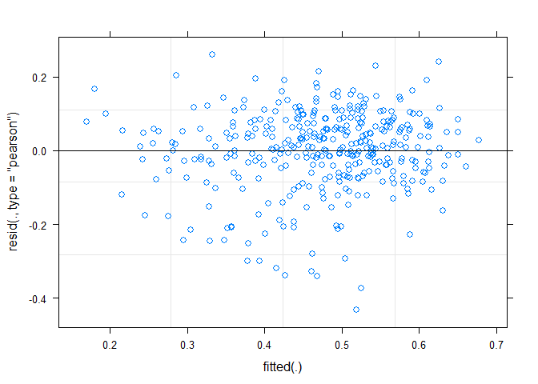
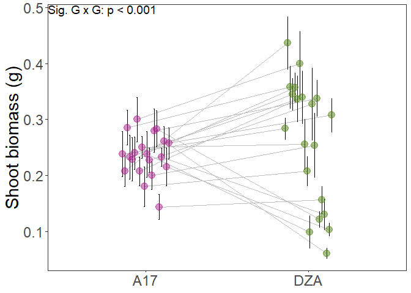

RNA seq experiment phenotypes to test for G by G
================
Rebecca Batstone
2021-10-21

Setup
-----

RNA seq experiment phenotypes to test for G by G (Supp. Fig. S11)
-----------------------------------------------------------------

``` r
GxG_data <- read_csv("./Raw_data/GxG_data.csv")

# variable specifications
GxG_data$strain_ID <- as.factor(GxG_data$strain_ID)
GxG_data$plant_line <- as.factor(GxG_data$plant_line)

# Model to test for G x G
lmm_shoot <- lmer(sqrt(shoot) ~ strain_ID*plant_line + (1|rack) + (1|researcher),
                      data = filter(GxG_data, treat_type == "exp"))
plot(lmm_shoot)
```



``` r
(Anova(lmm_shoot, type = 3)) # interaction term sig.
```

    ## Analysis of Deviance Table (Type III Wald chisquare tests)
    ## 
    ## Response: sqrt(shoot)
    ##                         Chisq Df Pr(>Chisq)    
    ## (Intercept)          793.7595  1  < 2.2e-16 ***
    ## strain_ID             94.8908 19  4.459e-12 ***
    ## plant_line             0.5534  1     0.4569    
    ## strain_ID:plant_line  83.2736 19  5.039e-10 ***
    ## ---
    ## Signif. codes:  0 '***' 0.001 '**' 0.01 '*' 0.05 '.' 0.1 ' ' 1

``` r
# Summarize the data
GxG_data_sum_shoot <- GxG_data %>%
  filter(treat_type == "exp") %>%
  group_by(plant_line, strain_ID) %>%
  summarize(count_shoot = length(shoot), 
            mean_shoot = mean(shoot, na.rm=TRUE), 
            SE_shoot = (sd(shoot, na.rm=TRUE)/sqrt(count_shoot)))

write.csv(GxG_data_sum_shoot, "./Data_output/GxG_expression_means.csv", row.names = FALSE)

## Supp. Fig. S11
(p1 <- ggplot(GxG_data_sum_shoot, aes(x=plant_line, y=mean_shoot, group=strain_ID)) + 
    geom_line(position = position_dodge(0.3), color = "grey") +
    geom_errorbar(aes(ymin=mean_shoot-SE_shoot, ymax=mean_shoot+SE_shoot), width=.1, 
                  position = position_dodge(0.3)) +
    geom_point(data = GxG_data_sum_shoot %>% filter(plant_line == "DZA"), alpha = 0.5,
             size=4, position = position_dodge(0.3), color = "#4F820D") + 
    geom_point(data = GxG_data_sum_shoot %>% filter(plant_line == "A17"), alpha = 0.5, 
             size=4, position = position_dodge(0.3), color = "#AD208E") +   
    annotate("text", x = -Inf, y = Inf, label = "Sig. G x G: p < 0.001", 
            hjust = 0, vjust = 1, size = 5) +
    theme_bw() +
    xlab(NULL) + 
    ylab("Shoot biomass (g)") +
    theme(axis.title.y = element_text(colour = "black", size = 22), 
          axis.text.y = element_text(size=18), 
          axis.title.x = element_text(size=22), 
          axis.text.x = element_text(size=18), 
          legend.position="none",
          legend.title = element_text(colour="black", size=16, face="bold"),
          legend.text = element_text(colour="black", size=12),
          strip.text.x = element_text(size=12, face = "bold"),
          plot.title = element_text(hjust=0.5, size=16, face = "bold"),
          panel.grid.major = element_blank(), 
          panel.grid.minor = element_blank()
          )
  )
```



``` r
save_plot("./Figures_tables/GxG.png", p1,
          ncol = 1, # we're saving a grid plot of 2 columns
          nrow = 1, # and 3 rows
          # each individual subplot should have an aspect ratio of 1.3
          base_aspect_ratio = 1.3
          )
```
