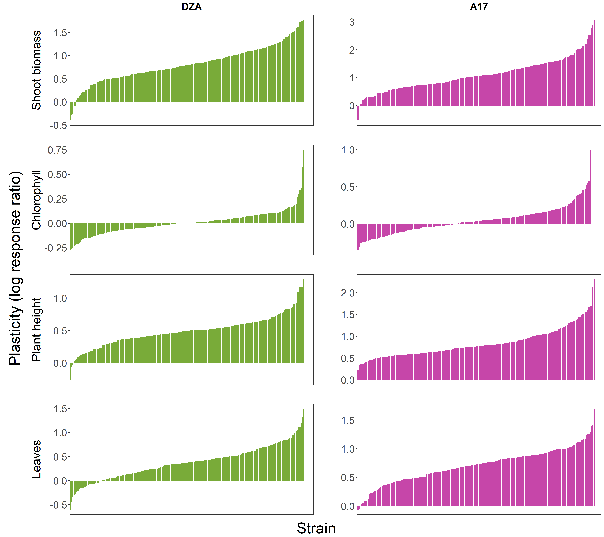
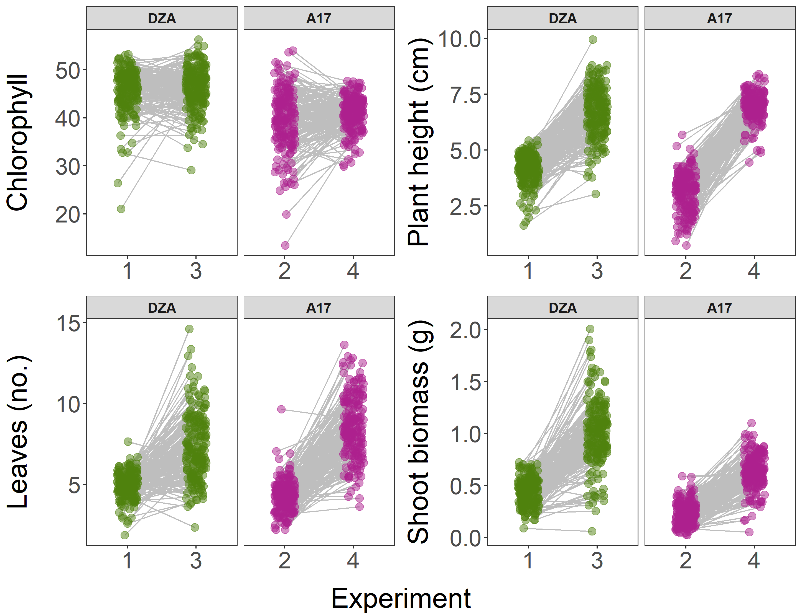
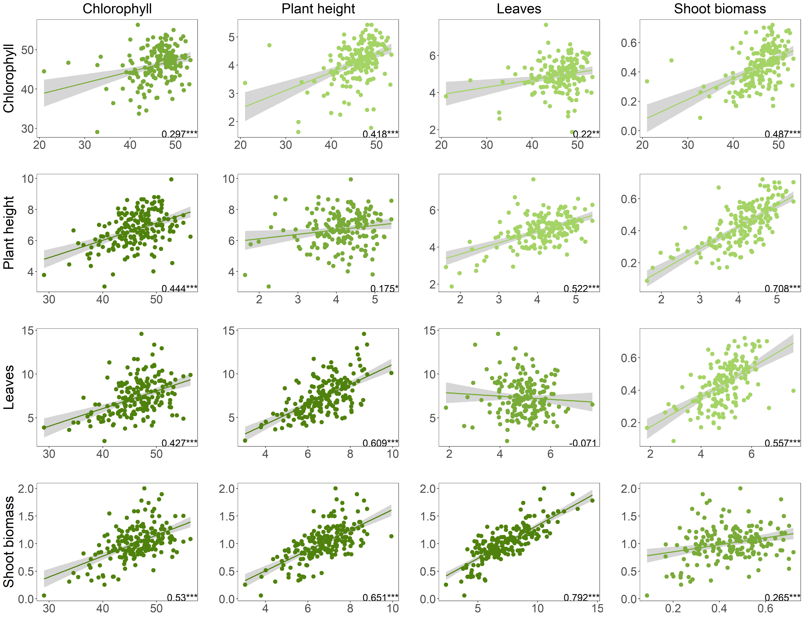
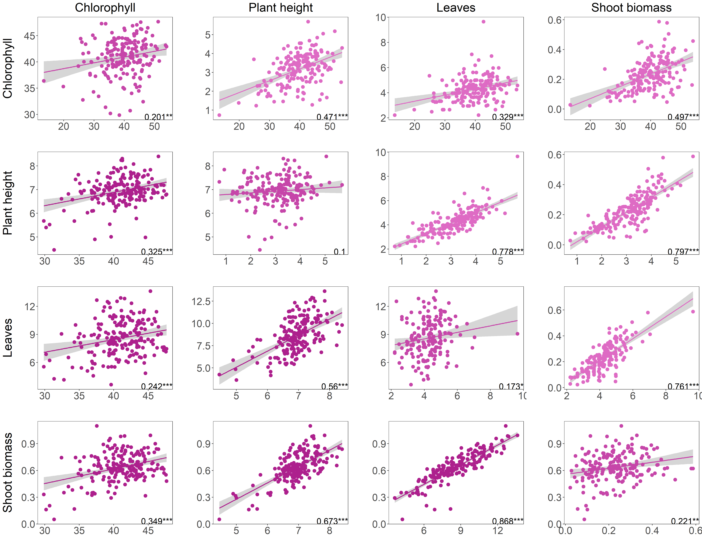

## Setup

```{r setup, include=FALSE}
# global options
knitr::opts_chunk$set(echo = TRUE, warning = FALSE, message = FALSE)

# set working directory
setwd("../../Complex_genetics/Phenotypic_analyses")

# load packages
library("tidyverse") ## includes ggplot2, dplyr, readr, stringr
library("knitr") ## produce the knitted doc
library("cowplot") ## produce paneled plots
library("data.table") ## for dcast function, multiple measurements
library("emmeans") ## calculate "least squares" means from fitted model
library("lme4") ## mixed effects models
library("car") ## Anova function

# set contrasts
options(contrasts = rep ("contr.sum", 2)) 
```

## Load the data

```{r load_data}
# load datasets
DZA_exp1 <- read_csv("./Raw_data/March_DZA_final.csv")
A17_exp2 <- read_csv("./Raw_data/May_A17_final.csv")
DZA_exp3 <- read_csv("./Raw_data/Sept_DZA_final.csv")
A17_exp4 <- read_csv("./Raw_data/Nov_A17_final.csv")

# merge datasets
keep_col <- c("plant_ID","strain_ID","line","exp",
              "chloro1","height1","leaf1",
              "chloro2","height2","leaf2",
              "nod","nod.weight",
              "shoot","root")
ds_all <- rbind(DZA_exp1[,keep_col], A17_exp2[,keep_col], 
                DZA_exp3[,keep_col], A17_exp4[,keep_col])

# add rack, position
plant_pos <- read_csv("./Raw_data/plant_pos.csv")
ds_all$rack <- plant_pos$rack[match(ds_all$plant_ID, plant_pos$plant_ID)] # Include rack for each plant
ds_all$pos <- plant_pos$pos[match(ds_all$plant_ID, plant_pos$plant_ID)] # Include position for each plant

# designate experimental versus control plants
ds_all$type <- ifelse(grepl("control_in", ds_all$strain_ID, ignore.case = T), 
                      "control_in",
                      ifelse(grepl("control_ex", ds_all$strain_ID, 
                                   ignore.case = T), "control_ex","treated"))

# add in strain metadata

## add MAG to strain_ID
ds_all$add <- "MAG"
ds_all$strains <- str_c(ds_all$add, ds_all$strain_ID, 
                        sep = "", collapse = NULL)
ds_all$strains <- as.factor(ds_all$strains)

# rename strain to match vcf on server:
ds_all$strains <- recode_factor(ds_all$strains, 
                                      MAG194 = "MAG194-mel",
                                      MAG758A = "MAG758A-mel")

# for 199 strains
strain_info <- read_csv("./Raw_data/strain_metadata.csv")
ds_all$region <- strain_info$region[match(ds_all$strain_ID, strain_info$strain_ID)] # Include region of origin for each strain
ds_all$pop <- strain_info$soil[match(ds_all$strain_ID, strain_info$strain_ID)] # Include population of origin for each strain
ds_all$plant_origin <- strain_info$plant_line[match(ds_all$strain_ID, strain_info$strain_ID)] 
## Include plant line of origin for each strain

## for 191 strains (confirmed to be Ensifer)
strain_info2 <- read_csv("./Raw_data/melilotiMeta_191.csv")
ds_all$lat <- strain_info2$lat[match(ds_all$strains, strain_info2$strain_ID)] 
ds_all$long <- strain_info2$long[match(ds_all$strains, strain_info2$strain_ID)]
ds_all$soil <- strain_info2$soil[match(ds_all$strains, strain_info2$strain_ID)]

# make line_exp col
ds_all$line_exp <- do.call(paste, c(ds_all[c("line","exp")], sep = "_"))

# column specifications
ds_all$pos <- as.factor(ds_all$pos)
ds_all$type <- as.factor(ds_all$type)
ds_all$exp <- factor(ds_all$exp, levels = c("1","2","3","4"))
ds_all$line_exp <- factor(ds_all$line_exp, 
                          levels = c("DZA_1","A17_2","DZA_3","A17_4"))
ds_all$line <- as.factor(ds_all$line)
ds_all$strain_ID <- as.factor(ds_all$strain_ID)
ds_all$plant_ID <- as.factor(ds_all$plant_ID)
ds_all$region <- as.factor(ds_all$region)
ds_all$soil <- as.factor(ds_all$soil)
ds_all$plant_origin <- as.factor(ds_all$plant_origin)

##### Check strain compatibility ##### 

## filter out all plants that formed 0 nods in either exps. 3 or 4, then summarize for strain:
ds_no_nod_sum <- ds_all %>%
  filter(nod == 0 & exp %in% c(3,4)) %>%
  droplevels(.) %>%
  group_by(strain_ID, line_exp) %>%
  summarize(count_no_nod=n(), mean_shoot_no_nod = mean(shoot, na.rm=TRUE))

## get list of non-nodulating strains
strains_inc <- levels(ds_no_nod_sum$strain_ID)

## designate colors
line_exp_cols <- c("#A4D466","#DE6BC4","#4E820C","#AD208D")
names(line_exp_cols) <- levels(ds_all$line_exp)
colScale <- scale_color_manual(values = line_exp_cols)

ggplot(ds_all %>% filter(strain_ID %in% strains_inc & exp %in% c(3,4)), 
                aes(x=line_exp, y = nod)) +
   facet_wrap(~strain_ID, strip.position = c("top"), scales = "free") +
   geom_hline(aes(yintercept = 0), linetype = 2) +
   geom_jitter(aes(color=line_exp), height = 0) +
   colScale +  
   theme_bw() +   
   xlab(NULL) +  
   ylab("Nodules (no.)")  +
   theme(axis.text.x = element_blank(),
         strip.text = element_text(face = "bold"),
         legend.position="bottom",
         legend.box = "horizontal")

## incompatible strains: 285, 476 (A17-only), 486, 557, 522, 702A, 717A, 733B

# include compatibility in full dataset (also, none are rhizobium)
ds_all$compat <- as.integer(ds_all$compat <- ifelse(
                grepl("285", ds_all$strain_ID, ignore.case = T), "0",
         ifelse(grepl("476", ds_all$strain_ID, ignore.case = T), "0",  
         ifelse(grepl("486", ds_all$strain_ID, ignore.case = T), "0",              
         ifelse(grepl("522", ds_all$strain_ID, ignore.case = T), "0",  
         ifelse(grepl("557", ds_all$strain_ID, ignore.case = T), "0",
         ifelse(grepl("702A", ds_all$strain_ID, ignore.case = T), "0",  
         ifelse(grepl("717A", ds_all$strain_ID, ignore.case = T), "0",  
         ifelse(grepl("733B", ds_all$strain_ID, ignore.case = T), "0",  
                "1")))))))))

write.csv(ds_all, "./Data_output/full_dataset.csv", row.names = FALSE)
save(ds_all, file = "./Data_output/full_dataset.Rdata")

## exclude non-Ensifer strains (N=8)
ds_ensifer <- ds_all %>%
  filter(!strains %in% c("MAG522","MAG702A","MAG717A","MAG733B",
                         "MAG285","MAG476","MAG486","MAG557")) %>% 
  droplevels(.)

save(ds_ensifer, file = "./Data_output/ensifer_dataset.Rdata")
```

## Compare treated versus control, exclude controls (Supp. Fig. S10)

```{r controls}
load(file = "./Data_output/ensifer_dataset.Rdata") ## loads ds_ensifer

# summarize
ds_control <- ds_ensifer %>%
  select(line_exp, exp, type, shoot, nod) %>%
  group_by(line_exp, exp, type) %>%
  summarise(mean_shoot = mean(shoot, na.rm=T), 
            SE_shoot = sd(shoot, na.rm=T)/sqrt(length(shoot)),
            mean_nod = mean(nod, na.rm=T), 
            SE_nod = sd(nod, na.rm=T)/sqrt(length(nod)))
## replace NaN with 0, bc it really means 0 and not missing data:
ds_control$mean_shoot[is.nan(ds_control$mean_shoot)] <- 0
ds_control$mean_nod[is.nan(ds_control$mean_nod)] <- 0

## designate colors
line_exp_cols <- c("#A4D466","#DE6BC4","#4E820C","#AD208D")
names(line_exp_cols) <- levels(ds_control$line_exp)
colScale <- scale_fill_manual(values = line_exp_cols)

## recode levels of type
level_key <- c(control_ex = "External",  control_in = "Internal", treated = "Treated")
ds_control$type <- recode_factor(ds_control$type, !!!level_key)

## compare shoot biomass
(p_shoot <- ggplot(data = ds_control, aes(x=exp, y=mean_shoot, fill = line_exp)) + 
  geom_bar(stat = "identity", position = position_dodge()) + 
  geom_errorbar(aes(ymin = mean_shoot-SE_shoot, ymax = mean_shoot+SE_shoot),
                width=.2, position = position_dodge()) +
  facet_wrap(~type) +
  theme_bw() +
  colScale +
  xlab("Experiment") + 
  ylab("Shoot biomass (g)") +
  theme(axis.title.y = element_text(colour = "black", size = 24), 
        axis.text.y = element_text(size=20), 
        axis.title.x = element_blank(), 
        axis.text.x = element_blank(), 
        legend.position="none",
        legend.title = element_text(colour="black", size=16, face="bold"),
        legend.text = element_text(colour="black", size=12),
        strip.text.x = element_text(size=12, face = "bold"),
        plot.title = element_blank(),
        panel.grid.major = element_blank(), 
        panel.grid.minor = element_blank()
        )
  )

## compare nodules (Supp. Fig. S10)
(p_nod <- ggplot(data = ds_control, aes(x=exp, y=mean_nod, fill = line_exp)) + 
  geom_bar(stat = "identity", position = position_dodge()) + 
  geom_errorbar(aes(ymin = mean_nod-SE_nod, ymax = mean_nod+SE_nod),
                width=.2, position = position_dodge()) +
  facet_wrap(~type) +
  theme_bw() +
  colScale +
  xlab("Experiment") + 
  ylab("Nodules (no.)") +
  theme(axis.title.y = element_text(colour = "black", size = 24), 
        axis.text.y = element_text(size=20), 
        axis.title.x = element_text(size=24), 
        axis.text.x = element_text(size=20), 
        legend.position="none",
        legend.title = element_text(colour="black", size=16, face="bold"),
        legend.text = element_text(colour="black", size=12),
        strip.text.x = element_text(size=12, face = "bold"),
        plot.title = element_blank(),
        panel.grid.major = element_blank(), 
        panel.grid.minor = element_blank()
        )
  )

save_plot("./Figures_tables/controls.png", p_nod,
          ncol = 1, # we're saving a grid plot of 2 columns
          nrow = 1, # and 3 rows
          # each individual subplot should have an aspect ratio of 1.3
          base_aspect_ratio = 1.3
          )

## remove controls
ds <- ds_ensifer %>%
  filter(type == "treated") %>%
  droplevels(.)

write.csv(ds, "./Data_output/dataset_treat.csv", row.names = FALSE)
save(ds, file = "./Data_output/ds_treat.Rdata")

## summarize metadata
ds_metadata <- ds %>%
  group_by(strains, region, pop, line_exp) %>%
  summarize(count = n()) %>%
  spread(line_exp, count)
```

## Calculate raw means

```{r raw_means}
load(file = "./Data_output/ds_treat.Rdata") ## loads ds

# summarize for each strain and experiment
ds_raw_means <- ds %>%
  group_by(line, exp, line_exp, strain_ID, strains, region, compat) %>%
  summarise_if(is.numeric, mean, na.rm=TRUE) %>%
  as.data.frame(.)

save(ds_raw_means, file = "./Data_output/raw_means_long.Rdata")

# long to wide for line
setDT(ds_raw_means)   # coerce to data.table
ds_means.w <- dcast(ds_raw_means, strain_ID ~ line_exp, 
                   value.var = c("chloro1","height1","leaf1",
                                 "nod","nod.weight","shoot"))

save(ds_means.w, file = "./Data_output/raw_means_wide.Rdata")
```

## Calculate emmeans (correcting for rack)

Run mixed models on each experiment:

```{r emmeans}
## load proper dataset
load(file = "./Data_output/ds_treat.Rdata") # loads ds

## create list of traits/exps to loop through:
traits_list <- c(rep("chloro1",4), rep("height1",4), rep("leaf1",4), 
            rep("shoot",4), rep("nod",4), rep("nod.weight", 4))
exps_list <- rep(c("DZA_1", "A17_2", "DZA_3", "A17_4"),6)
combs_list <- paste0(traits_list, "_", exps_list)

## source the function:
source("../Source_code/emmeans_func.R")

emmeans_out <- mapply(FUN = emmeans_function, 
                      combs = combs_list, 
                      traits = traits_list, 
                      exps = exps_list, 
                      USE.NAMES = TRUE, 
                      MoreArgs = list(df = ds))

## collapse dfs into one
emmeans.w <- emmeans_out %>% 
  reduce(full_join, by = "strain_ID") %>%
  select("strain_ID", starts_with("bt_emm"))

## rename cols
names(emmeans.w) <- c("strain_ID", 
                      "chloro1_DZA_1", "chloro1_A17_2",
                      "chloro1_DZA_3", "chloro1_A17_4",
                      "height1_DZA_1", "height1_A17_2",
                      "height1_DZA_3", "height1_A17_4", 
                      "leaf1_DZA_1", "leaf1_A17_2",
                      "leaf1_DZA_3", "leaf1_A17_4",
                      "shoot_DZA_1", "shoot_A17_2",
                      "shoot_DZA_3", "shoot_A17_4",
                      "nod_DZA_1", "nod_A17_2",
                      "nod_DZA_3", "nod_A17_4",
                      "nod.weight_DZA_1", "nod.weight_A17_2",
                      "nod.weight_DZA_3", "nod.weight_A17_4")

save(emmeans.w, file = "./Data_output/emmeans_wide.Rdata")

## wide to long
emmeans <- reshape(emmeans.w, direction='long', 
                   # note: order matters, alphabetical:    
        varying=c("chloro1_DZA_1","height1_DZA_1", 
                  "leaf1_DZA_1","nod_DZA_1",
                  "nod.weight_DZA_1","shoot_DZA_1",
                  "chloro1_A17_2","height1_A17_2",
                  "leaf1_A17_2","nod_A17_2", 
                  "nod.weight_A17_2","shoot_A17_2",
                  "chloro1_DZA_3","height1_DZA_3",
                  "leaf1_DZA_3","nod_DZA_3", 
                  "nod.weight_DZA_3","shoot_DZA_3",
                  "chloro1_A17_4","height1_A17_4",
                  "leaf1_A17_4","nod_A17_4",
                  "nod.weight_A17_4","shoot_A17_4"), 
        timevar='line_exp',
        times=c('DZA_1', 'A17_2', 'DZA_3', 'A17_4'),
        v.names=c('chloro1', 'height1','leaf1','nod','nod.weight','shoot'),
        idvar='strain_ID')

save(emmeans, file = "./Data_output/emmeans_long.Rdata")

## regress emmeans and raw_means to make sure they were correctly calculated
load("./Data_output/raw_means_long.Rdata") ## loads ds_raw_means
load(file = "./Data_output/emmeans_long.Rdata") ## loads emmeans

emmeans.l <- emmeans %>% 
  gather(traits, em_means, chloro1:shoot) %>%
  mutate(strain_trait = paste(strain_ID, traits, line_exp, sep="_")) 
raw_means.l <-  ds_raw_means %>% 
  gather(traits, raw_means, chloro1:shoot) %>%
  mutate(strain_trait = paste(strain_ID, traits, line, exp, sep="_")) %>%
  filter(!traits %in% c("chloro2","leaf2","height2"))

comb_means <- full_join(emmeans.l, raw_means.l[,c("strain_trait","raw_means")], 
                    by = "strain_trait")
comb_means <- separate(data = comb_means, 
                       col = strain_trait, 
                       into = c("strain_ID","trait","line","exp"), 
                       sep = "\\_", remove = FALSE)

(ggplot(comb_means, aes(x=raw_means, y = em_means)) +
  geom_point() +
  geom_smooth(method = "lm") +
  facet_wrap(exp~trait, scales = "free", ncol = 6))
## looks good
```

## Calculate strain plasticity (for all traits) - Supp. Fig. S5

```{r plasticity}
load(file = "./Data_output/emmeans_wide.Rdata") ## loads emmeans.w

## calculate plasticity (log response ratio exp2:exp1)
emmeans.w_Ensifer <- emmeans.w %>%
   mutate(chloro.plast_DZA_13 = log(chloro1_DZA_3/chloro1_DZA_1),
         chloro.plast_A17_24 = log(chloro1_A17_4/chloro1_A17_2),
         leaf.plast_DZA_13 = log(leaf1_DZA_3/leaf1_DZA_1),
         leaf.plast_A17_24 = log(leaf1_A17_4/leaf1_A17_2),
         height.plast_DZA_13 = log(height1_DZA_3/height1_DZA_1),
         height.plast_A17_24 = log(height1_A17_4/height1_A17_2),
         shoot.plast_DZA_13 = log(shoot_DZA_3/shoot_DZA_1),
         shoot.plast_A17_24 = log(shoot_A17_4/shoot_A17_2))
 
save(emmeans.w_Ensifer, file = "./Data_output/emmeans.w_Ensifer.Rdata") ## will get used to make phenotype file

## use plast function to plot values
source('../Source_code/plast_func.R')

trait.list <- c("chloro", "height", "leaf", "shoot")

plast_out <- sapply(trait.list, plast_func, df = emmeans.w_Ensifer,
                    USE.NAMES = TRUE, simplify = FALSE)

## all traits figure
fig_base <- plot_grid(plast_out[["shoot"]][[2]] + ylab("Shoot biomass") + ggtitle("DZA"),
                      plast_out[["shoot"]][[3]] + ggtitle("A17"), 
                       plast_out[["chloro"]][[2]] + ylab("Chlorophyll"),
                      plast_out[["chloro"]][[3]],
                       plast_out[["height"]][[2]] + ylab("Plant height"),
                       plast_out[["height"]][[3]],
                      plast_out[["leaf"]][[2]] + ylab("Leaves"),
                      plast_out[["leaf"]][[3]], 
                     
          ncol = 2,
          nrow = 4,
          align = "hv",
          labels = NULL)

# add on the shared x axis title
fig.xaxis <- add_sub(fig_base, "Strain", size = 30, hjust = 0.5)

# add on the shared y axis title
fig_y_axis <- ggdraw() + draw_label("Plasticity (log response ratio)", 
                                    size = 30, angle=90)

# put them together
fig <- plot_grid(fig_y_axis, fig.xaxis, ncol=2, rel_widths=c(0.05, 1)) 
# rel_heights or widths values control text margins

save_plot("./Figures_tables/strain_plasticity_all.png", fig,
          ncol = 1.5, # we're saving a grid plot of 2 columns
          nrow = 4, # and 3 rows
          # each individual subplot should have an aspect ratio of 1.3
          base_aspect_ratio = 3
          )

 ## Supp. Fig. S5
```

## Models: split by line, assess G x E (Table 1)

```{r GxE}
## create a function
load(file = "./Data_output/ds_treat.Rdata") # loads ds

## set vars to loop through:
trait_list <- c(rep("chloro1",2), rep("height1",2), rep("leaf1",2),rep("shoot",2))
line_list <- rep(c("DZA", "A17"),4)
combs_list <- paste0(trait_list, "_", line_list)

## source the function:
source("../Source_code/GxE_func.R")

## run
GxE_out <- mapply(FUN = GxE_func, 
                  combs = combs_list, 
                  traits = trait_list, 
                  lines = line_list, 
                  USE.NAMES = TRUE, 
                  MoreArgs = list(df = ds))

## combine ANOVA outputs
ANOVAs_out.DZA <- rbind(GxE_out[[1]], GxE_out[[5]], GxE_out[[9]], GxE_out[[13]])
ANOVAs_out.A17 <- rbind(GxE_out[[3]], GxE_out[[7]], GxE_out[[11]], GxE_out[[15]])  
Anovas_out <- rbind(ANOVAs_out.DZA, ANOVAs_out.A17)

## combine ChiSq outputs
rack_out.DZA <- rbind(GxE_out[[2]], GxE_out[[6]], GxE_out[[10]], GxE_out[[14]])
rack_out.A17 <- rbind(GxE_out[[4]], GxE_out[[8]], GxE_out[[12]], GxE_out[[16]])  
racks_out <- rbind(rack_out.DZA[c("lmm","lmm1","lmm2","lmm3"),
                                c("Chisq","Df","Pr(>Chisq)","trait_line")], 
                   rack_out.A17[c("lmm","lmm1","lmm2","lmm3"),
                                c("Chisq","Df","Pr(>Chisq)","trait_line")])

names(racks_out) <- c("Chisq", "Df","Pr(>Chisq)","trait_line")

# Format table 1 for paper
GxE_mods <- rbind(Anovas_out, racks_out)
GxE_mods$order <- c(rep(c(1, 2, 3, 4), 8), rep(5, 8))
GxE_mods$term <- row.names(GxE_mods)
GxE_mods$term <- gsub('[[:digit:]]+', '', GxE_mods$term)

### rename model terms
GxE_mods$term <- recode_factor(GxE_mods$term, 
                        '(Intercept)' = "Intercept", 
                        strain_ID = "Strain", 
                        exp = "Experiment", 
                        'strain_ID:exp' = "Strain X Experiment", 
                        lmm = "Rack")

### format significance, df
GxE_mods$Chisq.r <- round(GxE_mods$Chisq, digits = 2)
GxE_mods$sig <- ifelse(GxE_mods$'Pr(>Chisq)' < 0.001, "***",
                         ifelse(GxE_mods$'Pr(>Chisq)' < 0.01, "**",
                                ifelse(GxE_mods$'Pr(>Chisq)' < 0.05, "*",
                                       ifelse(GxE_mods$'Pr(>Chisq)' < 0.1, ".", " "))))
GxE_mods$Df_f <- paste0("(", GxE_mods$Df, ")")

### change layout
GxE_mods.w <- GxE_mods %>%
  mutate(Chi_sig = paste0(Chisq.r, Df_f, sig)) %>%
  arrange(trait_line, order, term) %>%
  separate(trait_line, c("trait","line"), sep = "\\_") %>%
  select(trait,line,term,Chi_sig) %>%
  spread(key = line, value = Chi_sig)

### Rename traits
GxE_mods.w$trait <- recode_factor(GxE_mods.w$trait, 
                        shoot = "Shoot biomass", 
                        nod = "Nodules", 
                        nod.weight = "Nodule weight",
                        chloro1 = "Chlorophyll", 
                        height1 = "Plant height", 
                        leaf1 = "Leaves")

write.csv(GxE_mods.w, "./Figures_tables/Table1.csv", row.names = FALSE) ## Table 1

kable(GxE_mods.w)
```

## Reaction norms (Supp. Fig. S4)

```{r rxn_norms}
load(file = "./Data_output/emmeans_long.Rdata") ## loads emmeans

## add info
emmeans$line <- sapply(strsplit(as.character(emmeans$line_exp), split="_"), "[", 1)
emmeans$exp <- sapply(strsplit(as.character(emmeans$line_exp), split="_"), "[", 2)

# create a paneled plot for all rxn norms

## rename traits
emmeans.rn <- emmeans %>% 
  rename(
        'Shoot biomass (g)' = shoot, 
        'Chlorophyll' = chloro1, 
        'Plant height (cm)' = height1, 
        'Leaves (no.)' = leaf1)

## reorder lines
emmeans.rn$line <- factor(emmeans.rn$line, levels = c("DZA","A17"))

## loop through vars
trait.list <- c("Chlorophyll","Plant height (cm)","Leaves (no.)","Shoot biomass (g)")

## source the function
source("../Source_code/rxn_func.R")

## run
rxn_out <- sapply(trait.list, rxn_func, df = emmeans.rn)

# put all plots into one
rxn_comb <- plot_grid(rxn_out[["Chlorophyll"]],
                      rxn_out[["Plant height (cm)"]],
                      rxn_out[["Leaves (no.)"]],
                      rxn_out[["Shoot biomass (g)"]],
          ncol = 2,
          nrow = 2,
          align = "hv",
          labels = NULL)

# add on the shared x axis title
fig <- add_sub(rxn_comb, "Experiment", size=24)

save_plot("./Figures_tables/rxn_all.png", fig,
          ncol = 2, # we're saving a grid plot of 2 columns
          nrow = 2, # and 3 rows
          # each individual subplot should have an aspect ratio of 1.3
          base_aspect_ratio = 1.3
          )

 ## Supp. Fig. S4
```

## Heritability

```{r herit}
# create a function
load(file = "./Data_output/ds_treat.Rdata") # loads ds

# Calculating heritability

## vars to loop over
trait_list <- c(rep("chloro1",4), rep("height1",4), rep("leaf1",4), 
            rep("shoot",4))
exp_list <- rep(c("DZA_1", "A17_2", "DZA_3", "A17_4"),4)
combs_list <- paste0(trait_list, "_", exp_list)

## source function
source("../Source_code/herit_func.R")

## run
herit_out <- mapply(FUN = herit_func, 
                    combs = combs_list,
                    traits = trait_list, 
                    exps = exp_list, 
                    USE.NAMES = TRUE, 
                    MoreArgs = list(df = ds))

# genetic variance
strain_out <- rbind(herit_out[[2]], herit_out[[4]], herit_out[[6]], herit_out[[8]], ## chloro
                    herit_out[[10]], herit_out[[12]], herit_out[[14]], herit_out[[16]], ## height
                    herit_out[[18]], herit_out[[20]], herit_out[[22]], herit_out[[24]], ## leaf
                    herit_out[[26]], herit_out[[28]], herit_out[[30]], herit_out[[32]]) ## shoot
  
strain_sig <- strain_out[c("lmm","lmm1","lmm2","lmm3",
                           "lmm4","lmm5","lmm6","lmm7",
                           "lmm8","lmm9","lmm10","lmm11",
                           "lmm12","lmm13","lmm14","lmm15"),
                                c("Chisq","Pr(>Chisq)","trait_exp")]

## Format significance, chi-sq
strain_sig$Chisq.r <- round(strain_sig$Chisq, digits = 2)
strain_sig$sig.c <- strain_sig$'Pr(>Chisq)' /2 ## one-tailed t-test
strain_sig$sig <- ifelse(strain_sig$sig.c < 0.001, "***",
                         ifelse(strain_sig$sig.c < 0.01, "**",
                                ifelse(strain_sig$sig.c < 0.05, "*",
                                       ifelse(strain_sig$sig.c < 0.1, ".", " "))))
strain_sig.f <- strain_sig %>%
  mutate(Chi_sig = paste0(Chisq.r, sig)) %>%
  select(trait_exp,Chi_sig,sig)

# VarCorr
varcor_out <- rbind(herit_out[[1]], herit_out[[3]], herit_out[[5]], herit_out[[7]], ## chloro
                    herit_out[[9]], herit_out[[11]], herit_out[[13]], herit_out[[15]], ## height
                    herit_out[[17]], herit_out[[19]], herit_out[[21]], herit_out[[23]], ## leaf
                    herit_out[[25]], herit_out[[27]], herit_out[[29]], herit_out[[31]]) ## shoot

## Format variance
varcor_out_Vg <- varcor_out %>%
  group_by(trait_exp) %>%
  mutate(V_tot = sum(vcov)) %>%
  ungroup(.)  %>%
  mutate(H = vcov/V_tot) %>%
  filter(grp == "strain_ID") %>%
  select(trait_exp, vcov, V_tot, H) %>%
  as.data.frame(.)

# Format full heritability table
herit_comb <- full_join(varcor_out_Vg, strain_sig.f, by = "trait_exp")

herit <- herit_comb %>%
  separate(trait_exp, c("trait","line","exp"), sep = "\\_")

## revalue trait
herit$trait <- recode_factor(herit$trait, 
                         shoot = "Shoot biomass", 
                        chloro1 = "Chlorophyll", 
                        height1 = "Plant height", 
                        leaf1 = "Leaves")

herit$H.r <- round(herit$H, digits = 3)

herit.f <- herit %>%
  mutate(H_sig = paste0(H.r, sig))

## save
save(herit.f, file = "./Data_output/heritability.Rdata") ## needed for cockerham's method
```

## Regression coefficients 

The same trait across the two experiments (G x E)

```{r corr_plot}
load(file = "./Data_output/emmeans.w_Ensifer.Rdata") ## loads emmeans.w_Ensifer

# reg coefficients function

## vars to loop through:
trait_exp1 <- c("chloro1_DZA_1","height1_DZA_1","leaf1_DZA_1", "shoot_DZA_1",
                "chloro1_A17_2","height1_A17_2","leaf1_A17_2", "shoot_A17_2")
trait_exp2 <- c("chloro1_DZA_3", "height1_DZA_3", "leaf1_DZA_3", "shoot_DZA_3",
                "chloro1_A17_4", "height1_A17_4", "leaf1_A17_4", "shoot_A17_4")
combs_list <- paste0(trait_exp1, "vs", trait_exp2)

## source the function
source("../Source_code/lin_reg_func.R")

## Run
reg_out <- mapply(FUN = lin_reg_func, 
                  combs = combs_list,
                  exp1 = trait_exp1, 
                  exp2 = trait_exp2, 
                  USE.NAMES = TRUE, 
                  MoreArgs = list(df = emmeans.w_Ensifer))

## Extract Reg coeffs
reg_coeffs_out1 <- as.data.frame(rbind(reg_out[[2]][2,],reg_out[[4]][2,],
                                       reg_out[[6]][2,],reg_out[[8]][2,],
                                       reg_out[[10]][2,],reg_out[[12]][2,],
                                       reg_out[[14]][2,],reg_out[[16]][2,]))


# extract correlation coefficients
reg_coeffs_out2 <- as.data.frame(rbind(reg_out[[1]],reg_out[[3]],
                                       reg_out[[5]],reg_out[[7]],
                                       reg_out[[9]],reg_out[[11]],
                                       reg_out[[13]],reg_out[[15]]))

## combine
reg_coeffs_out <- cbind(reg_coeffs_out1, reg_coeffs_out2)

## format
reg_coeffs_out$reg.r <- round(reg_coeffs_out$V1, digits = 3)
reg_coeffs_out$sig <- ifelse(reg_coeffs_out$'Pr(>|t|)' < 0.001, "***",
                         ifelse(reg_coeffs_out$'Pr(>|t|)' < 0.01, "**",
                                ifelse(reg_coeffs_out$'Pr(>|t|)' < 0.05, "*",
                                       ifelse(reg_coeffs_out$'Pr(>|t|)' < 0.1,
                                              ".", " "))))

reg_coeffs_out$trait <- rep(c("Chlorophyll", "Plant height", "Leaves", "Shoot biomass"),2)
reg_coeffs_out$line <- c(rep("DZA",4),rep("A17",4))

# save
save(reg_coeffs_out, file = "./Data_output/reg_coeff.Rdata") ## needed for cockerham's method
```

## Cockerham's method (Table 2)

```{r cockerham}
load(file = "./Data_output/heritability.Rdata") # loads herit.f

## format heritability
herit.f$exp2 <- ifelse(herit.f$exp == "1" | herit.f$exp == "2", "1","2")

herit2 <- herit.f %>%
  select(trait, line, exp2, vcov) %>%
  spread(key = exp2, value = vcov) %>%
  rename("Vg1" = '1',"Vg2" = '2') %>%
  mutate(trait_line = paste(trait, line, sep = "_"))

## format correlation coefficients
load(file = "./Data_output/reg_coeff.Rdata") ## loads reg_coeffs_out

reg_coeffs <- reg_coeffs_out %>%
  mutate(trait_line = paste(trait, line, sep = "_")) %>%
  rename("Rg" = V1)

# merge Vg's and reg coeffs:
cockerham_input <- merge(herit2, reg_coeffs[,c("trait_line","Rg")], by = "trait_line")

# source cockerham functions, and execute
source("../Source_code/cockerham_funcs.R")

## Calculations (Cockerham)

# Group by trait and calculate sum of imperfect correlation values (and divide by # environments*(# environments - 1) as per Cockerham 1963)
# Group by trait and calculate sum of heterogeneous variances values (and divide by # environments*(# environments - 1) as per Cockerham 1963)
# Calculate for each trait the percent of the total variance that is due to imperfect correlation (i.e., rank changes)

dataSum <- cockerham_input %>% 
  group_by(trait_line) %>% 
  summarise(crossingSum = sum(crossing)/(2*(2-1)),
            heteroSum = sum(hetero)/(2*(2-1))) %>%
  mutate(Sum = crossingSum+heteroSum, 
         perCross = 100*crossingSum/Sum)

dataSum$perCross.r <- round(dataSum$perCross, digits = 2)

# join with original data:

## with heritability instead of Vg:
herit3 <- herit.f %>%
  select(trait, line, exp2, H_sig) %>%
  spread(key = exp2, value = H_sig) %>%
  rename("H1" = '1',"H2" = '2') %>%
  mutate(trait_line = paste(trait, line, sep = "_"))

## additional formatting
reg_coeffs.f <- reg_coeffs_out %>%
  mutate(reg_sig = paste0(reg.r, sig),
         trait_line = paste(trait, line, sep = "_")) %>%
  arrange(trait_line) %>%
  select(trait_line,reg_sig)

## put together
cockerham_data2 <- merge(herit3, reg_coeffs.f, by = "trait_line")
cockerham <- merge(cockerham_data2, dataSum[,c("trait_line","perCross.r")], by = "trait_line")

cockerham <- cockerham %>%
  arrange(line, trait) %>%
  select(-trait_line)

kable(cockerham)

write.csv(cockerham, "./Figures_tables/Table2.csv", row.names = FALSE) ## Table 2
```

## Genetic correlation plots (Supp. Figs. S2 & S3)

```{r corrs}
load(file = "./Data_output/emmeans.w_Ensifer.Rdata") ## loads emmeans.w_Ensifer

## source the function
source("../Source_code/gen_corr_func.R")

## specify traits to loop through
traits1.list <- c(## DZA exp 1
                  rep("chloro1_DZA_1",4),rep("height1_DZA_1",3),rep("leaf1_DZA_1",2),
                  rep("shoot_DZA_1",1),
                  ## DZA exp 3
                  rep("chloro1_DZA_3",3),rep("height1_DZA_3",2),rep("leaf1_DZA_3",1),
                  ## A17 exp 2
                  rep("chloro1_A17_2",4),rep("height1_A17_2",3),rep("leaf1_A17_2",2),
                  rep("shoot_A17_2",1),
                  ## A17 exp 4
                  rep("chloro1_A17_4",3),rep("height1_A17_4",2),rep("leaf1_A17_4",1))

traits2.list <- c(## DZA exp 1
                  "chloro1_DZA_3","height1_DZA_1","leaf1_DZA_1","shoot_DZA_1",
                  "height1_DZA_3","leaf1_DZA_1","shoot_DZA_1",
                  "leaf1_DZA_3","shoot_DZA_1",
                  "shoot_DZA_3",
                  ## DZA exp 3
                  "height1_DZA_3","leaf1_DZA_3","shoot_DZA_3",
                  "leaf1_DZA_3","shoot_DZA_3",
                  "shoot_DZA_3",
                 ## A17 exp 2
                  "chloro1_A17_4","height1_A17_2","leaf1_A17_2","shoot_A17_2",
                  "height1_A17_4","leaf1_A17_2","shoot_A17_2",
                  "leaf1_A17_4","shoot_A17_2",
                  "shoot_A17_4",
                  ## A17 exp 4
                  "height1_A17_4","leaf1_A17_4","shoot_A17_4",
                  "leaf1_A17_4","shoot_A17_4",
                  "shoot_A17_4")
                  
cols.list <- c(## DZA
               "#79AB39", rep("#A4D466",3),"#79AB39",rep("#A4D466",2),
               "#79AB39",rep("#A4D466",1),"#79AB39",
               rep("#4E820C",6),
               ## A17
               "#C646A9", rep("#DE6BC4",3),"#C646A9",rep("#DE6BC4",2),
               "#C646A9",rep("#DE6BC4",1),"#C646A9",
               rep("#AD208D",6))

## Run
gc_out <- mapply(FUN = gen_corr_func, 
                 traits1 = traits1.list, 
                 traits2 = traits2.list, 
                 cols = cols.list, 
                 USE.NAMES = FALSE, 
                 MoreArgs = list(df = emmeans.w_Ensifer))

## create histograms of plasticity
(hist_plast_DZA <- ggplot(emmeans.w_Ensifer, aes(x=shoot.plast_DZA_13)) + 
  geom_histogram(bins = 40, position = position_dodge(), fill = "#79AB39") +
  xlab(NULL)  +
  ylab(NULL)  +
  theme_bw() +
    theme(axis.title.y = element_text(size=24), 
          axis.text.y = element_text(size=20), 
          axis.title.x = element_text(size=24), 
          legend.title = element_text(colour="black", size=10, face="bold"),
          legend.text = element_text(colour="black", size=8),
          strip.text = element_text(size = 12, face="bold"),
          axis.text.x = element_text(size=20),
          legend.position="right",
          legend.background = element_blank(),
          plot.title = element_text(hjust=0.5, size=24),
          panel.background = element_rect(fill="transparent"),
          panel.grid.major = element_blank(), 
          panel.grid.minor = element_blank()
        )
  )

(hist_plast_A17 <- ggplot(emmeans.w_Ensifer, aes(x=shoot.plast_A17_24)) + 
  geom_histogram(bins = 40, position = position_dodge(), fill = "#C646A9") +
  xlab(NULL)  +
  ylab(NULL)  +
  theme_bw() +
    theme(axis.title.y = element_text(size=24), 
          axis.text.y = element_text(size=20), 
          axis.title.x = element_text(size=24), 
          legend.title = element_text(colour="black", size=10, face="bold"),
          legend.text = element_text(colour="black", size=8),
          strip.text = element_text(size = 12, face="bold"),
          axis.text.x = element_text(size=20),
          legend.position="right",
          legend.background = element_blank(),
          plot.title = element_text(hjust=0.5, size=24),
          panel.background = element_rect(fill="transparent"),
          panel.grid.major = element_blank(), 
          panel.grid.minor = element_blank()
        )
  )

## create the paneled figures

fig_base_DZA <- plot_grid(gc_out[[2]] + ggtitle("Chlorophyll") + ylab("Chlorophyll"), 
                      gc_out[[4]] + ggtitle("Plant height"), 
                      gc_out[[6]] + ggtitle("Leaves"), 
                      gc_out[[8]] + ggtitle("Shoot biomass"),
                      gc_out[[22]] + ylab("Plant height"),
                      gc_out[[10]], gc_out[[12]], gc_out[[14]], 
                      gc_out[[24]] + ylab("Leaves"),
                      gc_out[[28]], gc_out[[16]], gc_out[[18]], 
                      gc_out[[26]] + ylab("Shoot biomass"),
                      gc_out[[30]], gc_out[[32]], gc_out[[20]],
                    
          ncol = 4,
          nrow = 4,
          align = "hv",
          labels = NULL)

save_plot("./Figures_tables/gen_corrs_DZA.png", fig_base_DZA,
          ncol = 4, # we're saving a grid plot of 2 columns
          nrow = 4, # and 3 rows
          # each individual subplot should have an aspect ratio of 1.3
          base_aspect_ratio = 1.3
          )

 ## Supp. Fig. S2

fig_base_A17 <- plot_grid(gc_out[[34]] + ggtitle("Chlorophyll") + ylab("Chlorophyll"), 
                      gc_out[[36]] + ggtitle("Plant height"), 
                      gc_out[[38]] + ggtitle("Leaves"), 
                      gc_out[[40]] + ggtitle("Shoot biomass"),
                      gc_out[[54]] + ylab("Plant height"),
                      gc_out[[42]], gc_out[[44]], gc_out[[46]], 
                      gc_out[[56]] + ylab("Leaves"),
                      gc_out[[60]], gc_out[[48]], gc_out[[50]], 
                      gc_out[[58]] + ylab("Shoot biomass"),
                      gc_out[[62]], gc_out[[64]], gc_out[[52]], 
          ncol = 4,
          nrow = 4,
          align = "hv",
          labels = NULL)

save_plot("./Figures_tables/gen_corrs_A17.png", fig_base_A17,
          ncol = 4, # we're saving a grid plot of 2 columns
          nrow = 4, # and 3 rows
          # each individual subplot should have an aspect ratio of 1.3
          base_aspect_ratio = 1.3
          )

 ## Supp. Fig. S3

```