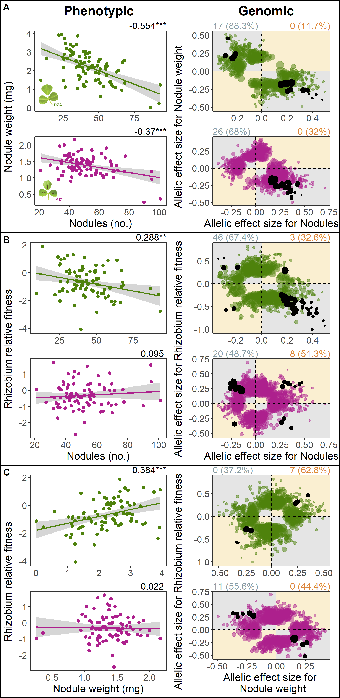
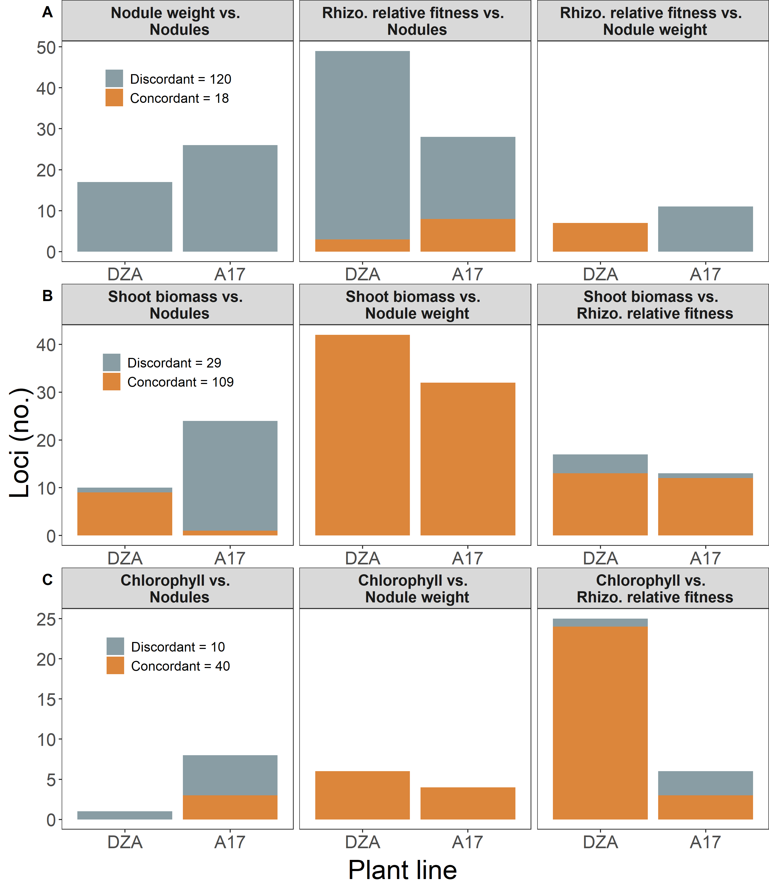

Genomic\_analyses
================
Rebecca Batstone
2021-10-21

Setup
-----

Categorize variants
-------------------

First, need to regress effect sizes for each pairwise trait combination of interest. Then, categorize variants as: pleiotropic, concordant, discordant

``` r
load(file = "./Data_output/SNPs_sel.Rdata") ## loads SNPs_sel

## specify vars to loop over
trait_y.list <- c(rep(c("nod.weight","fit","fit"),2),rep("shoot",6),rep("chloro",6))
trait_x.list <- c(rep(c("nod","nod","nod.weight"),2),rep(c("nod","nod.weight","fit"),4))
line.list <- c(rep(c(rep("DZA",3), rep("A17",3)),3))
comb.list <- paste0(trait_y.list,"_vs_",trait_x.list,"_",line.list)

## using function for regressing variant level effects
source("../Source_code/sig_snp_func.R")
  
snps_out <- mapply(combs = comb.list, trait_y = trait_y.list, 
                   trait_x = trait_x.list, line = line.list, 
                   MoreArgs = list(df = SNPs_sel),
                   FUN = sig_snp_func, 
                   USE.NAMES = TRUE)
```

    ## [1] "nod.weight_vs_nod_DZA"
    ## [1] "fit_vs_nod_DZA"
    ## [1] "fit_vs_nod.weight_DZA"
    ## [1] "nod.weight_vs_nod_A17"
    ## [1] "fit_vs_nod_A17"
    ## [1] "fit_vs_nod.weight_A17"
    ## [1] "shoot_vs_nod_DZA"
    ## [1] "shoot_vs_nod.weight_DZA"
    ## [1] "shoot_vs_fit_DZA"
    ## [1] "shoot_vs_nod_A17"
    ## [1] "shoot_vs_nod.weight_A17"
    ## [1] "shoot_vs_fit_A17"
    ## [1] "chloro_vs_nod_DZA"
    ## [1] "chloro_vs_nod.weight_DZA"
    ## [1] "chloro_vs_fit_DZA"
    ## [1] "chloro_vs_nod_A17"
    ## [1] "chloro_vs_nod.weight_A17"
    ## [1] "chloro_vs_fit_A17"

``` r
## combine all into one df
snps_comb <- do.call(rbind, snps_out)

## rm unwanted columns
sig_snps <- snps_comb %>%
  select(-contains("beta."),-contains("sig."),-trait_y_dir,-trait_x_dir)

save(sig_snps, file = "./Data_output/sig_snps.Rdata")
```

Corr plots (Figs. 1 & 2)
------------------------

``` r
load(file = "./Data_output/sig_snps.Rdata") ## loads sig_snps

## arguments
comb_list <- c("nod.weight_vs_nod_DZA", "fit_vs_nod_DZA", "fit_vs_nod.weight_DZA",    
               "nod.weight_vs_nod_A17", "fit_vs_nod_A17", "fit_vs_nod.weight_A17",    
               "shoot_vs_nod_DZA", "shoot_vs_nod.weight_DZA", "shoot_vs_fit_DZA",         
               "shoot_vs_nod_A17", "shoot_vs_nod.weight_A17", "shoot_vs_fit_A17",
               "chloro_vs_nod_DZA", "chloro_vs_nod.weight_DZA", "chloro_vs_fit_DZA",     
               "chloro_vs_nod_A17", "chloro_vs_nod.weight_A17", "chloro_vs_fit_A17")  
cols_D.list <- rep(c(rep("#4E820C",3),rep("#AD208D",3)),3)
cols_OD.list <- rep(c(rep("#A4D466",3),rep("#DE6BC4",3)),3)

## corr plots of allelic effect sizes  
source('../Source_code/var_corr_func.R')

corr_out <- mapply(combs = comb_list, 
                   cols_D = cols_D.list, 
                   cols_OD = cols_OD.list,
                   FUN = var_corr_func, 
                   MoreArgs = list(df = sig_snps),
                   USE.NAMES = TRUE)
```

    ## [1] "nod.weight_vs_nod_DZA"
    ## [1] "fit_vs_nod_DZA"
    ## [1] "fit_vs_nod.weight_DZA"
    ## [1] "nod.weight_vs_nod_A17"
    ## [1] "fit_vs_nod_A17"
    ## [1] "fit_vs_nod.weight_A17"
    ## [1] "shoot_vs_nod_DZA"
    ## [1] "shoot_vs_nod.weight_DZA"
    ## [1] "shoot_vs_fit_DZA"
    ## [1] "shoot_vs_nod_A17"
    ## [1] "shoot_vs_nod.weight_A17"
    ## [1] "shoot_vs_fit_A17"
    ## [1] "chloro_vs_nod_DZA"
    ## [1] "chloro_vs_nod.weight_DZA"
    ## [1] "chloro_vs_fit_DZA"
    ## [1] "chloro_vs_nod_A17"
    ## [1] "chloro_vs_nod.weight_A17"
    ## [1] "chloro_vs_fit_A17"

``` r
save(corr_out, file = "./Data_output/allelic_corrs.Rdata")
```

### Merge results for organismal and genomic levels

Main text Figures 1 & 2

``` r
load(file = "../Phenotypic_analyses/Data_output/pheno_corrs.Rdata") ## loads gc_ra
load(file = "./Data_output/allelic_corrs.Rdata") ## loads corr_out

##### Rhiz pleio #####

##### nod.weight vs nod

DZA <- "./Figures/Leaves_DZAt.png" %>%
  image_read() %>%
  image_resize("560x370") 

A17 <- "./Figures/Leaves_A17t.png" %>%
  image_read() %>%
  image_resize("560x370") 
 
## gen corrs
gc <- plot_grid(gc_ra[["nod.weight_vs_nod_DZA"]],
                gc_ra[["nod.weight_vs_nod_A17"]] + xlab("Nodules (no.)"),
          ncol = 1,
          nrow = 2,
          align = "v",
          labels = NULL)

## add on host line images
gc_leaves <- ggdraw() + 
  draw_plot(gc) +
  draw_image(
    DZA, x = 0.3, y = 1.15, hjust = 1, vjust = 1, 
    width = 0.15
  ) +
  draw_image(
    A17, x = 0.3, y = 0.7, hjust = 1, vjust = 1, 
    width = 0.15
  )

## add on the shared y axis title
y_axis <- ggdraw() + draw_label("Nodule weight (mg)", size = 16, angle=90)

## put them together
gc1 <- plot_grid(y_axis, gc_leaves, ncol=2, rel_widths=c(0.1, 1)) 

## effect size corrs
es <- plot_grid(corr_out[["nod.weight_vs_nod_DZA"]],
                       corr_out[["nod.weight_vs_nod_A17"]] +
                         xlab("Effect size for Nodules"),
          ncol = 1,
          nrow = 2,
          align = "v",
          labels = NULL)

## add on the shared y axis title
y_axis <- ggdraw() + draw_label("Effect size for Nodule weight", size = 16, angle=90)

## put them together
es1 <- plot_grid(y_axis, es, ncol=2, rel_widths=c(0.1, 1)) 

## create plot titles
t1 <- ggdraw() + draw_label("Organismal", size = 20, hjust = 0.3, fontface = "bold")
t2 <- ggdraw() + draw_label("Genomic", size = 20, hjust = 0.3, fontface = "bold")

## put both gc and es together
p1 <- plot_grid(t1, t2,
                gc1, es1,
                rel_heights=c(0.1, 1),
                ncol = 2,
                nrow = 2,
                align = "hv") +
      theme(panel.border = element_rect(colour = "black", fill=NA, size=1))

##### fit vs nods

## gen corrs
gc <- plot_grid(gc_ra[["fit_vs_nod_DZA"]],
                       gc_ra[["fit_vs_nod_A17"]] +
                         xlab("Nodules (no.)"),
          ncol = 1,
          nrow = 2,
          align = "v",
          labels = NULL)

## add on the shared y axis title
y_axis <- ggdraw() + draw_label("Competitive fitness", size = 16, angle=90)

## put them together
gc2 <- plot_grid(y_axis, gc, ncol=2, rel_widths=c(0.1, 1)) 

## effect size corrs
es <- plot_grid(corr_out[["fit_vs_nod_DZA"]],
                       corr_out[["fit_vs_nod_A17"]] +
                         xlab("Effect size for Nodules"),
          ncol = 1,
          nrow = 2,
          align = "v",
          labels = NULL)

## add on the shared y axis title
y_axis <- ggdraw() + draw_label("Effect size for Competitive fitness", 
                                size = 16, angle=90)

## put them together
es2 <- plot_grid(y_axis, es, ncol=2, rel_widths=c(0.1, 1)) 

## put both gc and es together
p2 <- plot_grid(gc2, es2,
                ncol = 2,
                nrow = 1,
                align = "h") +
      theme(panel.border = element_rect(colour = "black", fill=NA, size=1))

##### fit vs nod.weight

## gen corrs
gc <- plot_grid(gc_ra[["fit_vs_nod.weight_DZA"]],
                       gc_ra[["fit_vs_nod.weight_A17"]] +
                         xlab("Nodule weight (mg)"),
          ncol = 1,
          nrow = 2,
          align = "v",
          labels = NULL)

## add on the shared y axis title
y_axis <- ggdraw() + draw_label("Competitive fitness", size = 16, angle=90)

## put them together
gc3 <- plot_grid(y_axis, gc, ncol=2, rel_widths=c(0.1, 1)) 

## effect size corrs
es <- plot_grid(corr_out[["fit_vs_nod.weight_DZA"]],
                       corr_out[["fit_vs_nod.weight_A17"]] +
                         xlab("Effect size for Nodule weight"),
          ncol = 1,
          nrow = 2,
          align = "v",
          labels = NULL)

## add on the shared y axis title
y_axis <- ggdraw() + draw_label("Effect size for Competitive fitness", 
                                size = 16, angle=90)

## put them together
es3 <- plot_grid(y_axis, es, ncol=2, rel_widths=c(0.1, 1)) 

## put both gc and es together
p3 <- plot_grid(gc3, es3,
                ncol = 2,
                nrow = 1,
                align = "h") +
      theme(panel.border = element_rect(colour = "black", fill=NA, size=1))


## put all rhiz together
p_comb.rhiz <- plot_grid(p1,p2,p3,
                    ncol=1,
                    nrow=3,
                    align="v",
                    labels = c("A","B","C")) +
                    theme(panel.border = element_rect(colour = "black", fill=NA, size=1))

save_plot("./Figures/rhiz_fit.pdf", p_comb.rhiz,
          ncol = 1.5, # we're saving a grid plot of 2 columns
          nrow = 4, # and 3 rows
          # each individual subplot should have an aspect ratio of 1.3
          base_aspect_ratio = 1.3
          )

save_plot("./Figures/rhiz_fit.png", p_comb.rhiz,
          ncol = 1.5, # we're saving a grid plot of 2 columns
          nrow = 4, # and 3 rows
          # each individual subplot should have an aspect ratio of 1.3
          base_aspect_ratio = 1.3
          )


```


``` r
##### Sym pleio #####

##### shoot vs nods

## gen corrs
gc <- plot_grid(gc_ra[["shoot_vs_nod_DZA"]],
                       gc_ra[["shoot_vs_nod_A17"]] +
                         xlab("Nodules (no.)"),
          ncol = 1,
          nrow = 2,
          align = "v",
          labels = NULL)

## add on host line images
gc_leaves <- ggdraw() + 
  draw_plot(gc) +
  draw_image(
    DZA, x = 0.31, y = 1.15, hjust = 1, vjust = 1, 
    width = 0.13
  ) +
  draw_image(
    A17, x = 0.3, y = 0.7, hjust = 1, vjust = 1, 
    width = 0.13
  )

## add on the shared y axis title
y_axis <- ggdraw() + draw_label("Shoot biomass (g)", size = 16, angle=90)

## put them together
gc4 <- plot_grid(y_axis, gc_leaves, ncol=2, rel_widths=c(0.1, 1)) 

## effect size corrs
es <- plot_grid(corr_out[["shoot_vs_nod_DZA"]],
                       corr_out[["shoot_vs_nod_A17"]] +
                         xlab("Effect size for Nodules"),
          ncol = 1,
          nrow = 2,
          align = "v",
          labels = NULL)

## add on the shared y axis title
y_axis <- ggdraw() + draw_label("Effect size for Shoot biomass", size = 16, angle=90)

## put them together
es4 <- plot_grid(y_axis, es, ncol=2, rel_widths=c(0.1, 1)) 

## create plot titles
t1 <- ggdraw() + draw_label("Organismal", size = 20, hjust = 0.3, fontface = "bold")
t2 <- ggdraw() + draw_label("Genomic", size = 20, hjust = 0.3, fontface = "bold")

## put both gc and es together
p4 <- plot_grid(t1, t2,
                gc4, es4,
                ncol = 2,
                rel_heights=c(0.1,1),
                nrow = 2,
                align = "hv") +
      theme(panel.border = element_rect(colour = "black", fill=NA, size=1))

##### shoot vs nod.weight

## gen corrs
gc <- plot_grid(gc_ra[["shoot_vs_nod.weight_DZA"]],
                       gc_ra[["shoot_vs_nod.weight_A17"]] +
                         xlab("Nodule weight (mg)"),
          ncol = 1,
          nrow = 2,
          align = "v",
          labels = NULL)

## add on the shared y axis title
y_axis <- ggdraw() + draw_label("Shoot biomass (g)", size = 16, angle=90)

## put them together
gc5 <- plot_grid(y_axis, gc, ncol=2, rel_widths=c(0.1, 1)) 

## effect size corrs
es <- plot_grid(corr_out[["shoot_vs_nod.weight_DZA"]],
                       corr_out[["shoot_vs_nod.weight_A17"]] +
                         xlab("Effect size for Nodule weight"),
          ncol = 1,
          nrow = 2,
          align = "v",
          labels = NULL)

## add on the shared y axis title
y_axis <- ggdraw() + draw_label("Effect size for Shoot biomass", size = 16, angle=90)

## put them together
es5 <- plot_grid(y_axis, es, ncol=2, rel_widths=c(0.1, 1)) 

## put both gc and es together
p5 <- plot_grid(gc5, es5,
                ncol = 2,
                nrow = 1,
                align = "h") +
      theme(panel.border = element_rect(colour = "black", fill=NA, size=1))

##### shoot vs fit

## gen corrs
gc <- plot_grid(gc_ra[["shoot_vs_fit_DZA"]],
                       gc_ra[["shoot_vs_fit_A17"]] +
                         xlab("Competitive fitness"),
          ncol = 1,
          nrow = 2,
          align = "v",
          labels = NULL)

## add on the shared y axis title
y_axis <- ggdraw() + draw_label("Shoot biomass (g)", size = 16, angle=90)

## put them together
gc6 <- plot_grid(y_axis, gc, ncol=2, rel_widths=c(0.1, 1)) 

## effect size corrs
es <- plot_grid(corr_out[["shoot_vs_fit_DZA"]],
                       corr_out[["shoot_vs_fit_A17"]] +
                         xlab("Effect size for Comp. fitness"),
          ncol = 1,
          nrow = 2,
          align = "v",
          labels = NULL)

## add on the shared y axis title
y_axis <- ggdraw() + draw_label("Effect size for Shoot biomass", size = 16, angle=90)

## put them together
es6 <- plot_grid(y_axis, es, ncol=2, rel_widths=c(0.1, 1)) 

## put both gc and es together
p6 <- plot_grid(gc6, es6,
                ncol = 2,
                nrow = 1,
                align = "h") +
      theme(panel.border = element_rect(colour = "black", fill=NA, size=1))


## put all shoot together
p_comb.shoot <- plot_grid(p4,p5,p6,
                    ncol=1,
                    nrow=3,
                    align="v",
                    labels = c("A","B","C")) +
                    theme(panel.border = element_rect(colour = "black", fill=NA, size=1))

##### chloro vs nod

## gen corrs
gc <- plot_grid(gc_ra[["chloro_vs_nod_DZA"]],
                       gc_ra[["chloro_vs_nod_A17"]] +
                         xlab("Nodules (no.)"),
          ncol = 1,
          nrow = 2,
          align = "v",
          labels = NULL)

## add on the shared y axis title
y_axis <- ggdraw() + draw_label("Chlorophyll A", size = 16, angle=90)

## put them together
gc7 <- plot_grid(y_axis, gc, ncol=2, rel_widths=c(0.1, 1)) 

## effect size corrs
es <- plot_grid(corr_out[["chloro_vs_nod_DZA"]],
                       corr_out[["chloro_vs_nod_A17"]] +
                         xlab("Effect size for Nodules"),
          ncol = 1,
          nrow = 2,
          align = "v",
          labels = NULL)

## add on the shared y axis title
y_axis <- ggdraw() + draw_label("Effect size for Chlorophyll A", size = 16, angle=90)

## put them together
es7 <- plot_grid(y_axis, es, ncol=2, rel_widths=c(0.1, 1)) 

## create plot titles
t1 <- ggdraw() + draw_label("Organismal", size = 20, hjust = 0.3, fontface = "bold")
t2 <- ggdraw() + draw_label("Genomic", size = 20, hjust = 0.3, fontface = "bold")

## put both gc and es together
p7 <- plot_grid(t1, t2,
                gc7, es7,
                ncol = 2,
                rel_heights=c(0.1,1),
                nrow = 2,
                align = "hv") +
      theme(panel.border = element_rect(colour = "black", fill=NA, size=1))

##### chloro vs nod.weight

## gen corrs
gc <- plot_grid(gc_ra[["chloro_vs_nod.weight_DZA"]],
                       gc_ra[["chloro_vs_nod.weight_A17"]] +
                         xlab("Nodule weight"),
          ncol = 1,
          nrow = 2,
          align = "v",
          labels = NULL)

## add on the shared y axis title
y_axis <- ggdraw() + draw_label("Chlorophyll A", size = 16, angle=90)

## put them together
gc8 <- plot_grid(y_axis, gc, ncol=2, rel_widths=c(0.1, 1)) 

## effect size corrs
es <- plot_grid(corr_out[["chloro_vs_nod.weight_DZA"]],
                       corr_out[["chloro_vs_nod.weight_A17"]] +
                         xlab("Effect size for Nodule weight"),
          ncol = 1,
          nrow = 2,
          align = "v",
          labels = NULL)

## add on the shared y axis title
y_axis <- ggdraw() + draw_label("Effect size for Chlorophyll A", size = 16, angle=90)

## put them together
es8 <- plot_grid(y_axis, es, ncol=2, rel_widths=c(0.1, 1)) 

## put both gc and es together
p8 <- plot_grid(gc8, es8,
                ncol = 2,
                nrow = 1,
                align = "h") +
      theme(panel.border = element_rect(colour = "black", fill=NA, size=1))

##### chloro vs fit

## gen corrs
gc <- plot_grid(gc_ra[["chloro_vs_fit_DZA"]],
                       gc_ra[["chloro_vs_fit_A17"]] +
                         xlab("Competitive fitness"),
          ncol = 1,
          nrow = 2,
          align = "v",
          labels = NULL)

## add on the shared y axis title
y_axis <- ggdraw() + draw_label("Chlorophyll A", size = 16, angle=90)

## put them together
gc9 <- plot_grid(y_axis, gc, ncol=2, rel_widths=c(0.1, 1)) 

## effect size corrs
es <- plot_grid(corr_out[["chloro_vs_fit_DZA"]],
                       corr_out[["chloro_vs_fit_A17"]] +
                         xlab("Effect size for Comp. fitness"),
          ncol = 1,
          nrow = 2,
          align = "v",
          labels = NULL)

## add on the shared y axis title
y_axis <- ggdraw() + draw_label("Effect size for Chlorophyll A", size = 16, angle=90)

## put them together
es9 <- plot_grid(y_axis, es, ncol=2, rel_widths=c(0.1, 1)) 

## put both gc and es together
p9 <- plot_grid(gc9, es9,
                ncol = 2,
                nrow = 1,
                align = "h") +
      theme(panel.border = element_rect(colour = "black", fill=NA, size=1))

## put all chloro together
p_comb.chloro <- plot_grid(p7,p8,p9,
                    ncol=1,
                    nrow=3,
                    align="v",
                    labels = c("D","E","F")) +
                    theme(panel.border = element_rect(colour = "black", fill=NA, size=1))

## put shoot and chloro together
p_comb <- plot_grid(p_comb.shoot,p_comb.chloro,
                    ncol = 2,
                    nrow=1,
                    align="h",
                    labels = NULL)

save_plot("./Figures/sym.pdf", p_comb,
          ncol = 3, # we're saving a grid plot of 2 columns
          nrow = 4, # and 3 rows
          # each individual subplot should have an aspect ratio of 1.3
          base_aspect_ratio = 1.3
          )

save_plot("./Figures/sym.png", p_comb,
          ncol = 3, # we're saving a grid plot of 2 columns
          nrow = 4, # and 3 rows
          # each individual subplot should have an aspect ratio of 1.3
          base_aspect_ratio = 1.3
          )


```


Count and compare pleiotropic variants (Supp. Fig. S2)
------------------------------------------------------

Create barplots of counts

Supplementary Materials Fig

``` r
load(file = "./Data_output/sig_snps.Rdata") ## loads sig_snps

## add column to break up into: rhiz, sym_shoot, sym_chloro
sig_snps$group <- ifelse(grepl("shoot_", sig_snps$trait_comb, 
                               ignore.case = T), "sym_shoot",
                         ifelse(grepl("chloro_", sig_snps$trait_comb, 
                                      ignore.case = T),"sym_chloro",
                              sig_snps$pleio_type))

sig_snps$group <- factor(sig_snps$group, levels = c("rhiz","sym_shoot","sym_chloro"))

group.list <- levels(sig_snps$group)

## plots of counts for pleiotropic variants
source('../Source_code/tally_func.R')

tally_out <- sapply(group.list, tally_func, df = sig_snps,
                   USE.NAMES = TRUE, simplify = FALSE)
```

    ## [1] "rhiz"
    ## [1] "sym_shoot"
    ## [1] "sym_chloro"

``` r
## create a paneled plot
plot_comb <- plot_grid(plotlist = tally_out,
                       ncol = 1,
                       nrow = 3,
                       align = "v",
                       labels = c("A","B","C"))

## add on the shared x axis title
fig_x_axis <- add_sub(plot_comb, "Plant line", size=24)

## add on the shared y axis title
fig_y_axis <- ggdraw() + draw_label("Loci (no.)", size = 24, angle=90)

## put them together
fig <- plot_grid(fig_y_axis, fig_x_axis, ncol=2, rel_widths=c(0.05, 1)) 

# save
save_plot("./Figures/pleio_counts.pdf", fig,
          ncol = 2, # we're saving a grid plot of 2 columns
          nrow = 3, # and 3 rows
          # each individual subplot should have an aspect ratio of 1.3
          base_aspect_ratio = 1.3
          )

save_plot("./Figures/pleio_counts.png", fig,
          ncol = 2, # we're saving a grid plot of 2 columns
          nrow = 3, # and 3 rows
          # each individual subplot should have an aspect ratio of 1.3
          base_aspect_ratio = 1.3
          )


```


Merge pleiotropic vars with all sigs
------------------------------------

Summarize in layers: pleio vars first, then all sig, then all vars run through GEMMA

``` r
load(file = "./Data_output/sig_snps.Rdata") ## loads sig_snps

## summarize to the position level, pleio_cats spread
sig_snps_pleio_rhiz <- sig_snps %>%
   filter(pleio == "Y" & pleio_type == "rhiz") %>%
   group_by(rs, pleio_type) %>% ## summarized to rs-level
  summarize(
    pleio_cats = paste(unique(pleio_cat), collapse = ", "),
    trait_combs = paste(unique(trait_comb_dir), collapse = ", ")) %>%
  as.data.frame(.)

# format
sig_snps_pleio_rhiz$cat <- ifelse(sig_snps_pleio_rhiz$pleio_cats == "P", "positive",
                              ifelse(sig_snps_pleio_rhiz$pleio_cats == "An",
                                     "antagonistic","mixed"))
                                      
## summarize to the position level, pleio_cats spread
sig_snps_pleio_sym <- sig_snps %>%
   filter(pleio == "Y" & pleio_type == "sym") %>%
   group_by(rs, pleio_type) %>% ## summarized to rs-level
  summarize(
    pleio_cats = paste(unique(pleio_cat), collapse = ", "),
    trait_combs = paste(unique(trait_comb_dir), collapse = ", ")) %>%
  as.data.frame(.)

## format
sig_snps_pleio_sym$cat <- ifelse(sig_snps_pleio_sym$pleio_cats == "Al", 
                                 "alignment",
                              ifelse(sig_snps_pleio_sym$pleio_cats == "C",
                                     "conflict","mixed"))

## combine
sig_snps_pleio.ps <- sig_snps_pleio_rhiz[c("rs","cat","trait_combs")] %>%
  full_join(sig_snps_pleio_sym[c("rs","cat","trait_combs")], 
            by = "rs", suffix = c("_rhiz","_sym")) 

## format
sig_snps_pleio.ps$pleio_type <- ifelse(is.na(sig_snps_pleio.ps$cat_sym), "rhiz_only",
                                       ifelse(is.na(sig_snps_pleio.ps$cat_rhiz),
                                              "sym_only", "Both"))

sig_snps_pleio.ps$trait_combs <- ifelse(sig_snps_pleio.ps$pleio_type == "Both",
                                       paste0(sig_snps_pleio.ps$trait_combs_rhiz,
                                              "; ",sig_snps_pleio.ps$trait_combs_sym),
                                         ifelse(sig_snps_pleio.ps$pleio_type ==
                                                  "rhiz_only",
                                                sig_snps_pleio.ps$trait_combs_rhiz,
                                                sig_snps_pleio.ps$trait_combs_sym))

sig_snps_pleio.ps$host_pleio <- ifelse(grepl("_DZA", sig_snps_pleio.ps$trait_combs,
                                             ignore.case = T) & 
                                grepl("_A17", sig_snps_pleio.ps$trait_combs,
                                      ignore.case = T), "Both",
                         ifelse(grepl("_DZA", sig_snps_pleio.ps$trait_combs,
                                      ignore.case = T) & 
                                !grepl("_A17", sig_snps_pleio.ps$trait_combs,
                                       ignore.case = T), "DZA_only",
                                "A17_only"))
                                      

sig_snps_pleio.ps$pleio <- "Y" ## 278 total

## summarize
### for pleio_type
sig_snps_pleio.ps_sumType <- sig_snps_pleio.ps %>%
  group_by(pleio_type) %>%
  summarize(counts = n())
kable(sig_snps_pleio.ps_sumType)
```

| pleio\_type |  counts|
|:------------|-------:|
| Both        |      20|
| rhiz\_only  |     110|
| sym\_only   |     148|

``` r
### for host_pleio in Rhiz vars
sig_snps_pleio.ps_sumRhiz <- sig_snps_pleio.ps %>%
  filter(pleio_type %in% c("rhiz_only","Both")) %>%
  droplevels(.) %>%
  group_by(host_pleio) %>%
  summarize(counts = n())
kable(sig_snps_pleio.ps_sumRhiz)
```

| host\_pleio |  counts|
|:------------|-------:|
| A17\_only   |      61|
| Both        |      13|
| DZA\_only   |      56|

``` r
### for host_pleio in sym vars
sig_snps_pleio.ps_sumSym <- sig_snps_pleio.ps %>%
  filter(pleio_type %in% c("sym_only","Both")) %>%
  droplevels(.) %>%
  group_by(host_pleio) %>%
  summarize(counts = n())
kable(sig_snps_pleio.ps_sumSym)
```

| host\_pleio |  counts|
|:------------|-------:|
| A17\_only   |      60|
| Both        |      15|
| DZA\_only   |      93|

``` r
## merge with all sig SNPs
load(file = "./Data_output/SNPs_ann_ps.Rdata") ## loads SNPs_ann_ps

sig_snps_all.ps <- SNPs_ann_ps %>%
  left_join(sig_snps_pleio.ps, by = "rs") %>%
  select(-trait_combs_rhiz, -trait_combs_sym)

## format cols
sig_snps_all.ps$pleio <- ifelse(is.na(sig_snps_all.ps$pleio) == TRUE, 
                                "non-pleio", "pleio")
sig_snps_all.ps$sig <- "Y" ## 2471 total 

# merge with all sigs
load(file = "./Data_output/SNPs_sel.Rdata") ## loads SNPs_sel

SNPs_sel <- SNPs_sel %>%
  left_join(sig_snps_all.ps, by = "rs")

## format cols
SNPs_sel$sig <- ifelse(is.na(SNPs_sel$sig) == TRUE, "non-sig", "sig")

## select cols to keep
SNPs_all <- SNPs_sel %>%
  select(-contains("beta"),-contains("sig.")) %>%
  arrange(sig, pleio, trait_combs) ## 7517 total

## refactor vars
SNPs_all$sig <- factor(SNPs_all$sig, levels = c("non-sig","sig"))
SNPs_all$pleio <- factor(SNPs_all$pleio, levels = c("non-pleio","pleio"))

## summary 
SNPs_all.sum <- SNPs_all %>%
  group_by(sig, pleio, cat_rhiz, cat_sym) %>%
  summarize(count = n(), mean_af = mean((af_191))) %>%
  arrange(-count)

kable(SNPs_all.sum)
```

| sig     | pleio     | cat\_rhiz    | cat\_sym  |  count|   mean\_af|
|:--------|:----------|:-------------|:----------|------:|----------:|
| non-sig | NA        | NA           | NA        |   5046|  0.2086048|
| sig     | non-pleio | NA           | NA        |   2193|  0.1944907|
| sig     | pleio     | NA           | alignment |    131|  0.1886794|
| sig     | pleio     | antagonistic | NA        |     92|  0.1438478|
| sig     | pleio     | NA           | conflict  |     17|  0.2001176|
| sig     | pleio     | positive     | NA        |     15|  0.1339333|
| sig     | pleio     | antagonistic | conflict  |     11|  0.0833636|
| sig     | pleio     | antagonistic | mixed     |      9|  0.1278889|
| sig     | pleio     | mixed        | NA        |      3|  0.0650000|

``` r
## distribution of number of effects
ggplot(SNPs_all %>% filter(sig == "sig"), aes(x = no_effects)) +
  geom_histogram(bins = 10) +
  facet_wrap(~host, scales = "free_x")
```


``` r
## plot number of effects and average effects
ggplot(SNPs_all %>% filter(sig == "sig"), aes(x = as.factor(no_effects), y = ave_effect)) +
  geom_boxplot() +
  facet_wrap(~host, scales = "free_x")
```


``` r
## save files
write.csv(SNPs_all, file="./Data_output/SNPs_all.csv", row.names = FALSE)
save(SNPs_all, file="./Data_output/SNPs_all.Rdata")
```

SNP and Gene-level summaries for pleiotropic variants (Supp. Table S2; Supp. Datasets S2 & S3)
----------------------------------------------------------------------------------------------

``` r
# load all SNPs first
load(file="./Data_output/SNPs_all.Rdata") ## loads SNPs_all

## add in the specific variants within the linkage group
one_variant <- 
  read.delim("../../Complex_genetics/GWAS/Data_input/one_variant.tsv", 
                          header=FALSE)
colnames(one_variant) <- c("region","start_ps","end_ps","rs","group_no","vars_in_group")
### add to SNPs
SNPs_all$vars_in_group <- 
  one_variant$vars_in_group[match(SNPs_all$rs, one_variant$rs)]

## summarize to ps level
pleio_vars.ps <- SNPs_all %>%
  filter(pleio == "pleio") %>%
  droplevels(.) %>%
  select(-sig, -pleio, -host, -lines, -assocs) %>%
  arrange(pleio_type)

write.csv(pleio_vars.ps, file="./Data_output/pleio_vars.ps.csv", row.names = FALSE) ## Supp. Dataset S2

## summarize to the gene-level
pleio_vars.gene <- SNPs_all %>%
  filter(pleio == "pleio" & ncbi_func != "non-coding") %>%
   group_by(region, RefSeq_ID, ncbi_func, protein_ID, gene_ID, start_pos, end_pos) %>% ## summarize to the gene-level
 summarize(
    no_vars = n_distinct(rs),
    no_effects = sum(no_effects),
    max_effect = max(ave_effect),
    min_ps = min(ps), 
    max_ps = max(ps), 
    trait_combs = paste(unique(trait_combs), collapse = "| "),
    hosts = paste(unique(host_pleio), collapse = "| "),
    sym_cats = paste(unique(cat_sym), collapse = "| "),
    rhiz_cats = paste(unique(cat_rhiz), collapse = "| ")) %>%
  as.data.frame(.)

## recat genes
### for rhiz
pleio_vars.gene$rhiz <- ifelse(pleio_vars.gene$rhiz_cats == "NA| antagonistic" |
                          pleio_vars.gene$rhiz_cats == "antagonistic| NA" |
                          pleio_vars.gene$rhiz_cats == "antagonistic| mixed",
                          "antagonistic",
                    ifelse(pleio_vars.gene$rhiz_cats == "NA| positive" |
                           pleio_vars.gene$rhiz_cats == "positive| NA", "positive",
                       ifelse(pleio_vars.gene$rhiz_cats == "positive| antagonistic" |
                                pleio_vars.gene$rhiz_cats == 
                                "NA| antagonistic| positive", "mixed",
                               pleio_vars.gene$rhiz_cats)))
pleio_vars.gene$rhiz <- factor(pleio_vars.gene$rhiz, 
                               levels = c("positive","antagonistic","mixed"))
### for sym
pleio_vars.gene$sym <- ifelse(pleio_vars.gene$sym_cats == "alignment| NA" |
                          pleio_vars.gene$sym_cats == "NA| alignment" |
                          pleio_vars.gene$sym_cats == "mixed| alignment", "alignment",
                    ifelse(pleio_vars.gene$sym_cats == "conflict| NA" |
                           pleio_vars.gene$sym_cats == "NA| conflict", "conflict",
                       ifelse(pleio_vars.gene$sym_cats == "conflict| alignment" |
                                pleio_vars.gene$sym_cats == "mixed| alignment" |
                                pleio_vars.gene$sym_cats == "NA| mixed", "mixed",
                               pleio_vars.gene$sym_cats)))
pleio_vars.gene$sym <- factor(pleio_vars.gene$sym, 
                              levels = c("alignment","conflict","mixed"))

## format
pleio_vars.gene$pleio_type <- ifelse(is.na(pleio_vars.gene$sym), "rhiz_only",
                                       ifelse(is.na(pleio_vars.gene$rhiz), "sym_only",
                                              "Both"))

## remove redundant cols
pleio_vars.gene <- pleio_vars.gene %>%
  select(-sym_cats,-rhiz_cats) %>%
  arrange(pleio_type)

save(pleio_vars.gene, file = "./Data_output/pleio_vars.gene.Rdata")
write.csv(pleio_vars.gene, file="./Data_output/pleio_vars.gene.csv", 
          row.names = FALSE) ## Supp. Table S2 & Dataset S3 (partially)
```

Nucleotide diversity and other Pop Gen stats
--------------------------------------------

<https://wurmlab.github.io/genomicscourse/2016-SIB/practicals/population_genetics/popgen>

Notes: used the vcf filtered for quality only, and not linkage.

Determined the starting and end positions for each gene of interest using the annotation (gff) file. Then, used those positions to extract fasta sequences from the whole-genome, one for each gene.

Reads into PopGenome as long as there are no other folders or files in the directory specified

Note about using vcf directly instead of FASTA:

Issues with number of sites. n.sites, just takes the last position of the SNP in the vcf (for most vcfs, but not all), and is not based on gene. It also calculates bi-allelic sites differently, and I am not sure why. For example, for gene A7, there are 13 bi-allelic sites in the vcf, but none are counted by PopGenome. There could be some filtering going on internally to account for the differences in SNP counts, but I can't see anything obvious.

### Extracting gene positions from annotation file

``` r
## load genes of interest
genes <- read_csv("./Data_output/pleio_vars.gene.csv")

## load full gene annotation file
gff <- read.table("./Data_output/GCA_002197065.1_ASM219706v1_genomic.gff", 
                  sep="\t", quote = "")

gff <- gff %>%
  filter(V3 == "CDS") %>%
  droplevels(.) %>%
  mutate(RefSeq_ID = sub(".*RefSeq: *(.*?) *;.*", "\\1", V9),
         protein_ID = sub(".*protein_id= *(.*?) *;.*", "\\1", V9),
         gene_ID = sub(".*locus_tag= *(.*?) *;.*", "\\1", V9),
         gene_name = sub(".*gene= *(.*?) *;.*", "\\1", V9),
         ncbi_func = sub(".*product= *(.*?) *;.*", "\\1", V9))

## replace long string with NA
gff$RefSeq_ID <- ifelse(!grepl("RefSeq:", gff$V9, fixed = FALSE),NA, 
                        gff$RefSeq_ID)
gff$protein_ID <- ifelse(!grepl("protein_id=", gff$V9, fixed = FALSE),NA,
                         gff$protein_ID)
gff$gene_ID <- ifelse(!grepl("locus_tag=", gff$V9, fixed = FALSE),NA, 
                      gff$gene_ID)
gff$gene_name <- ifelse(!grepl("gene=", gff$V9, fixed = FALSE),NA, 
                        gff$gene_name)
gff$ncbi_func <- ifelse(!grepl("product=", gff$V9, fixed = FALSE),NA, 
                        gff$ncbi_func)

gff.select <- gff %>%
  select(V1, V4, V5, "RefSeq_ID", "protein_ID", "gene_ID", "gene_name", "ncbi_func")

colnames(gff.select) <- c("region","start_pos","end_pos","RefSeq_ID",  
                   "protein_ID", "gene_ID", "gene_name", "ncbi_func")

## save full annotation file
write.csv(gff.select, file = "./Data_output/gene_annotations_all.csv", row.names = FALSE)

(gff_sum <- gff.select %>%
  group_by(region) %>%
  summarize(count = n()))
```

    ## # A tibble: 3 x 2
    ##   region     count
    ##   <fct>      <int>
    ## 1 CP021797.1  3509
    ## 2 CP021798.1  1462
    ## 3 CP021799.1  1640

### Extract genes of interest for each strain

Instead of using the VCFs directly, I got full sequence alignments of the genes of interest, as well as all other coding genes on pSymA and pSymB, plus one gene on the chromosome (N = 3103). Used whole genome VCF, indexed, and then used bcftools to input SNPs into reference sequences for each individual (strain) and gene. We also need to ensure that region names match those in the reference files.

Completed on server:

``` bash
## make sure region names are consistent across ref fasta and the vcf, use this if not:
$bcftools annotate --rename-chrs rename_regions.txt vcf-file.vcf -o vcf-file_renamed.vcf

## then, need to bgzip, and then tabix the vcfs (in gene_VCFs directory)
bgzip vcf-file_renamed.vcf
tabix -p vcf vcf-file_renamed.vcf.gz

## input SNPs for each sample and gene of interest, output fastas (vcf_to_fasta.sh)
while IFS=$'\t' read -ra gene; 
do
  while read -r strain;
  do
    samtools faidx GCF_002197065.1_ASM219706v1_genomic.fna \
    ${gene[1]} | \
    $bcftools consensus vcf-file_renamed.vcf.gz -s ${strain} -p ${gene[0]}-${strain}- \
    -o ${gene[0]}-${strain}.fasta
  done < strains.list
done < genes.list # two fields, first [0] is gene code, second [1] is region:start_pos-end_pos
```

### Use PopGenome

Completed on server:

``` r
## run through for each group (server)
source('../Source_code/popgenome_func.R')
group.list <- sprintf('%0.2d', 1:11)
popgenome_out <- sapply(group.list, popgenome_func,
                        simplify = FALSE, USE.NAMES = TRUE)

save(popgenome_out, file = "pg_stats_all.Rdata")

## scp'ed to Data_output folder
## note that I saved the focal genes of interest as well (real_gene_stats.Rdata)
```

### PopGenome randomizations (Supp. Table S1; Supp. Dataset S1)

Compare test stats of focal genes to randomly selected genes in the WG.

``` r
## load all genes (for randomization)
load(file = "./Data_input/pg_stats_all.Rdata") ## loads pg_out
### combine all into one df
all_gene_stats <- do.call(dplyr::bind_rows, pg_out)

## load in read gene stats and ID's
load(file = "./Data_input/real_gene_stats.Rdata") ## loads real_gene_stats
### rename gene_code to match gene_ID
real_gene_stats.f <- real_gene_stats %>%
  filter(gene_code == "C001") %>%
  droplevels(.)
real_gene_stats.f$gene_code <- recode_factor(real_gene_stats.f$gene_code, 
                                       'C001' = "CDO30_15000")

## combine
all_gene_stats.c <- rbind(all_gene_stats,real_gene_stats.f)

## add in categories (GWAS, sig)
# load all SNPs first
load(file="./Data_output/SNPs_all.Rdata") ## loads SNPs_all

## summarize to the gene-level (filter all non-coding regions and chromosome)
GWAS_vars.gene <- SNPs_all %>%
   filter(ncbi_func != "non-coding") %>%
   droplevels(.) %>%
   group_by(region, RefSeq_ID, ncbi_func, protein_ID, gene_ID, start_pos, end_pos) %>% ## summarize to the gene-level
 summarize(
    no_vars = n_distinct(rs),
    no_effects = sum(no_effects),
    max_effect = max(ave_effect),
    min_ps = min(ps), 
    max_ps = max(ps), 
    trait_combs = paste(unique(trait_combs), collapse = "| "),
    hosts = paste(unique(host_pleio), collapse = "| "),
    sigs = paste(unique(sig), collapse = "| "),
    pleios = paste(unique(pleio), collapse = "| ")) %>%
  as.data.frame(.)

GWAS_vars.gene$gene_code <- GWAS_vars.gene$gene_ID 

## merge with all genes
all_genes <- left_join(all_gene_stats.c, GWAS_vars.gene, by = "gene_code")

## load focal gene stats, add in gene info 
load(file = "./Data_output/pleio_vars.gene.Rdata") ## loads pleio_vars.gene
gene_codes <- read_csv("./Data_input/gene_codes.csv")
### merge based on gene_codes
gene_codes_added <- full_join(pleio_vars.gene, 
                              gene_codes[c("gene_code","RefSeq_ID")], 
                              by = "RefSeq_ID")
focal_genes <- left_join(real_gene_stats, gene_codes_added, by = "gene_code")

## add in gene cats from focal_genes
all_genes$rhiz <- focal_genes$rhiz[match(all_genes$gene_ID,
                                              focal_genes$gene_ID)]
## add in gene cats from focal_genes
all_genes$sym <- focal_genes$sym[match(all_genes$gene_ID,
                                              focal_genes$gene_ID)]

all_genes$cat <- ifelse(is.na(all_genes$sigs), "all",
                         ifelse(all_genes$sigs == "non-sig", "GWAS",
                                ifelse(is.na(all_genes$rhiz) & 
                                         is.na(all_genes$sym),
                                       "sig","pleio")))

(all_genes.sum <- all_genes %>%
  group_by(cat) %>%
  summarize(counts = n()))
```

    ## # A tibble: 4 x 2
    ##   cat   counts
    ##   <chr>  <int>
    ## 1 all     1377
    ## 2 GWAS     675
    ## 3 pleio    198
    ## 4 sig      853

``` r
write.csv(all_genes, file = "./Data_output/all_gene_stats.csv", row.names = FALSE) ## Supp. Dataset S1
save(all_genes, file = "./Data_output/all_gene_stats.Rdata")

### numbers/stats to iterate:
cat.list <- rep(c("positive", "antagonistic", "alignment", "conflict","sig","GWAS"),4)
size.list <- rep(c(10, 85, 97, 21, 1051, 1726), 4) 
stat.list <- c(rep("Pi",6),rep("Tajima.D",6),rep("Fu.Li.F",6),rep("Fu.Li.D",6))
comb.list <- paste0(stat.list,"_", cat.list)

### source the function
source('../Source_code/ttest_func.R')

### run 
ttests_out <- mapply(combs = comb.list, 
                     sizes = size.list,
                     stats = stat.list, 
                     cats = cat.list,
                     MoreArgs = list(df = all_genes),
                     FUN = ttest_func, 
                     USE.NAMES = TRUE)
```

    ## [1] "Pi_positive"
    ## [1] "Pi_antagonistic"
    ## [1] "Pi_alignment"
    ## [1] "Pi_conflict"
    ## [1] "Pi_sig"
    ## [1] "Pi_GWAS"
    ## [1] "Tajima.D_positive"
    ## [1] "Tajima.D_antagonistic"
    ## [1] "Tajima.D_alignment"
    ## [1] "Tajima.D_conflict"
    ## [1] "Tajima.D_sig"
    ## [1] "Tajima.D_GWAS"
    ## [1] "Fu.Li.F_positive"
    ## [1] "Fu.Li.F_antagonistic"
    ## [1] "Fu.Li.F_alignment"
    ## [1] "Fu.Li.F_conflict"
    ## [1] "Fu.Li.F_sig"
    ## [1] "Fu.Li.F_GWAS"
    ## [1] "Fu.Li.D_positive"
    ## [1] "Fu.Li.D_antagonistic"
    ## [1] "Fu.Li.D_alignment"
    ## [1] "Fu.Li.D_conflict"
    ## [1] "Fu.Li.D_sig"
    ## [1] "Fu.Li.D_GWAS"

``` r
### format outputs
pvals_comb <- as.data.frame(t(bind_rows(ttests_out)))
pvals_comb.all <- rownames_to_column(pvals_comb, var = "group")
colnames(pvals_comb.all) <- c("group","pvals.all")
pvals_comb.all <- pvals_comb.all %>%
  separate(group, c("stat", "cat"), sep = "_", remove = FALSE)

## same as above but for all GWAS genes
## numbers/stats to iterate:
cat.list <- rep(c("positive", "antagonistic", "alignment", "conflict"),4)
size.list <- rep(c(10, 85, 97, 21),4) 
stat.list <- c(rep("Pi",4),rep("Tajima.D",4),rep("Fu.Li.F",4),rep("Fu.Li.D",4))
comb.list <- paste0(stat.list,"_", cat.list)
## run (just for GWAS genes)
ttests_out <- mapply(combs = comb.list, sizes = size.list,
                     stats = stat.list, cats = cat.list,
                     MoreArgs = list(df = all_genes %>% filter(cat != "all")),
                    FUN = ttest_func, USE.NAMES = TRUE)
```

    ## [1] "Pi_positive"
    ## [1] "Pi_antagonistic"
    ## [1] "Pi_alignment"
    ## [1] "Pi_conflict"
    ## [1] "Tajima.D_positive"
    ## [1] "Tajima.D_antagonistic"
    ## [1] "Tajima.D_alignment"
    ## [1] "Tajima.D_conflict"
    ## [1] "Fu.Li.F_positive"
    ## [1] "Fu.Li.F_antagonistic"
    ## [1] "Fu.Li.F_alignment"
    ## [1] "Fu.Li.F_conflict"
    ## [1] "Fu.Li.D_positive"
    ## [1] "Fu.Li.D_antagonistic"
    ## [1] "Fu.Li.D_alignment"
    ## [1] "Fu.Li.D_conflict"

``` r
### format outputs
pvals_comb <- as.data.frame(t(bind_rows(ttests_out)))
pvals_comb.GWAS <- rownames_to_column(pvals_comb, var = "group")
colnames(pvals_comb.GWAS) <- c("group","pvals.GWAS")
pvals_comb.GWAS <- pvals_comb.GWAS %>%
  separate(group, c("stat", "cat"), sep = "_", remove = FALSE)

## same as above but for all sig genes
### run (just for sig genes)
ttests_out <- mapply(combs = comb.list, sizes = size.list,
                     stats = stat.list, cats = cat.list,
                     MoreArgs = list(df = all_genes %>% 
                                       filter(cat == "sig" | cat == "pleio")),
                    FUN = ttest_func, USE.NAMES = TRUE)
```

    ## [1] "Pi_positive"
    ## [1] "Pi_antagonistic"
    ## [1] "Pi_alignment"
    ## [1] "Pi_conflict"
    ## [1] "Tajima.D_positive"
    ## [1] "Tajima.D_antagonistic"
    ## [1] "Tajima.D_alignment"
    ## [1] "Tajima.D_conflict"
    ## [1] "Fu.Li.F_positive"
    ## [1] "Fu.Li.F_antagonistic"
    ## [1] "Fu.Li.F_alignment"
    ## [1] "Fu.Li.F_conflict"
    ## [1] "Fu.Li.D_positive"
    ## [1] "Fu.Li.D_antagonistic"
    ## [1] "Fu.Li.D_alignment"
    ## [1] "Fu.Li.D_conflict"

``` r
### format outputs
pvals_comb <- as.data.frame(t(bind_rows(ttests_out)))
pvals_comb.sig <- rownames_to_column(pvals_comb, var = "group")
colnames(pvals_comb.sig) <- c("group","pvals.sig")
pvals_comb.sig <- pvals_comb.sig %>%
  separate(group, c("stat", "cat"), sep = "_", remove = FALSE)

## combine all pvals:
pvals1 <- left_join(pvals_comb.all, 
                   pvals_comb.GWAS[,c("group","pvals.GWAS")],
                   by = "group")

pvals <- left_join(pvals1, 
                   pvals_comb.sig[,c("group","pvals.sig")],
                   by = "group")

## calculate means for each stat
### numbers/stats to iterate:
cat.list <- c("positive", "antagonistic", "alignment", "conflict","sig","GWAS")

## source function
source('../Source_code/mean_func.R')

## run
means_out <- sapply(cat.list,mean_func,df = all_genes,
                     simplify = FALSE, USE.NAMES = TRUE)
```

    ## [1] "positive"
    ## [1] "antagonistic"
    ## [1] "alignment"
    ## [1] "conflict"
    ## [1] "sig"
    ## [1] "GWAS"

``` r
## format
means.all <- bind_rows(means_out)
means.all$group <- paste0(means.all$stat, "_", means.all$cat)

## combine with p values
real_data <- left_join(pvals, 
                       means.all[,c("group","mean")], 
                       by = "group")
### format
real_data$sig <- ifelse(real_data$pvals.sig < 0.1, "sig","NS")
real_data$sig <- factor(real_data$sig, levels = c("NS","sig"))
real_data$cat <- factor(real_data$cat, 
                         levels = c("positive","antagonistic",
                                    "alignment","conflict","sig","GWAS"))

write.csv(real_data, file = "./Data_output/neutrality_stats.csv",
     row.names = FALSE) ## Supp. Table S1
save(real_data, file = "./Data_output/neutrality_stats.Rdata")
```

### Visualize the data (Fig. 3 and Supp. Fig. S3)

``` r
## load relevant files
load(file = "./Data_output/neutrality_stats.Rdata") ## loads real_data
load(file = "./Data_output/all_gene_stats.Rdata") ## loads all_genes

## wide to long format
all_genes.l <- all_genes %>%
  gather(stat, vals, Pi:Fu.Li.D)

# New facet label names for stats
stat.labs <- c("Nucleotide diversity",
               "Tajima's D",
               "Fu Li's F", 
               "Fu Li's D")
names(stat.labs) <- c("Pi", "Tajima.D","Fu.Li.F","Fu.Li.D")

## symbiotic pleiotropy
sym_dist <- ggplot() +
  geom_density(data = all_genes.l %>% filter(cat == "sig" | 
                                               cat == "pleio"), aes(x=vals), 
               fill = "grey", alpha = 0.1) +
  facet_wrap(~stat, scales = "free", 
             labeller = labeller(stat = stat.labs)) +
  theme_bw()+
  ylab("Density") +
  xlab("Values") +
  geom_vline(data = real_data %>% filter(cat == "alignment" |
                                           cat == "conflict"), 
             aes(xintercept = mean, color = cat, linetype = sig), size = 1) +
  scale_color_manual(breaks=c("alignment", "conflict"),
                             values = c("#dc863b","#899da4")) +
  scale_linetype_manual(breaks=c("NS", "sig"),
                             values = c(2,1)) +
  theme(  axis.title.y = element_text(size=24), 
          axis.text.y = element_text(size=12), 
          axis.title.x = element_text(size=24), 
          axis.text.x = element_text(size=12),
          legend.title = element_blank(),
          legend.text = element_text(colour="black", size=10),
          strip.text = element_text(size = 12, face="bold"),
          legend.position="none",
          legend.background = element_blank(),
          plot.title = element_text(hjust=0.5, size=14),
          panel.background = element_rect(fill="transparent"),
          panel.grid.major = element_blank(), 
          panel.grid.minor = element_blank())

ggsave("./Figures/popgen_stats_sym.pdf")
ggsave("./Figures/popgen_stats_sym.png")

 ## Fig. 3
```


``` r
## rhizobium fitness pleiotropy
rhiz_dist <- ggplot() +
  geom_density(data = all_genes.l %>% filter(cat == "sig" | 
                                               cat == "pleio"), aes(x=vals), 
               fill = "grey", alpha = 0.1) +
  facet_wrap(~stat, scales = "free", 
             labeller = labeller(stat = stat.labs)) +
  theme_bw()+
  ylab("Density") +
  xlab("Values") +
  geom_vline(data = real_data %>% filter(cat == "positive" |
                                           cat == "antagonistic"), 
             aes(xintercept = mean, color = cat, linetype = sig), size = 1) +
  scale_color_manual(breaks=c("positive", "antagonistic"),
                             values = c("#dc863b","#899da4")) +
  scale_linetype_manual(breaks=c("NS", "sig"),
                             values = c(2,1)) +
  theme(axis.title.y = element_text(size=24), 
          axis.text.y = element_text(size=12), 
          axis.title.x = element_text(size=24), 
          axis.text.x = element_text(size=12),
          legend.title = element_blank(),
          legend.text = element_text(colour="black", size=10),
          strip.text = element_text(size = 12, face="bold"),
          legend.position="none",
          legend.background = element_blank(),
          plot.title = element_text(hjust=0.5, size=14),
          panel.background = element_rect(fill="transparent"),
          panel.grid.major = element_blank(), 
          panel.grid.minor = element_blank())

ggsave("./Figures/popgen_stats_rhiz.pdf")
ggsave("./Figures/popgen_stats_rhiz.png")

 ## Supp. Fig. S3
```


