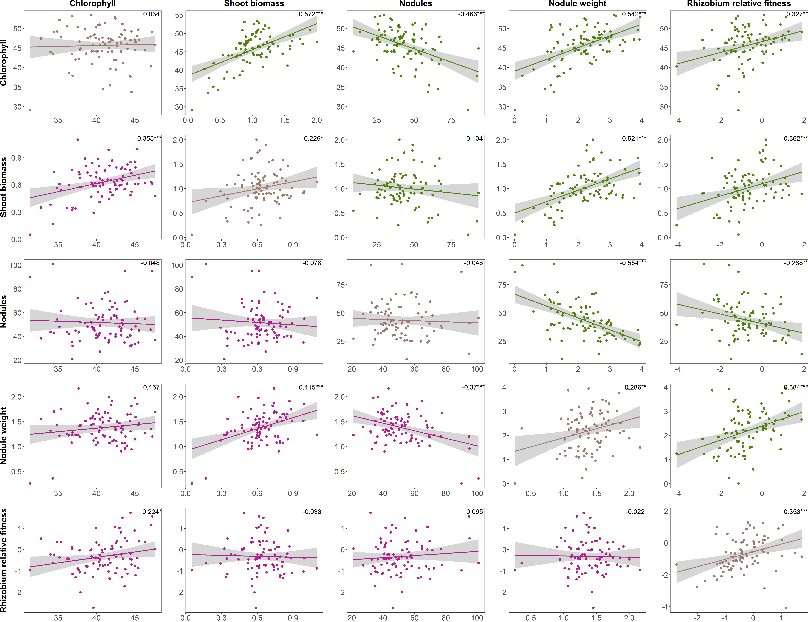

Phenotypic analyses
================
Rebecca Batstone
2021-10-20

Setup
-----

Load the data, format
---------------------

``` r
load(file = "../../Complex_genetics/Phenotypic_analyses/Data_output/emmeans.w_Ensifer.Rdata") ## loads emmeans.w_Ensifer
fit <- read.delim("./Data_output/multistrain_data.txt") ## from Liana's experiment

# format fitness data
fit_sel <- fit %>%
  select("strains" = Strain, contains("_Fit_"))

# format other data

## add MAG to strain_ID
emmeans.w_Ensifer$add <- "MAG"
emmeans.w_Ensifer$strains <- str_c(emmeans.w_Ensifer$add, 
                                   emmeans.w_Ensifer$strain_ID, sep = "", 
                                   collapse = NULL)
emmeans.w_Ensifer$strains <- as.factor(emmeans.w_Ensifer$strains)

## rename strain to match vcf on server:
emmeans.w_Ensifer$strains <- recode_factor(emmeans.w_Ensifer$strains, 
                                      MAG194 = "MAG194-mel")

# combine into one:
comb <- left_join(fit_sel, emmeans.w_Ensifer, by = "strains")

## select relevant cols
sub89_means <- comb %>%
  select(-ends_with("_1"), -ends_with("_2"), -strain_ID, -add,
         -contains("height"), -contains("leaf"), -contains("_L_"), -contains("plast"),
         # traits DZA
         chloro.DZA = chloro1_DZA_3, 
         shoot.DZA = shoot_DZA_3, 
         nod.DZA = nod_DZA_3, 
         nod.weight.DZA = nod.weight_DZA_3, 
         fit.DZA = DZA_Lold_Fit_med, 
         # traits A17
         chloro.A17 = chloro1_A17_4, 
         shoot.A17 = shoot_A17_4, 
         nod.A17 = nod_A17_4, 
         nod.weight.A17 = nod.weight_A17_4, 
         fit.A17 = A17_Lold_Fit_med)

# set strain_ID as row-names
rownames(sub89_means) <- sub89_means[,c("strains")]

save(sub89_means, file = "./Data_output/sub89_means.Rdata")
write.csv(sub89_means, file = "./Data_output/means_89strains.csv", row.names = FALSE)
```

Panel figure (supp)
-------------------

``` r
## load relevant df
load(file = "./Data_output/sub89_means.Rdata") ## loads sub89_means

## specify traits and colors to loop through
traits_y.list <- c(rep("chloro.DZA",5), ## first row
                  "shoot.A17", rep("shoot.DZA",4), ## second row
                  rep("nod.A17",2),rep("nod.DZA",3), ## third row
                  rep("nod.weight.A17",3),rep("nod.weight.DZA",2), ## fourth row
                  rep("fit.A17",4),"fit.DZA") ## fifth row
             
traits_x.list <- c("chloro.A17","shoot.DZA","nod.DZA","nod.weight.DZA","fit.DZA", ## first 
                   "chloro.A17","shoot.A17","nod.DZA","nod.weight.DZA","fit.DZA", ## second
                   "chloro.A17","shoot.A17","nod.A17","nod.weight.DZA","fit.DZA", ## third
                   "chloro.A17","shoot.A17","nod.A17","nod.weight.A17","fit.DZA", ## forth 
                   "chloro.A17","shoot.A17","nod.A17","nod.weight.A17","fit.A17") ## fifth 

comb.list <- paste0(traits_y.list, "_vs_",traits_x.list)

cols.list <- c('#9F7871', rep("#4E820C",4), ## first
               '#AD208D','#9F7871', rep("#4E820C",3), ## second
               rep('#AD208D',2),'#9F7871',rep("#4E820C",2), ## third
               rep('#AD208D',3),'#9F7871',"#4E820C", ## fourth
               rep('#AD208D',4),'#9F7871' ## fifth
               )

## source the function
source("../Source_code/gen_corr_func.R")

# run the function
gc_out <- mapply(combs = comb.list, traits_y = traits_y.list, traits_x = traits_x.list, 
                 cols = cols.list, 
                 FUN = gen_corr_func2,  
                 USE.NAMES = TRUE, 
                 MoreArgs = list(df = sub89_means))
```

    ## [1] "chloro.DZA_vs_chloro.A17"
    ## [1] "chloro.DZA_vs_shoot.DZA"
    ## [1] "chloro.DZA_vs_nod.DZA"
    ## [1] "chloro.DZA_vs_nod.weight.DZA"
    ## [1] "chloro.DZA_vs_fit.DZA"
    ## [1] "shoot.A17_vs_chloro.A17"
    ## [1] "shoot.DZA_vs_shoot.A17"
    ## [1] "shoot.DZA_vs_nod.DZA"
    ## [1] "shoot.DZA_vs_nod.weight.DZA"
    ## [1] "shoot.DZA_vs_fit.DZA"
    ## [1] "nod.A17_vs_chloro.A17"
    ## [1] "nod.A17_vs_shoot.A17"
    ## [1] "nod.DZA_vs_nod.A17"
    ## [1] "nod.DZA_vs_nod.weight.DZA"
    ## [1] "nod.DZA_vs_fit.DZA"
    ## [1] "nod.weight.A17_vs_chloro.A17"
    ## [1] "nod.weight.A17_vs_shoot.A17"
    ## [1] "nod.weight.A17_vs_nod.A17"
    ## [1] "nod.weight.DZA_vs_nod.weight.A17"
    ## [1] "nod.weight.DZA_vs_fit.DZA"
    ## [1] "fit.A17_vs_chloro.A17"
    ## [1] "fit.A17_vs_shoot.A17"
    ## [1] "fit.A17_vs_nod.A17"
    ## [1] "fit.A17_vs_nod.weight.A17"
    ## [1] "fit.DZA_vs_fit.A17"

``` r
# create the full-paneled figure

fig_base <- plot_grid(gc_out[["chloro.DZA_vs_chloro.A17"]] + 
                        ggtitle("Chlorophyll") + ylab("Chlorophyll"), 
                      gc_out[["chloro.DZA_vs_shoot.DZA"]] + ggtitle("Shoot biomass"), 
                      gc_out[["chloro.DZA_vs_nod.DZA"]] + ggtitle("Nodules"), 
                      gc_out[["chloro.DZA_vs_nod.weight.DZA"]] + ggtitle("Nodule weight"),
                      gc_out[["chloro.DZA_vs_fit.DZA"]]+ ggtitle("Competitive fitness"),
                      gc_out[["shoot.A17_vs_chloro.A17"]] + ylab("Shoot biomass"),
                      gc_out[["shoot.DZA_vs_shoot.A17"]], 
                      gc_out[["shoot.DZA_vs_nod.DZA"]], 
                      gc_out[["shoot.DZA_vs_nod.weight.DZA"]], 
                      gc_out[["shoot.DZA_vs_fit.DZA"]],
                      gc_out[["nod.A17_vs_chloro.A17"]] + ylab("Nodules"),
                      gc_out[["nod.A17_vs_shoot.A17"]], 
                      gc_out[["nod.DZA_vs_nod.A17"]], 
                      gc_out[["nod.DZA_vs_nod.weight.DZA"]], 
                      gc_out[["nod.DZA_vs_fit.DZA"]],
                      gc_out[["nod.weight.A17_vs_chloro.A17"]] + ylab("Nodule weight"),
                      gc_out[["nod.weight.A17_vs_shoot.A17"]], 
                      gc_out[["nod.weight.A17_vs_nod.A17"]], 
                      gc_out[["nod.weight.DZA_vs_nod.weight.A17"]], 
                      gc_out[["nod.weight.DZA_vs_fit.DZA"]],
                      gc_out[["fit.A17_vs_chloro.A17"]] + ylab("Competitive fitness"), 
                      gc_out[["fit.A17_vs_shoot.A17"]], 
                      gc_out[["fit.A17_vs_nod.A17"]], 
                      gc_out[["fit.A17_vs_nod.weight.A17"]], 
                      gc_out[["fit.DZA_vs_fit.A17"]],
          ncol = 5,
          nrow = 5,
          align = "hv",
          labels = NULL)

save_plot("./Figures/panel_gen_corr.png", fig_base,
          ncol = 5, # we're saving a grid plot of 2 columns
          nrow = 5, # and 3 rows
          # each individual subplot should have an aspect ratio of 1.3
          base_aspect_ratio = 1.3
          )


```


Identifying cheaters
--------------------

``` r
## load relevant df
load(file = "./Data_output/sub89_means.Rdata") ## loads sub89_means

## add in pop metadata
load(file = "../../Complex_genetics/Phenotypic_analyses/Data_output/raw_means_long.Rdata") ## loads ds_raw_means

## summarize 
ds_raw_means.sum <- ds_raw_means %>%
  group_by(strains, region) %>%
  summarise(count = n())

## join with sub89_means
sub89_means <- left_join(sub89_means, ds_raw_means.sum[,c("strains","region")],
                         by = "strains")

sub89_means <- sub89_means %>%
  mutate(rel_chloro.DZA = chloro.DZA/mean(chloro.DZA, na.rm=TRUE),
         rel_shoot.DZA = shoot.DZA/mean(shoot.DZA, na.rm=TRUE),
         rel_chloro.A17 = chloro.A17/mean(chloro.A17, na.rm=TRUE),
         rel_shoot.A17 = shoot.A17/mean(shoot.A17, na.rm=TRUE)) %>%
  as.data.frame(.)

sub89_means.l1 <- sub89_means %>%
  gather(quality, qual_vals, rel_chloro.DZA:rel_shoot.A17) %>%
  separate(col = quality, into = c("trait","line"), 
                           sep = "\\.", remove = FALSE) %>%
  mutate(ID = paste0(strains, "_", line))

sub89_means.l2 <- sub89_means %>%
  gather(fit, fit_vals, fit.DZA:fit.A17) %>%
  separate(col = fit, into = c("trait","line"), 
                           sep = "\\.", remove = FALSE) %>%
  mutate(ID = paste0(strains, "_", line))

sub89_means.l <- left_join(sub89_means.l1, sub89_means.l2[,c("fit_vals","ID")],
                           by = "ID")

sub89_means.l$quality <- factor(sub89_means.l$quality, 
                                levels = c("rel_shoot.DZA","rel_chloro.DZA",
                                           "rel_shoot.A17","rel_chloro.A17"))

means <- sub89_means.l %>%
  group_by(quality) %>%
  summarize(mean_qual = mean(qual_vals, na.rm = TRUE),
            mean_fit = mean(fit_vals, na.rm = TRUE))

ggplot(sub89_means.l %>%
         filter(!is.na(region)), 
       aes(x = qual_vals, y = fit_vals, color = region)) +
  geom_point() +
  geom_hline(data = means, aes(yintercept = mean_fit), linetype = 2) +
  geom_vline(data = means, aes(xintercept = mean_qual), linetype = 2) +
  geom_smooth(method = "lm", formula = "y~x") +
  facet_wrap(.~quality, ncol = 2, scales = "free") +
  geom_text(aes(label = strains), size = 2, nudge_y = -0.1) +
  theme_bw()
```


``` r
ggsave("./Figures/cheaters.pdf", width = 9, height = 6, units = "in")
```
